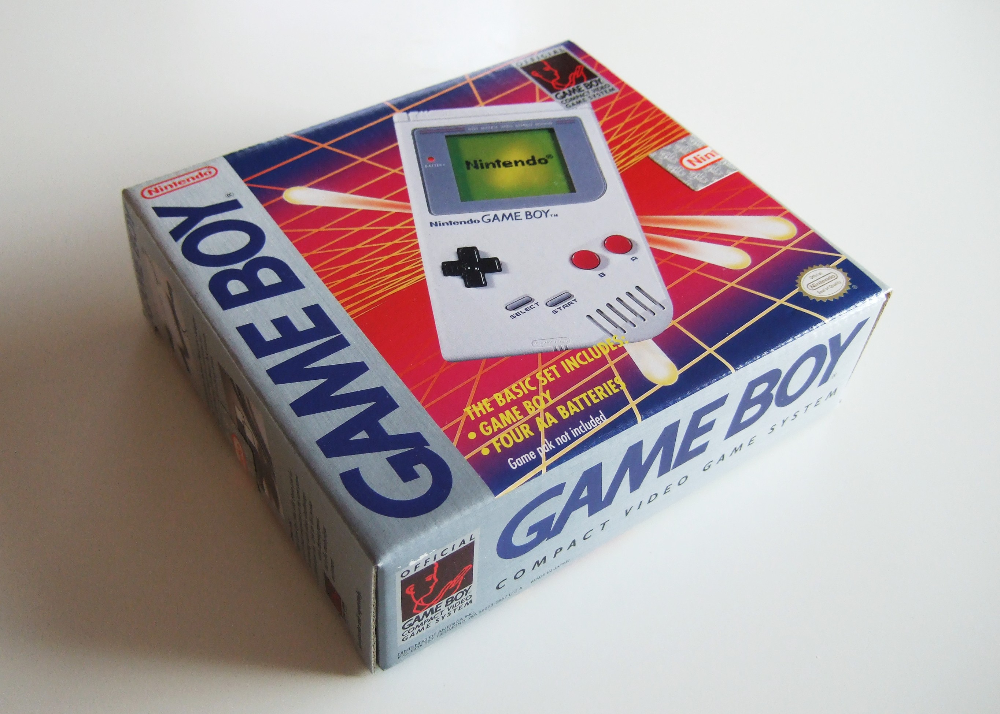
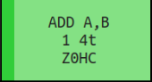
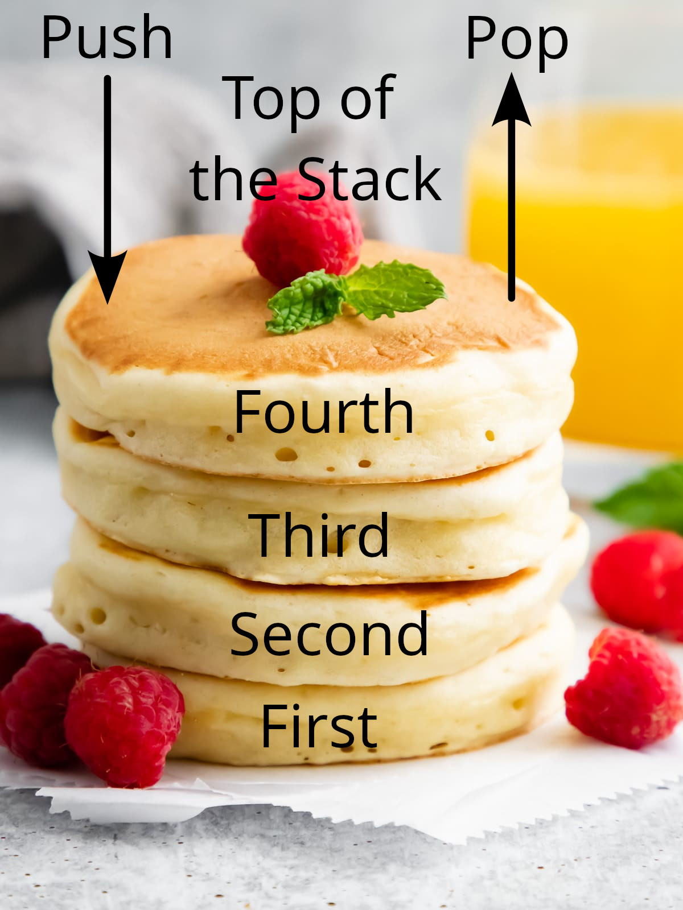

# Chapter II. Game Boy CPU Specification

[*Return to Index*](../README.md)

[*Previous Chapter*](01-refresher.md)

Before we begin writing any lines of code, we should familiarize ourselves with our goal. An emulator has a single job, to accept a video game file and simulate that game as it would play on real hardware. For us, that corresponds to the Game Boy system and its game cartridges. By the end of this project, you will be intimately familiar with both items, but we shall begin with a general overview of what comprises each part, and how exactly they work together.

## The Game Boy System

The Game Boy needs little introduction. Introduced in 1989 by Nintendo, the Game Boy quickly became the pre-eminent handheld console of its day, a position it would maintain for over a decade. While there are some minor revisions, its most significant enhancements would be the Super Game Boy, an adapter for the Super Nintendo released in 1994, and the Game Boy Color, released in 1998, which despite its marketing is more akin to a "pro" version of the Game Boy, rather than a true successor. It wouldn't be until the release of the Game Boy Advance in 2001 that the system would finally be made obsolete, with the device finally being discontinued in 2003, after 14 years of support.

The original Game Boy in all its glory.

The Game Boy system is made of a variety of parts internally and externally.There is a 160x144 pixel LCD display, capable of displaying four different shades of gray (or more accurately, four shades of green). There are eight input buttons; the four direction "D-pad", as well as A, B, Start, and Select buttons. Finally, a single mono speaker capable of four audio channels rounds out the elements the end user with interact with.

Internally you'll find the CPU (Central Processing Unit), a collection of RAM (Random Access Memory) chips, the connection to the game cartridge, along with a smattering of other electrical parts. The CPU is a custom 8-bit Sharp LR35902 chip, officially known as the DMG-CPU (DMG standing for "Dot Matrix Game", an internal name for the Game Boy). This chip is often referred to as a modified version of the popular Z80 chip. If you're familiar with the Z80, you'll notice there are some instructions have have been omitted between the two, as well as a few extra additions (anything to do with ports is gone, two of the flags are missing, etc.). Despite these differences, you'll sometimes see Game Boy assembly code inaccurately referred to as "z80" or "GBz80" assembly.

A Game Boy won't get very far without a game cartridge, which itself contains a few electric components, some of them optional. You will often hear people refer to game files as a "ROM". This is an acronym, standing for *Read-Only Memory*. This refers to how the completed game is stored and shipped inside the game cartridge. The Game Boy is a primitive ancestor of your modern PC or game console. Like those devices, there are different types of data storage that are needed for normal operation. Some are designed to only be used while the computer is running, such as its RAM, while some data should never be modified from how it was set at the factory. This is the ROM, and it contains the game's code as designed by its programmers. As the game executes, it will read data from the ROM, using its information to create graphics, audio, and gameplay. Not all games used the same ROM size, although there were a few standardized options. For a higher manufacturing cost, a developer could spring for a larger ROM if their game took up additional space. If they were truly adventurous, they could also ship additional RAM and even a battery for saving functionality within the game cartridge. We'll discuss how these pieces fit together in their respective chapters.

## CPU Instructions

Emulated gameplay will not work correctly until all the various subsystems are implemented correctly. Fortunately, each subsystem can be developed as an isolated part, although it will be difficult to verify correct behavior until enough pieces are in place to have partial execution. We'll begin with the central piece of any computer, the CPU.

CPUs, in a very basic sense, simply do math. As mentioned, the entirety of a Game Boy game is stored in the game cartridge's ROM. This includes video and audio data, but gameplay code is stored as well, not as human-readable code, but as machine understandable instructions. These instructions tell the CPU to perform the mathematical operations needed for gameplay. A single instruction is made up of one or more bytes, with the first byte known as the *opcode*, and subsequent bytes are operands for that opcode. Take a look at the [opcode reference table](https://izik1.github.io/gbops/), a webpage that we'll often refer to throughout this book. Each mathematical operation the CPU is capable of was given a unique index value by the chip designer, its opcode. The table is indexed in hexadecimal and has sixteen operations in each row and column for a total of 256 possible mathematical operation. Each cell has a text box which describes what the operation will do. The first word is the operation itself, abbreviated to three letters, and subsequent words, if any, describe what to use as inputs to those instructions. You'll notice that many of them seem to do the same thing, for example there are quite a few that perform addition. We'll discuss the nuances between the different cells in the table as we implement them.

An example opcode entry, in this case the ADD A, B operation.

To execute an instruction, the CPU reads the current opcode from memory, cross-references it with the matching instruction, then performs whatever task is required, which may or may not require reading more data for inputs or outputs. These instructions include more traditional mathematical functions like addition, subtraction, bitwise operators, etc., but it can also include comparing two numbers, moving to a different section of code depending on game conditions, among a handful of other items. It's these indices and their operands that make up the code section of a game cartridge ROM.

The first major goal in creating an emulator will be to simulate the CPU. To have a functional emulator that can accurately play Game Boy games, we need to follow along with the execution in the same way the real hardware would. That means correctly identifying which opcode goes with which mathematical function, reading the inputs correctly, and yielding the same result. Any mistakes or bugs would quickly deviate in behavior against a real system, which often rapidly snowballs into a complete breakdown of the game.

## Registers

Looking at the opcode table again, many instructions have a singular letter or a pair of letters separated with a comma following the opcode name. These letters refer to the *CPU Registers*. It's not enough for a computer to simply execute code, input values need to be consumed and outputs need to be placed somewhere. While the aforementioned RAM can provide this functionality, RAM access is relatively slow. Instead, the CPU is built-in with space to store a handful of bytes for use with operations. These are the registers, and there are eight 8-bit registers, named A, B, C, D, E, F, H, and L. These registers also have the added ability to be combined end to end to provide four 16-bit registers instead, for instructions that require larger values. Each 8-bit register has a designated pair -- AF, BC, DE, and HL (we'll get to the unintuitive pairings in a moment). Our much larger RAM space is more or less just a staging area for the registers, and a place for data to be placed for other subsystems to use. If you want to perform some operation, the data must first be loaded into one of the registers before it can occur.

| 16-Bit Register | High | Low | Purpose                     |
| --------------- | ---- | --- | --------------------------- |
|       AF        |  A   |  F  | Accumulator / Flag Register |
|       BC        |  B   |  C  |                             |
|       DE        |  D   |  E  |                             |
|       HL        |  H   |  L  | High / Low                  |
|       PC        |      |     | Program Counter             |
|       SP        |      |     | Stack Pointer               |

I mentioned the odd register naming scheme, and this is because not all registers are created equal. Some of the registers have additional responsibilities the others do not. Perhaps the most important is the A register (short for "accumulator"), as all mathematical instructions will use the A register as the output of the instruction if applicable. For example, when you add two values together, regardless of which addition opcode you use, the output *always* goes into the A register. Returning to the opcode table, we noted that there are several different instructions beginning with the word `ADD`. These, unsurprisingly, all deal with addition. You'll also notice that all them mention the A register as an input, with the only difference being which second register is also used. Rather than requiring each operation to store subsequent bytes as inputs, using up valuable bytes in memory, each of the possible addition pairs gets their own instruction. Adding the values in the A and B register is one instruction (`ADD A, B`), adding A and C is another (`ADD A, C`), and so on. The instructions don't mention where the output value goes, and that's because it always gets stored into A. The A register is always one of the inputs, and it also serves as the output, at least for the instructions that produce one. If you're used to a high level language, you can think of the instruction `ADD A, B` as being equal to `a += b`.

Next up is the F or "flag" register. In this case, a flag refers to a boolean value, with 1 for true, or *set*, and 0 for false, or *clear*. Some mathematical instructions will have certain "side effects", like overflowing1, which the game developer might wish to take into account. There are four flags in total, each represented as a single bit of the F register. These are the Zero flag ("Z") which is set if the operation resulted in 0, the Carry flag ("C") for if the 7th (most significant) bit overflows, the Half Carry flag ("H") for if the 3rd bit carried over to the 4th, and the Negative ("N") flag for if the operation was a subtraction. Each opcode will modify the flags in its own way, but not all instructions will update every flag. Notice though, that we have four flags here, each taking up one bit each, but eight possible bits in the F register. They are organized like so: `ZNHC0000`, with the Z flag corresponding to the most significant bit, the N flag next to that, and so on, with the four lower bits not having a purpose and always left as zero.

| Flag | Bit | Purpose         |
| ---- | --- | --------------- |
|  Z   |  7  | Zero Flag       |
|  N   |  6  | Negative Flag   |
|  H   |  5  | Half-Carry Flag |
|  C   |  4  | Carry Flag      |

Last up are the H and L registers, short for "high" and "low" respectively. While there are instructions that deal with them separately, it's more common to see them used together as the 16-bit HL register. HL has the role of specifying where RAM memory should be accessed. While the Game Boy might have several distinct RAM chips, they are treated like a single continuous block as far as the CPU is concerned. Each byte in RAM is given an *address*, with a possible range from 0x0000 to 0xFFFF, meaning the address can fit within two bytes. If you want to read a value from RAM, you would put the 16-bit address you want into the HL register, then call the corresponding "load" (`LD`) instruction to grab the value at that address and copy it to your destination. There are a few operations that also can use BC or DE to access a value in RAM, but it's more commonly a role given to HL.

1 "Overflowing" is when a value becomes too large for its data size and rolls over, for example a byte going from 255 back to 0. The opposite behavior is known as "underflowing".

## The Program Counter and Stack Pointer

That's the overview of the 8-bit/16-bit register pairs. It's a lot to take in, but it hopefully will become second nature once we begin implementation. The CPU does possess other purely 16-bit registers as well. The first of the two is the Program Counter ("PC"), which has the vital role of holding the RAM address at which the game execution is currently located. The CPU has to keep track of where code is currently running, which as we'll see, is always at a value in RAM. Left alone, the PC would move instruction by instruction1, but there are some operations that modify it explicitly, such as jumping to a different area of code. This allows the programmer to do things like call subroutines2 or perform conditionals. I do want to emphasize here that the PC points to a location *in RAM*, not at the cartridge ROM. The ROM is kept separate from the CPU, and the game must be loaded (at least partially) into RAM before the game can utilize it. We will need to implement this behavior for ourselves for our emulator to function.

The final register is the 16-bit Stack Pointer ("SP"). The stack is a special area of RAM where values can be stored without the developer needing to specify a particular address. Think of it like a stack of pancakes, where values can be piled into the stack (known as "pushing"), without much care for how large the stack is or what other values are already present. When values are read and removed from the stack ("popping"), you can only grab the pancake on the top of the stack, aka the most recent value added is the first to be removed, a process often referred to as "First in, Last Out". The stack is commonly used when calling subroutines, as the game will need to know where the PC was when the subroutine was, and thus where to return to when it's finished. We'll save the details for where in RAM the stack actually lives later, just know that the SP points to the current top value of the stack, and moves up and down when values are pushed or popped.

That, in a nutshell, is the Game Boy CPU. It's a lot to take in, and we haven't even talked about how RAM is laid out, how the graphics are constructed, or how the cartridge fits in to all this3. We'll cover all that in due time, but for now this is enough information to begin the emulation process.

1 Although not necessarily byte by byte. The number of bytes needed per instruction varies.

2 Here, 'subroutine' is a synonym for 'function'

3 It fits into the slot in the back.

[*Next Chapter*](03-project-setup.md)
