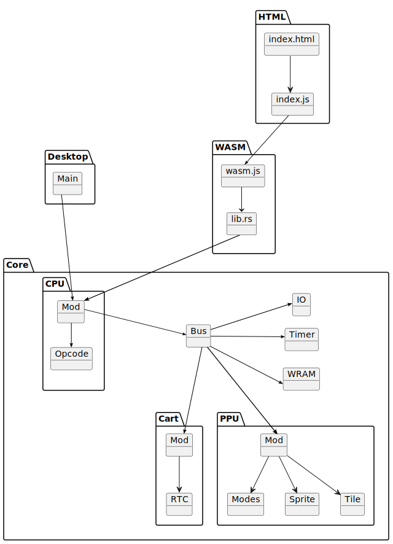

# Chapter III. Project Setup

[*Return to Index*](README.md)

[*Previous Chapter*](02-cpu-specs.md)

If you have worked through the Chip-8 book, the basic structure of this project will look very similar. Our goal is to have two different frontends for this project, a desktop application as well as a web version. Each of these will implement their own way of rendering the screen, accepting inputs, and loading the game. The backend, or "core", will contain the system emulation itself, designed in such a way that it can be utilized by either frontend without any modifications. This allows us to only write the Game Boy emulation code once, but use it as part of two different programs.

## Module Initialization

We'll set up the two frontends and single backend structure now. Move into the folder where you will store your project, and run the following command to generate the Rust boilerplate code. Note that any line beginning with `$` indicates that this is a shell command, and the `$` shouldn't be included.

```
$ cargo init core --name gb_core --lib
```

This command creates a Rust library to be included as part of another program, rather than an executable, as the core will only be used by other modules. The `--name` flag specifies that the folder should be called `core` while the module called `gb_core` (since `core` is used by the Rust library, it needs a different name). You're welcome to call it anything you prefer though.

Let's now create the two frontends via the following two commands.

```
$ cargo init desktop
$ cargo init wasm --lib
```

`wasm` here is short for WebAssembly, a fairly recent technology that allows compiled languages to be used on webpages. The `desktop` module will be compiled together into a typical executable application, while the `wasm` module will be utilized as part of a website we'll build. The bulk of our time will be spent in the `desktop` module, and any time we need to add something to a frontend, this guide will take the time to add it to both.

After running these commands, you should have three folders -- `core`, `desktop`, and `wasm` -- and your overall folder structure should look something like this.

```
.
├── core
│   ├── Cargo.toml
│   └── src
│       └── lib.rs
├── desktop
│   ├── Cargo.toml
│   └── src
│       └── main.rs
└── wasm
    ├── Cargo.toml
    └── src
        └── lib.rs
```

For the last bit of setup, we need to point both frontends to the location of `core`. Open up `desktop/Cargo.toml`, and under `[dependencies]` add the following line:

```toml
# In desktop/Cargo.toml

[dependencies]
gb_core = { path = "../core" }
```

After saving, add the same line in `wasm/Cargo.toml`.

## Backend Structure

While we're thinking about project structure, let's take a moment to discuss how the internals of the emulator should be laid out. Rust is infamously picky about the accessibility of objects, so while some languages might happily allow us to pass pointers to various subsystems around, in Rust we will need to structure things more carefully.

Fortunately, the various subsystems of a Game Boy lend themselves well. The CPU will access the current instruction from memory, perform the required operations, and potentially store data back into memory. Thus, the CPU needs full access to our emulated RAM, but luckily for us, the memory does not care at all what the CPU is doing, and we can construct a "memory bus" child object that the CPU can access as it needs to. The bus then can access various other submodules, like the game cartridge data, video handling, and other objects. We'll only add each piece as we come to it, but if you're curious, this is the full, final class diagram for the `core`.



The inheritance diagram of the final emulator. This is our goal.

[*Next Chapter*](04-cpu-setup.md)
