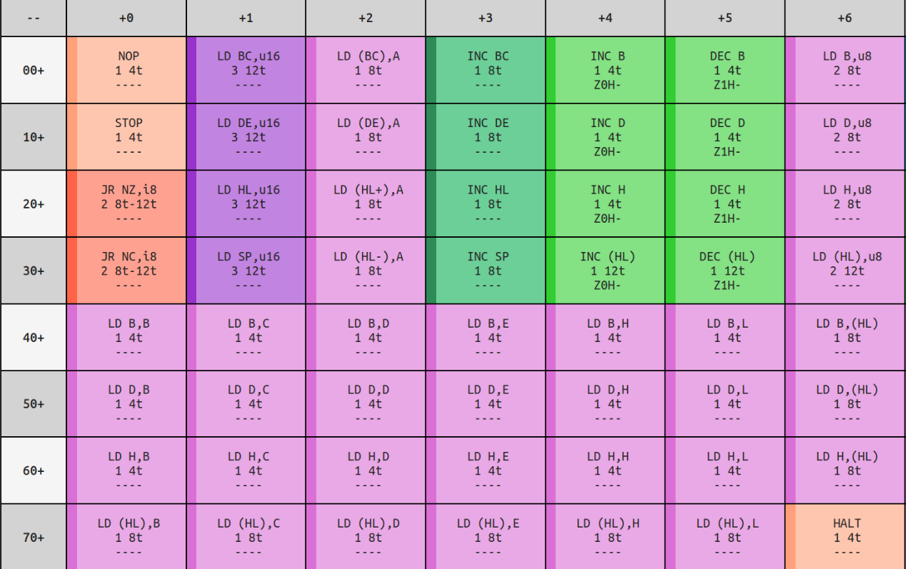
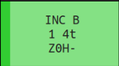

# Chapter V. Opcode Setup

[*Return to Index*](README.md)

[*Previous Chapter*](04-cpu-setup.md)

It's now time to dive deep into the implementation of the CPU. There are roughly 500 in common, so to make this more manageable the next several chapters are devoted to implementing them in groups based on common functionality. I'll admit this can be a frustrating part of the project, especially since it needs to happen rather early on. On the one hand, each instruction has a specific list of behaviors it needs to follow, and it's somewhat easy to verify it's working as designed. You simply need to give a range of inputs to each instruction, and ensure that it returns the expected value. Compare this to debugging the video rendering, where finding bugs requires playing the game with a keen eye. On the other hand, there are roughly 500 different operations, each and every one we'll need to implement correctly. Many of them are very similar to each other, but it's still probably the most time consuming and monotonous part of the project. If you begin growing bored with the process, I encourage you to stick with it, it'll pick up!

Rather than store 500 different opcode functions in our `cpu/mod.rs` file, I'm going to create a new `cpu/opcodes.rs` file for them specifically, so we can try and keep things a bit tidier.

```
.
├── core
│   ├── Cargo.toml
│   └── src
│       ├── cpu
│       │   ├── mod.rs
│       │   └── opcodes.rs
│       ├── lib.rs
│       └── utils.rs
├── desktop
│   ├── Cargo.toml
│   └── src
│       └── main.rs
└── wasm
    ├── Cargo.toml
    └── src
        └── lib.rs
```

At the top of `cpu/mod.rs`, we will need to let Rust know that there is a new file by adding the following line.

```rust
// In cpu/mod.rs

pub mod opcodes;
```

## Fetch, Decode, Execute

We've discussed a bit about CPU instructions and what they do, but we have yet to cover how the CPU operates and the steps it takes to process an instruction. You can think of the CPU as a sort of state machine, cycling through a handful of steps for each instruction and repeating these steps continuously while the system is running. When examined from a high-level perspective, there are only three steps the CPU performs.

The first is to "fetch" the next instruction. This means that the CPU will read the byte of RAM currently pointed at by its Program Counter. This byte, the opcode, is then "decoded". We've discussed this process previously, this is when the CPU uses the value of the opcode to determine which instruction it will execute, whether it be addition, subtraction, comparison, etc. Finally, it will "execute" that instruction. This may require additional bytes to be accessed in RAM or in the CPU registers, whatever the instruction requires. With this done, the Program Counter is advanced to the next instruction and the cycle begins again.

We'll start by implementing the fetching behavior in `cpu/mod.rs`, along with some other functions to assist in that behavior.

```rust
// In cpu/mod.rs

impl Cpu {
    // Unchanged code omitted

    pub fn fetch(&mut self) -> u8 {
        let val = self.read_ram(self.pc);
        self.pc += 1;
        val
    }

    pub fn fetch_u16(&mut self) -> u16 {
        let low = self.fetch();
        let high = self.fetch();
        let val = merge_bytes(high, low);
        val
    }

    pub fn read_ram(&self, addr: u16) -> u8 {
        todo!();
    }

    pub fn write_ram(&mut self, addr: u16, val: u8) {
        todo!();
    }
}
```

We don't actually have any RAM functionality in place for now, so we'll create empty functions and use the built-in `todo!` macro to remind us to come back to this when we're ready. In addition to the typical `fetch` operation, I've created a convenient helper `fetch_u16`. You will often see instructions that need to fetch a 16-bit value by merging two 8-bit ones together; commonly enough that it's worth a specific function to handle it. It's important to notice that when fetching a 16-bit value, the low byte will be the first one read, with the high byte stored at the subsequent address. The Game Boy is a little endian system (check [Chapter I](01-refresher.md) for more details), leading to this storage method, rather than them stored the other way around. We must keep them straight, as we'd end up with a completely different 16-bit value if we merged them in the wrong order.

The decode step is nothing more than looking at the `u8` returned by `fetch` and using it to decide which instruction's behavior to execute. We'll set up the structure to do so in a moment, first let's jump over to `cpu/opcodes.rs` and add the function that will utilize `fetch`. We will need to give this file access to our `Cpu` struct<sup>1</sup>. We'll call this function `execute`, and it will begin by calling `fetch` to give us our opcode index value.

```rust
// In cpu/opcodes.rs

use crate::cpu::*;
use crate::utils::*;

pub fn execute(cpu: &mut Cpu) -> u8 {
    let op_index = cpu.fetch();

    return 0; // TODO
}
```

<sup>1</sup> In case you were wondering, this is why we needed to make all the functions in `Cpu` public

## Opcode Lookup Table

Now to implement the decoding stage. Take a look at the [opcode reference table](https://izik1.github.io/gbops/). There are two tables here, both of which we'll eventually need to implement, but we'll focus on the first one for now. It is a 16x16 table, with each cell corresponding to a different CPU operation. Each of them are numbered in hexadecimal, beginning in the top row and moving right, so the first cell is the 0x00 instruction, followed by 0x01, and so on, until the 0x0F instruction at the end of the first row, and continuing on the second row with 0x10.



The Opcode Lookup Table

Inside each cell is three pieces of information about each opcode. First is the name of the operation, which uses Game Boy assembly syntax. These abbreviations provide important clues as to how the instruction functions, as well as any inputs it might use. Secondly is a list of flags that are modified as part of executing the instruction, if any. Finally, there is a number, corresponding to the number of clock cycles it took to complete the instruction. We'll discuss the CPU cycles in greater detail later, but think of them as the amount of time the CPU took to perform that instruction. The simpler instructions might use only one cycle, while more complex ones can use up to five or six. The clock cycles corresponding to each opcode, according to the table, are what we're going to return from `execute`.



The `INC B` instruction.

There's a few ways to structure the opcode execution. We could have a giant switch statement, using the opcode index to jump to the correct section. This is what I did in the [Chip-8 tutorial](https://github.com/aquova/chip8-book), which worked well there as that emulator has far fewer instructions. Another way is use the patterns in the tables to find the matching instruction. The opcode value given to each of the opcodes was very carefully thought out, and there are intentional patterns in how each instruction type or parameter is placed. You can begin to see it if you look at the opcode table and notice similar instructions are in the same row, or similar inputs in the same column. Using this pattern is closer to what real hardware would do<sup>1</sup>, but there are enough exceptions to the patterns which, in my opinion, makes it almost more of a hassle to follow explicitly.

Instead, we're going to take a simpler approach. We'll implement each instruction in its own dedicated function, which are conveniently already numbered for us by the opcode value. We'll implement a big lookup table mapping opcode value to the instruction's corresponding function. Whenever we have an opcode and need to know which function to execute, we just index into it.

While we could expand this array piece by piece as we go, I'm going to create all 256 values for it now, just to try and keep our compiler happy. Each of these functions must have the same function signature to be in this array, in this case accepting our CPU object as its input, and returning the number of cycles the instruction took (as a `u8`) as its output.

```rust
// cpu/opcodes.rs
use crate::cpu::*;
use crate::utils::*;

const OPCODES: [fn(&mut Cpu) -> u8; 256] = [
//  0x00, 0x01, 0x02, 0x03, 0x04, 0x05, 0x06, 0x07, 0x08, 0x09, 0x0A, 0x0B, 0x0C, 0x0D, 0x0E, 0x0F
  todo, todo, todo, todo, todo, todo, todo, todo, todo, todo, todo, todo, todo, todo, todo, todo, // 0x00
  todo, todo, todo, todo, todo, todo, todo, todo, todo, todo, todo, todo, todo, todo, todo, todo, // 0x10
  todo, todo, todo, todo, todo, todo, todo, todo, todo, todo, todo, todo, todo, todo, todo, todo, // 0x20
  todo, todo, todo, todo, todo, todo, todo, todo, todo, todo, todo, todo, todo, todo, todo, todo, // 0x30
  todo, todo, todo, todo, todo, todo, todo, todo, todo, todo, todo, todo, todo, todo, todo, todo, // 0x40
  todo, todo, todo, todo, todo, todo, todo, todo, todo, todo, todo, todo, todo, todo, todo, todo, // 0x50
  todo, todo, todo, todo, todo, todo, todo, todo, todo, todo, todo, todo, todo, todo, todo, todo, // 0x60
  todo, todo, todo, todo, todo, todo, todo, todo, todo, todo, todo, todo, todo, todo, todo, todo, // 0x70
  todo, todo, todo, todo, todo, todo, todo, todo, todo, todo, todo, todo, todo, todo, todo, todo, // 0x80
  todo, todo, todo, todo, todo, todo, todo, todo, todo, todo, todo, todo, todo, todo, todo, todo, // 0x90
  todo, todo, todo, todo, todo, todo, todo, todo, todo, todo, todo, todo, todo, todo, todo, todo, // 0xA0
  todo, todo, todo, todo, todo, todo, todo, todo, todo, todo, todo, todo, todo, todo, todo, todo, // 0xB0
  todo, todo, todo, todo, todo, todo, todo, todo, todo, todo, todo, todo, todo, todo, todo, todo, // 0xC0
  todo, todo, todo, todo, todo, todo, todo, todo, todo, todo, todo, todo, todo, todo, todo, todo, // 0xD0
  todo, todo, todo, todo, todo, todo, todo, todo, todo, todo, todo, todo, todo, todo, todo, todo, // 0xE0
  todo, todo, todo, todo, todo, todo, todo, todo, todo, todo, todo, todo, todo, todo, todo, todo, // 0xF0
];

fn todo(cpu: &mut Cpu) -> u8 {
  todo!();
}

pub fn execute(cpu: &mut Cpu) -> u8 {
  let op_index = cpu.fetch();
  OPCODES[op_index as usize](cpu)
}
```

With the addition of our table, we now have 256 functions that need to be created and stored in the table at their proper place. The goal here is to replace every instance of the `todo` function, and eventually delete it when it's no longer used. This will require us to use the opcode reference table to get a sense of how each instruction should work. I've also updated the `execute` function to use the index with the table directly, and return its cycle value.

<sup>1</sup> Here is an [interesting article](http://z80.info/decoding.htm) describing the process of decoding the opcodes in full.

## NOP

The next several chapters will be an overview of each category of instruction, describing how they work and what inputs it could accept. I'm not going to painstakingly describe the implementation of each instruction, but there should be enough examples to teach the general structure. Let's begin here by implementing the first instruction. If you look at the table, instruction 0x00 is `NOP`, the "no operation" instruction. It's entire job is to do nothing, an instruction more useful as it sounds as it is often used to provide padding or other alignments in your code.

The implementation of `NOP` will use the same pattern we will follow for all the instructions. First we will create a new function with the same parameters as our table -- accepting our mutable `Cpu` object and returning a `u8`. We'll name this new function `nop_00`, which is the name of the instruction followed by its opcode value. While you're welcome to name it anything you like, I suggest this naming scheme as it clearly gives an indication as to what the instruction should do, as well as where in the table it should be placed, without requiring us to flip back and forth to the reference table.

Since the `NOP` instruction doesn't do anything, the function has no behavior other than returning a `u8`. The `1` value to return was gathered from the opcode table itself, and indicates that even though it didn't really do anything, the `NOP` instruction took one clock cycle to complete. Finally, we'll replace the `todo` placeholder at the 0x00 position with `nop_00`.

```rust
const OPCODES: [fn(&mut Cpu) -> u8; 256] = [
//  0x00,   0x01, 0x02, 0x03, 0x04, 0x05, 0x06, 0x07, 0x08, 0x09, 0x0A, 0x0B, 0x0C, 0x0D, 0x0E, 0x0F
  nop_00, todo, todo, todo, todo, todo, todo, todo, todo, todo, todo, todo, todo, todo, todo, todo, // 0x00
  todo,   todo, todo, todo, todo, todo, todo, todo, todo, todo, todo, todo, todo, todo, todo, todo, // 0x10
  todo,   todo, todo, todo, todo, todo, todo, todo, todo, todo, todo, todo, todo, todo, todo, todo, // 0x20
  todo,   todo, todo, todo, todo, todo, todo, todo, todo, todo, todo, todo, todo, todo, todo, todo, // 0x30
  todo,   todo, todo, todo, todo, todo, todo, todo, todo, todo, todo, todo, todo, todo, todo, todo, // 0x40
  todo,   todo, todo, todo, todo, todo, todo, todo, todo, todo, todo, todo, todo, todo, todo, todo, // 0x50
  todo,   todo, todo, todo, todo, todo, todo, todo, todo, todo, todo, todo, todo, todo, todo, todo, // 0x60
  todo,   todo, todo, todo, todo, todo, todo, todo, todo, todo, todo, todo, todo, todo, todo, todo, // 0x70
  todo,   todo, todo, todo, todo, todo, todo, todo, todo, todo, todo, todo, todo, todo, todo, todo, // 0x80
  todo,   todo, todo, todo, todo, todo, todo, todo, todo, todo, todo, todo, todo, todo, todo, todo, // 0x90
  todo,   todo, todo, todo, todo, todo, todo, todo, todo, todo, todo, todo, todo, todo, todo, todo, // 0xA0
  todo,   todo, todo, todo, todo, todo, todo, todo, todo, todo, todo, todo, todo, todo, todo, todo, // 0xB0
  todo,   todo, todo, todo, todo, todo, todo, todo, todo, todo, todo, todo, todo, todo, todo, todo, // 0xC0
  todo,   todo, todo, todo, todo, todo, todo, todo, todo, todo, todo, todo, todo, todo, todo, todo, // 0xD0
  todo,   todo, todo, todo, todo, todo, todo, todo, todo, todo, todo, todo, todo, todo, todo, todo, // 0xE0
  todo,   todo, todo, todo, todo, todo, todo, todo, todo, todo, todo, todo, todo, todo, todo, todo, // 0xF0
];

// Unchanged code omitted

// NOP
// ----
fn nop_00(_cpu: &mut Cpu) -> u8 {
  // Do nothing
  1
}
```

One final note on the cycle return values. These might seem fairly arbitrary, but like the instruction ordering, they come from the physical characteristics of the CPU. As we get further into implementation, you'll see that it becomes a careful balance ensuring that all the different subsystems remain in sync. Knowing how long the CPU has taken is an important part of that. You might also be wondering why we don't use a lookup table for the cycle return values as well. For the vast majority of instructions, we could. However, there are a few that have conditionals, and can use two different amount of clock cycles depending. Rather than hack some solution on top of a lookup table, I've elected to just store the return values within the function directly.

[*Next Chapter*](06-increment-decrement.md)
