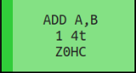
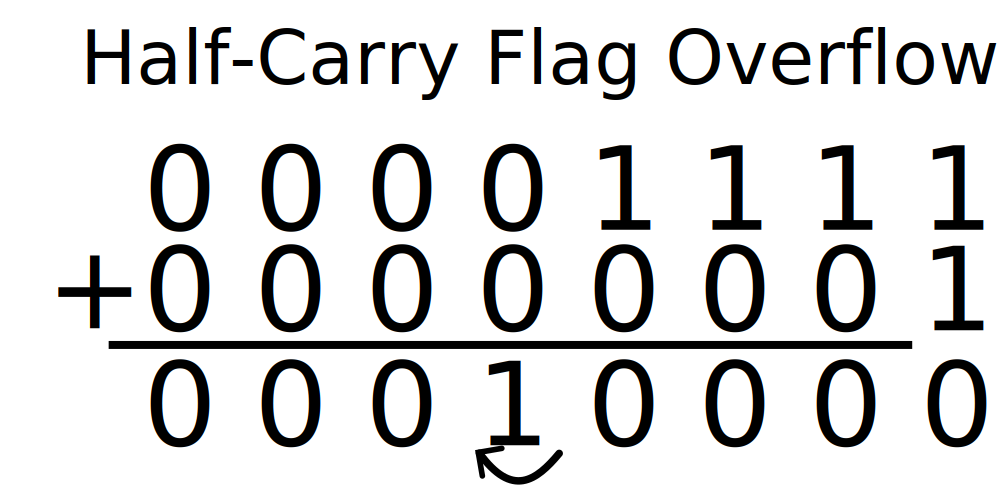

# VI. Increment/Decrement Instructions

With the opcode execution framework in place, we now need to turn our attention to understanding the different instructions and what they do, and if possible, determine if there is any commonalities between them that can make our lives easier. First, take another look at the [opcode reference](https://izik1.github.io/gbops/). I talked briefly in the previous chapter about the information contained in each cell, but I now want to talk about the names of each instruction, and what they tell us. This table has each of them listed as they appear in Game Boy assembly language (or one flavor of it anyway), where the name of the instruction comes first, followed by the register the instruction operates upon, if any, followed by a comma and then second register input, if any.

As an example, let's look at opcode 0x04, `INC B`. `INC` here is short for "increment", meaning to add one. This instruction will take the value stored in the B register, and increase it by one. If the value is already maxed out at 0xFF, it would roll over back to 0x00. The flag entry for this instruction is listed as `Z0H-`. This notation will always list the four flags in the order Z, N, H, C; with a 1 indicating it's always set, a 0 for always cleared, a - for left alone, and its own name to indicate it follows its particular behavior. This means that the N flag is always set to 1, regardless of what happened. The Z flag should be set according to how it works, namely if the result is 0 (which only happens if it rolled over from 0xFF to 0x00). The H flag also is set based on its rules -- if a half carry occurred. Finally, the C flag is always left alone.


Opcode 0x04 - `INC B`

These next chapters will heavily rely on this table, so it's important to get the hang of what it's describing. Let's look at a second example then, one with two different registers affected, such as 0x80, `ADD A, B`. This instruction adds the values stored in the A and B registers, and as was discussed in an earlier chapter, replaces the A register with the sum. It follows the convention that for instructions that use two registers the output is stored into the register *on the left*. In instruction 0x43, `LD B, E`, this same rule is followed. The value currently in the right-hand register, E, is "loaded" (copied) into the register on the left, B.



Opcode 0x80 - `ADD A, B`

One other major thing to note is that some of the registers are surrounded with parenthesis, such as instruction 0x34, `INC (HL)`. These parenthesis means that we aren't performing the instruction on the value stored in the register, but instead *on the value in RAM pointed to by the address stored in the register*. As an example, let's say 0x12 is stored in the H register, and 0x34 in the L register, meaning HL together would store 0x1234. The `INC (HL)` instruction would increment the value in RAM at address 0x1234. The value in HL is, in this case, left alone. This means that the parenthesis always surrounds a 16-bit register, as RAM must be addressed by a 16-bit value.


Opcode 0x34 - `INC (HL)`

There are some instructions that do modify the register value as well. Instruction 0x2A, `LD A, (HL+)`, reads the value in RAM pointed to by HL's value and copies it into register A. Once that's done, the value in HL is incremented by one, as signified by the `+`. There are some instructions with `-` instead, which would decrement the value in the register after the operation completes.


Opcode 0x2A - `LD A, (HL+)`

Once you understand how these instructions are written, you'll begin to see quite a few patterns emerging. For example, instructions 0x80 through 0x87 are all addition instructions between register A and another 8-bit register (or in the case of instruction 0x86, an 8-bit value in RAM pointed at by HL). This set of instructions is a prime candidate for writing a single helper function which would accept a register enum and perform the same addition steps upon the value that register stores. You'll quickly notice a lot of other patterns just like this, although there are some unique instructions sprinkled amongst them. Let's explore some of these patterns now.

## Increment/Decrement

Back to the increment and decrement instructions. They are relatively straight-forward, and are signified with the abbreviation `INC` for increment and `DEC` for decrement. As described earlier, increment means to increase the value in that register by one, and decrement to decrease it by one, with the value wrapping around if need be. The Game Boy has twelve instructions of each type, arranged in columns of four on the opcode table. For `INC` these are the columns beginning at 0x03, 0x04, and 0x0C. `DEC` meanwhile are the first four items in the columns starting at 0x05, 0x0B, and 0x0D.


First four rows of the opcode table

I'm pointing out the columns for a reason, as while there are twelve `INC` instructions in total, they aren't all the same. The two columns at 0x04 and 0x0C each increment an 8-bit value, take one cycle, and modify the flags in the same way, `Z0H-`. The four items in column 0x03 however, modify 16-bit values, also take one cycle, but don't adjust the flags at all. This is a useful distinction, as it means that during implementation, we can create two helper functions, an 8-bit increment and a 16-bit one, and use these two to handle all the cases (special attention will need to be given to 0x34, `INC (HL)` since it modifies a RAM value rather than a register, but it's still pretty similar). The twelve `DEC` instructions follow the same pattern, eight 8-bit decrement instructions and four 16-bit ones.

Let's begin by creating these helper functions in `cpu/mod.rs`. They will accept one of our 16-bit register enum values and use it to increment or decrement the corresponding register value. Once these are in place, all our individual instruction functions will need to do is call these with the correct parameters.

```rust
// In cpu/mod.rs

impl Cpu {
    // Unchanged code omitted

    pub fn dec_r16(&mut self, r: Regs16) {
        let val = self.get_r16(r);
        let dec = val.wrapping_sub(1);
        self.set_r16(r, dec);
    }

    pub fn inc_r16(&mut self, r: Regs16) {
        let val = self.get_r16(r);
        let inc = val.wrapping_add(1);
        self.set_r16(r, inc);
    }
}
```

While some languages will happy roll over a 16-bit value, Rust does not like values overflowing and will throw an error if this happens. To handle this gracefully, we will use the `wrapping_add` and `wrapping_sub` functions, which will handle the overflow behavior for us.

## Carry and Half-Carry

On to the 8-bit versions. These are a bit more complicated due to how they modify their flags. If you look again at the [opcode reference](https://izik1.github.io/gbops/), all of the 8-bit `INC` instructions (such as `INC B`, `INC D`, etc.) all have the same flag behavior -- `Z0H-`. This means that the N flag always should be set to 0, C should be left alone, and we need to determine if Z and H should be set. Likewise all the 8-bit `DEC` instructions are `Z1H-`. The same, except the N flag should always be set to 1.

The Z and N flags are easy enough to understand, but the Carry and Half-Carry flags are somewhat well-known for their complexity. These two flags are checking for overflow in their most significant bytes, with the Carry flag noting if the most 7th bit overflowed into the (non-existent) 8th bit, and a Half-Carry for the 3rd bit into the 4th.



Example of Half-Carry overflow


Example of Carry overflow

For example, say we have the 8-bit value 0xAA, which is 10101010 in binary. If we add one to that value, we will get 0xAB -- 10101011. Neither of the two bits in question -- the 3rd or 7th -- carried over, so both the C and H flags would be 0. If instead we add 8 to 0xAA, we would have 10110010. The 3rd bit here did carry into the 4th bit, meaning the Half-Carry flag would be set, but the 7th bit was unchanged, so C would be cleared.

Two extra things to note. 16-bit values also affect the Carry and Half-Carry flags, following the same rules as described above. However, they only look at the high byte for making this determination (so the 12th and 15th bits), any carrying in the low byte isn't noted. Secondly, while the flags are called the "Carry" flags, they are also set during the reverse operation, when the 3rd or 7th bits need to borrow a value from the next bit over.

Rather than re-implement this behavior every time a Carry or Half-Carry comes up, we'll implement some helper functions to unify our implementation. We'll need eight similar helper functions in all, four for Carry -- 8-bit carry, 8-bit borrow, 16-bit carry, and 16-bit borrow -- and their corresponding Half-Carry versions.

Thanks to some built-in Rust functionality, the Carry flag functions are the simplest. Here, we can use the `checked_add` and `checked_sub` functions to see if a carry or borrow occurred. We won't actually utilize what the result is here, we only want to check if a Carry did occur; we'll leave it up to the caller to decide what to do with this information. We'll store these functions in `utils.rs`, so both `cpu/mod.rs` and `cpu/opcodes.rs` can access them.

```rust
// In utils.rs
// Unchanged code omitted

pub fn check_c_carry_u8(lhs: u8, rhs: u8) -> bool {
    lhs.checked_add(rhs).is_none()
}

pub fn check_c_carry_u16(lhs: u16, rhs: u16) -> bool {
    lhs.checked_add(rhs).is_none()
}

pub fn check_c_borrow_u8(lhs: u8, rhs: u8) -> bool {
    lhs.checked_sub(rhs).is_none()
}

pub fn check_c_borrow_u16(lhs: u16, rhs: u16) -> bool {
    lhs.checked_sub(rhs).is_none()
}
```

Next the Half-Carries. We don't have the luxury of built-in functions here, as a successful Half-Carry wouldn't cause any byte overflow. Instead, we need to check if an addition in the lower four bits of the value cause overflow into the higher four bits. To do this, we'll mask away those higher four bits, perform the addition as normal, and see if anything moved carried into there.

```rust
// In utils.rs
// Unchanged code omitted

pub fn check_h_carry_u8(lhs: u8, rhs: u8) -> bool {
    ((lhs & 0xF) + (rhs & 0xF)) & 0xF0 != 0
}

pub fn check_h_carry_u16(lhs: u16, rhs: u16) -> bool {
    ((lhs & 0xFFF) + (rhs & 0xFFF)) & 0xF000 != 0
}
```

These functions use an AND operation to remove the highest four bits of each input, adds them together, then only keeps the highest four bits to see if that addition operation carried anything into there. If it did, then the function will return true, indicating the Half-Carry criteria was met.

We'll use a combination of these two techniques to handle the Half-Carry borrow operations. We will mask away the high four bits again, but with this done, a borrow would result in the value underflowing. Therefore, we'll again use `checked_sub` to both gracefully handle as well as detect this underflow.

```rust
// In utils.rs
// Unchanged code omitted

pub fn check_h_borrow_u8(lhs: u8, rhs: u8) -> bool {
    (lhs & 0xF).checked_sub(rhs & 0xF).is_none()
}

pub fn check_h_borrow_u16(lhs: u16, rhs: u16) -> bool {
    (lhs & 0xFFF).checked_sub(rhs & 0xFFF).is_none()
}
```

## Completing the Instructions

With that detour aside, we can finally complete our 8-bit increment and decrement helpers. Like the 16-bit versions above, these will accept a 8-bit register enum value and will perform the operation upon the corresponding register. Unlike the 16-bit versions though, these functions will also need to examine the output of the instruction and update the CPU flags accordingly. As mentioned above, this is `Z0H-` for increment and `Z1H-` for decrement.

```rust
// In cpu/mod.rs

impl Cpu {
    // Unchanged code omitted

    pub fn dec_r8(&mut self, r: Regs) {
        let val = self.get_r8(r);
        let dec = val.wrapping_sub(1);
        let set_h = check_h_borrow_u8(val, 1);

        self.set_r8(r, dec);
        self.set_flag(Flags::N, true);
        self.set_flag(Flags::Z, dec == 0);
        self.set_flag(Flags::H, set_h);
    }

    pub fn inc_r8(&mut self, r: Regs) {
        let val = self.get_r8(r);
        let inc = val.wrapping_add(1);
        let set_h = check_h_carry_u8(val, 1);

        self.set_r8(r, inc);
        self.set_flag(Flags::N, false);
        self.set_flag(Flags::Z, inc == 0);
        self.set_flag(Flags::H, set_h);
    }
}
```

Modifying the register value itself is pretty much the same as the 16-bit versions, but here we also update the flags. Thanks to our `check_h_carry_u8` and `check_h_borrow_u8` functions, we simply pass in the two operands and it informs us of how to set the H flag. For the Z flag, we check if the result is zero or not, and the N flag is set to a constant value depending on which operation we're performing.

With these four helper functions in place, we can now return to `cpu/opcodes.rs` and use them for 22 of the 24 different increment/decrement instructions. The two that are different are the `INC (HL)` and `DEC (HL)` instructions, since they modify a value in RAM, not in a register. We'll come back to those two exceptions in a moment, first let's begin by implementing the common ones. Rather than type all 22 here, I'll show some examples, and leave the rest up to the reader. Note that the return values are not the same for all of these, the 16-bit versions take a higher number of CPU cycles than the 8-bit versions, which is reflected in the return value.

```rust
// In cpu/opcodes.rs
// Unchanged code omitted

// INC BC
// ----
fn inc_03(cpu: &mut Cpu) -> u8 {
    cpu.inc_r16(Regs16::BC);
    2
}

// DEC B
// Z1H-
fn dec_05(cpu: &mut Cpu) -> u8 {
    cpu.dec_r8(Regs::B);
    1
}

// DEC SP
// ----
fn dec_3b(cpu: &mut Cpu) -> u8 {
    cpu.dec_r16(Regs16::SP);
    1
}

// Etc...
```

## INC (HL) and DEC (HL)

We need to finish up with the modified versions for `INC (HL)` and `DEC (HL)`. There are several groups of instructions that have an opcode for each of the different 8-bit registers, and they often include `(HL)` among them. This is still considered an 8-bit operation, as the operation in question is still working upon the 8-bit value stored at HL's address. Rather than handle these cases differently than the others in the group, we shall instead bend the rules for our 8-bit registers and include behavior to handle `(HL)`. To do this, we'll add a new entry into the `Regs` enum set, and then expand our `get_r8` and `set_r8` to match.

```rust
// In cpu/mod.rs
// Unchanged code omitted

#[derive(Copy, Clone)]
pub enum Regs {
    A,
    B,
    C,
    D,
    E,
    F,
    H,
    L,
    HL,
}

impl Cpu {
    pub fn get_r8(&self, r: Regs) -> u8 {
        match r {
            Regs::A => { self.a },
            Regs::B => { self.b },
            Regs::C => { self.c },
            Regs::D => { self.d },
            Regs::E => { self.e },
            Regs::F => { self.f },
            Regs::H => { self.h },
            Regs::L => { self.l },
            Regs::HL => {
                let addr = self.get_r16(Regs16::HL);
                self.read_ram(addr)
            }
        }
    }

    pub fn set_r8(&mut self, r: Regs, val: u8) {
        match r {
            Regs::A => { self.a = val },
            Regs::B => { self.b = val },
            Regs::C => { self.c = val },
            Regs::D => { self.d = val },
            Regs::E => { self.e = val },
            Regs::F => { self.f = val & 0xF0 },
            Regs::H => { self.h = val },
            Regs::L => { self.l = val },
            Regs::HL => {
                let addr = self.get_r16(Regs16::HL);
                self.write_ram(addr, val);
            }
        }
    }
}
```

Now, for `INC (HL)` and `DEC (HL)`, we can use the exact same helper function we used for the other 22 operations. It will use `get_r8` to retrieve the appropriate 8-bit value, which will undergo the same operation, then be placed back where it came from via `set_r8`. The only difference here is that these two use 3 CPU cycles, due to the additional time required to read from RAM.

```rust
// In cpu/opcodes.rs
// Unchanged code omitted

// INC (HL)
// Z0H-
fn inc_34(cpu: &mut Cpu) -> u8 {
    cpu.inc_r8(Regs::HL);
    3
}

// DEC (HL)
// Z1H-
fn dec_35(cpu: &mut Cpu) -> u8 {
    cpu.dec_r8(Regs::HL);
    3
}
```

I've only covered five different instructions, but these five encompass all of the different patterns that you will see when implementing the 24 different Increment and Decrement instructions. This is the pattern that I will follow for the rest of the CPU chapters. Rather than repeat myself 24 times, I will showcase each of the different instruction patterns, how they're implemented, and any helper functions to assist in code reuse. It will be up to the reader to take these examples and expand upon them.

By this point, you should have implemented opcode 0x00 in the previous chapter, and opcodes 0x03, 0x04, 0x05, 0x0B, 0x0C, 0x0D, 0x13, 0x14, 0x15, 0x1B, 0x1C, 0x1D, 0x23, 0x24, 0x25, 0x2B, 0x2C, 0x2D, 0x33, 0x34, 0x35, 0x3B, 0x3C, and 0x3D. The final step now is to update our `OPCODES` array with the names of all 24 of these new functions, taking care that we place them into their correct positions. If you've used a different naming scheme than I have, ensure that your array entries match.

```rust
// In cpu/opcodes.rs

const OPCODES: [fn(&mut Cpu) -> u8; 256] = [
//  0x00,   0x01, 0x02, 0x03,   0x04,   0x05,   0x06, 0x07, 0x08, 0x09, 0x0A, 0x0B,   0x0C,   0x0D,   0x0E, 0x0F
    nop_00, todo, todo, inc_03, inc_04, dec_05, todo, todo, todo, todo, todo, dec_0b, inc_0c, dec_0d, todo, todo, // 0x00
    todo,   todo, todo, inc_13, inc_14, dec_15, todo, todo, todo, todo, todo, dec_1b, inc_1c, dec_1d, todo, todo, // 0x10
    todo,   todo, todo, inc_23, inc_24, dec_25, todo, todo, todo, todo, todo, dec_2b, inc_2c, dec_2d, todo, todo, // 0x20
    todo,   todo, todo, inc_33, inc_34, dec_35, todo, todo, todo, todo, todo, dec_3b, inc_3c, dec_3d, todo, todo, // 0x30
    todo,   todo, todo, todo,   todo,   todo,   todo, todo, todo, todo, todo, todo,   todo,   todo,   todo, todo, // 0x40
    todo,   todo, todo, todo,   todo,   todo,   todo, todo, todo, todo, todo, todo,   todo,   todo,   todo, todo, // 0x50
    todo,   todo, todo, todo,   todo,   todo,   todo, todo, todo, todo, todo, todo,   todo,   todo,   todo, todo, // 0x60
    todo,   todo, todo, todo,   todo,   todo,   todo, todo, todo, todo, todo, todo,   todo,   todo,   todo, todo, // 0x70
    todo,   todo, todo, todo,   todo,   todo,   todo, todo, todo, todo, todo, todo,   todo,   todo,   todo, todo, // 0x80
    todo,   todo, todo, todo,   todo,   todo,   todo, todo, todo, todo, todo, todo,   todo,   todo,   todo, todo, // 0x90
    todo,   todo, todo, todo,   todo,   todo,   todo, todo, todo, todo, todo, todo,   todo,   todo,   todo, todo, // 0xA0
    todo,   todo, todo, todo,   todo,   todo,   todo, todo, todo, todo, todo, todo,   todo,   todo,   todo, todo, // 0xB0
    todo,   todo, todo, todo,   todo,   todo,   todo, todo, todo, todo, todo, todo,   todo,   todo,   todo, todo, // 0xC0
    todo,   todo, todo, todo,   todo,   todo,   todo, todo, todo, todo, todo, todo,   todo,   todo,   todo, todo, // 0xD0
    todo,   todo, todo, todo,   todo,   todo,   todo, todo, todo, todo, todo, todo,   todo,   todo,   todo, todo, // 0xE0
    todo,   todo, todo, todo,   todo,   todo,   todo, todo, todo, todo, todo, todo,   todo,   todo,   todo, todo, // 0xF0
];
```

[*Next Chapter*](07-load-instructions.md)
