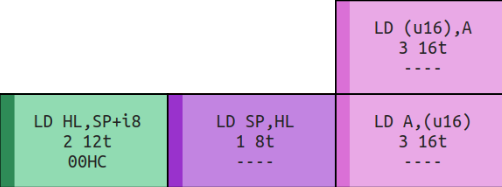

# VII. Load Instructions

[*Return to Index*](../README.md)

[*Previous Chapter*](06-increment-decrement.md)

Load instructions are abbreviated as `LD` and they always have two inputs, the destination on the left and the source on the right. The word "load" here is a synonym with "copy", so while the original value in the destination register is overwritten, the value in the source is left alone. You'll sometimes see me using the word "store" instead of load. This is fundamentally the same operation, it's just English semantics to whether we're copying into or out of the register in question, such as storing *to* RAM or loading *from* RAM.

There are *a lot* of different load instructions. The simplest are the ones that make up four entire rows from 0x40 through 0x7F (with the exception of 0x76). These all load a value from one 8-bit register to another, without changing any flags. The large number of possible register pairings requires there to be many different operations in total. Fortunately, this means that we can encompass this entire block with a single helper function.


The 0x40 through 0x7F block of instructions, which handles loads.

Like the Increment/Decrement instructions before, there are some different load instructions that make up the first four elements of some columns. The columns beginning with 0x02 and 0x0A load values pointed to by 16-bit register into 8-bit registers (and vice versa), sometimes modifying their address register via `(HL+)`, as described above.


The top four instructions of the 0x2 and 0xA columns.

The two columns of 0x01 and 0x0E do something we haven't seen before, which is to use "immediate" values. Rather than load a value to or from a register, these fetch the next 8-bit or 16-bit value from RAM and load that into the corresponding register. I use the term "fetch" in the same sense we implemented it the `fetch` function; reading the data pointed to by the PC, and incrementing it after. For the 16-bit loads, that means fetching twice and combining the two bytes into a single value (via `fetch_u16`).


The top four instructions of the 0x1 and 0xE columns.

There is a final lone load instruction near the top of the chart, 0x08 `LD (u16), SP`. This instruction has several steps, fetching the next 16-bit value from the PC, treating that as a RAM memory address, and storing the value into the SP register (which, don't forget, is a 16-bit value).


Opcode 0x08 - `LD (u16), CP`

In the bottom quarter of the opcode table, there are a few more load instructions. 0xE0, 0xF0, 0xE2, and 0xF2 all grab an 8-bit value; either by fetching or from the value stored in the C register, add 0xFF00 to it to get a new memory address, then either load or store it into the A register.


Opcodes 0xE0, 0xF0, 0xE2, and 0xF2

Finally, there are four remaining `LD`'s. 0xEA and 0xFA do something similar to 0x08 did above, where it fetched a 16-bit value and read or stores a value from A into it, rather than SP. 0xF9 simply copies the value from the HL register into SP, and 0xF8 does something similar, but fetches a value, adds that to SP, then stores it into HL.



The last load instructions - 0xF8, 0xF9, 0xEA, and 0xFA

Loading is a very important operation, and over one fourth of all instructions are devoted to it. Many of them share common behavior, but as you have seen, many will require their own unique approach. Rather than have many niche helper functions, we're not going to have any. Try not to panic, as the reason isn't that there is no common behavior between instructions, but that the common behavior is already covered by some of our functions. Recall what most of the load instructions have in common. For one, only one of them modifies any flags, which simplifies things quite a bit. Secondly, with only a few exceptions all of them take a value and store it into a register. We already have functions that do that (`set_r8` and `set_r16`). These will be our helper functions, and it will be the job of whoever calls them to acquire the values they need to store.

## 8-bit Load Instructions

Let's look at some examples. The majority of the load instructions are between two 8-bit registers, such as 0x41 `LD B, C`. Recall that when loading, the source register is on the right, and the destination is on the left. So to implement this instruction, we need to get the value out of the C register, and store it into B.

```rust
// In cpu/opcodes.rs

// LD B, C
// ----
fn ld_41(cpu: &mut Cpu) -> u8 {
    let val = cpu.get_r8(Regs::C);
    cpu.set_r8(Regs::B, val);
    1
}
```

One interesting quirk is that there are a number of instructions where nothing has to happen, where the source and destination registers are the same. These functionally are the same as a `NOP`. 0x40 `LD B, B` is one such example.

```rust
// In cpu/opcodes.rs

// LD B, B
// ----
fn ld_40(_cpu: &mut Cpu) -> u8 {
    // Don't need to copy a value from a register to itself, do nothing
    1
}
```

Several of these instructions would only copy a value to itself and can be ignored. This isn't an oversight or a typo, it's a side effect of how the opcodes are laid out. I've drawn attention on several occasions to the intentional patterns in the rows and columns of the opcode table. The first part of the 0x40 row is for copying values into register B, and that portion of the 0x00 column copies values out of register B, so when the two patterns intersect, you copy from B to B. The designers could've replaced this instruction with something more useful (as they did with 0x76, `HALT`), but elected to keep the pattern intact. This just means less work for us and our emulator.


An example of the opcode register pattern. Columns are the source register while rows are the destination.

Moving on, the instructions that use immediate values look very similar to the basic pattern, such as with 0x1E `LD E, u8`.

```rust
// In cpu/opcodes.rs

// LD E, u8
// ----
fn ld_1e(cpu: &mut Cpu) -> u8 {
    let val = cpu.fetch();
    cpu.set_r8(Regs::E, val);
    2
}
```

Rather than reading the value from a register, the value is read from RAM via the `fetch` function. Notice that this instruction will take two cycles to complete rather than one, thus it returns a different value.

## 16-bit Loads

Next, the 16-bit load instructions. 0x01 `LD BC, u16` requires us to fetch a 16-bit value, rather than an 8-bit, which we can accomplish easier by using our `fetch_u16` helper.

```rust
// In cpu/opcodes.rs

// LD BC, u16
// ----
fn ld_01(cpu: &mut Cpu) -> u8 {
    let val = cpu.fetch_u16();
    cpu.set_r16(Regs16::BC, val);
    3
}
```

Special care must also be taken when writing a 16-bit value to RAM, such as with 0x08 `LD (u16), SP`. SP is a 16-bit value, but our `write_ram` function only accepts `u8` values -- which makes sense, as each RAM address stores an 8-bit value. To accomplish this, we actually will split the 16-bit SP value into two bytes, storing the low byte at the address and the high byte at one address higher (due to our CPU being little endian).

```rust
// In cpu/opcodes.rs

// LD (u16), SP
// ----
fn ld_08(cpu: &mut Cpu) -> u8 {
    let addr = cpu.fetch_u16();
    let val = cpu.get_r16(Regs16::SP);
    cpu.write_ram(addr, val.low_byte());
    cpu.write_ram(addr + 1, val.high_byte());
    5
}
```

In addition to the immediate 16-bit loads, there are some 16-bit instructions that not only save their value to a RAM address, but also increment the address when they're done, such as 0x2A `LD A, (HL+)`.

```rust
// In cpu/opcodes.rs

// LD A, (HL+)
// ----
fn ld_2a(cpu: &mut Cpu) -> u8 {
    let addr = cpu.get_r16(Regs16::HL);
    let val = cpu.read_ram(addr);
    cpu.set_r8(Regs::A, val);
    cpu.set_r16(Regs16::HL, addr.wrapping_add(1));
    2
}
```

This instruction has two important things to note. Firstly that we don't increment the value in HL until *after* we use it as a RAM address, and secondly that Rust doesn't allow for overflow, so we need to use the special `wrapping_add` function which will not panic if an overflow occurs.

The last types of load instruction I'm going to cover are the ones that fetch a value and use that as an offset from a RAM address, such as 0xE0 `LD (FF00+u8), A`. This one looks complicated at first, but it's actually not too different from what we've done already. It adds the value we `fetch` to 0xFF00, then stores the value from the A register into that memory address.

```rust
// In cpu/opcodes.rs

// LD (FF00+u8), A
// ----
fn ld_e0(cpu: &mut Cpu) -> u8 {
    let offset = cpu.fetch() as u16;
    let addr = 0xFF00 + offset;
    let val = cpu.get_r8(Regs::A);
    cpu.write_ram(addr, val);
    2
}
```

Finally there's 0xF8, `LD HL, SP+i8`. This one is pretty similar to the previous one we covered, with one notable difference. The value we fetch needs to be treated as a signed byte, rather than unsigned. This is signified in the opcode table with `i8` rather than `u8`, which coincidentally is the same nomenclature Rust uses. There is a trick to properly casting the value to be an `i8`, because it also needs to be cast to a `u16` before Rust will allow it to be added to SP's value. Also take note, this is the one load instruction that modifies flags.

```rust
// In cpu/opcodes.rs

// LD HL, SP+i8
// 00HC
fn ld_f8(cpu: &mut Cpu) -> u8 {
    let offset = cpu.fetch() as i8 as i16 as u16;
    let sp = cpu.get_r16(Regs16::SP);
    let set_c = check_c_carry_u8(sp.low_byte(), offset.low_byte());
    let set_h = check_h_carry_u8(sp.low_byte(), offset.low_byte());

    cpu.set_r16(Regs16::HL, offset.wrapping_add(sp));
    cpu.set_flag(Flags::Z, false);
    cpu.set_flag(Flags::N, false);
    cpu.set_flag(Flags::C, set_c);
    cpu.set_flag(Flags::H, set_h);
    3
}
```

These examples should cover the range of different load instructions that you'll encounter, and I'll leave the rest of the implementation up to the reader. Altogether, to complete this chapter you should ensure that all the `LD` opcodes in the table are completed. Once you're finished, the updated `OPCODES` array should look something like this.

```rust
const OPCODES: [fn(&mut Cpu) -> u8; 256] = [
//  0x00,   0x01,  0x02,   0x03,  0x04,   0x05,   0x06,  0x07,  0x08,  0x09,  0x0A,  0x0B,   0x0C,   0x0D,   0x0E,  0x0F
    nop_00, ld_01, ld_02, inc_03, inc_04, dec_05, ld_06, todo,  ld_08, todo,  ld_0a, dec_0b, inc_0c, dec_0d, ld_0e, todo,  // 0x00
    todo,   ld_11, ld_12, inc_13, inc_14, dec_15, ld_16, todo,  todo,  todo,  ld_1a, dec_1b, inc_1c, dec_1d, ld_1e, todo,  // 0x10
    todo,   ld_21, ld_22, inc_23, inc_24, dec_25, ld_26, todo,  todo,  todo,  ld_2a, dec_2b, inc_2c, dec_2d, ld_2e, todo,  // 0x20
    todo,   ld_31, ld_32, inc_33, inc_34, dec_35, ld_36, todo,  todo,  todo,  ld_3a, dec_3b, inc_3c, dec_3d, ld_3e, todo,  // 0x30
    ld_40,  ld_41, ld_42, ld_43,  ld_44,  ld_45,  ld_46, ld_47, ld_48, ld_49, ld_4a, ld_4b,  ld_4c,  ld_4d,  ld_4e, ld_4f, // 0x40
    ld_50,  ld_51, ld_52, ld_53,  ld_54,  ld_55,  ld_56, ld_57, ld_58, ld_59, ld_5a, ld_5b,  ld_5c,  ld_5d,  ld_5e, ld_5f, // 0x50
    ld_60,  ld_61, ld_62, ld_63,  ld_64,  ld_65,  ld_66, ld_67, ld_68, ld_69, ld_6a, ld_6b,  ld_6c,  ld_6d,  ld_6e, ld_6f, // 0x60
    ld_70,  ld_71, ld_72, ld_73,  ld_74,  ld_75,  todo,  ld_77, ld_78, ld_79, ld_7a, ld_7b,  ld_7c,  ld_7d,  ld_7e, ld_7f, // 0x70
    todo,   todo,  todo,  todo,   todo,   todo,   todo,  todo,  todo,  todo,  todo,  todo,   todo,   todo,   todo,  todo,  // 0x80
    todo,   todo,  todo,  todo,   todo,   todo,   todo,  todo,  todo,  todo,  todo,  todo,   todo,   todo,   todo,  todo,  // 0x90
    todo,   todo,  todo,  todo,   todo,   todo,   todo,  todo,  todo,  todo,  todo,  todo,   todo,   todo,   todo,  todo,  // 0xA0
    todo,   todo,  todo,  todo,   todo,   todo,   todo,  todo,  todo,  todo,  todo,  todo,   todo,   todo,   todo,  todo,  // 0xB0
    todo,   todo,  todo,  todo,   todo,   todo,   todo,  todo,  todo,  todo,  todo,  todo,   todo,   todo,   todo,  todo,  // 0xC0
    todo,   todo,  todo,  todo,   todo,   todo,   todo,  todo,  todo,  todo,  todo,  todo,   todo,   todo,   todo,  todo,  // 0xD0
    ld_e0,  todo,  ld_e2, todo,   todo,   todo,   todo,  todo,  todo,  todo,  ld_ea, todo,   todo,   todo,   todo,  todo,  // 0xE0
    ld_f0,  todo,  ld_f2, todo,   todo,   todo,   todo,  todo,  ld_f8, ld_f9, ld_fa, todo,   todo,   todo,   todo,  todo,  // 0xF0
];
```

[*Next Chapter*](08-bitwise-instructions.md)
