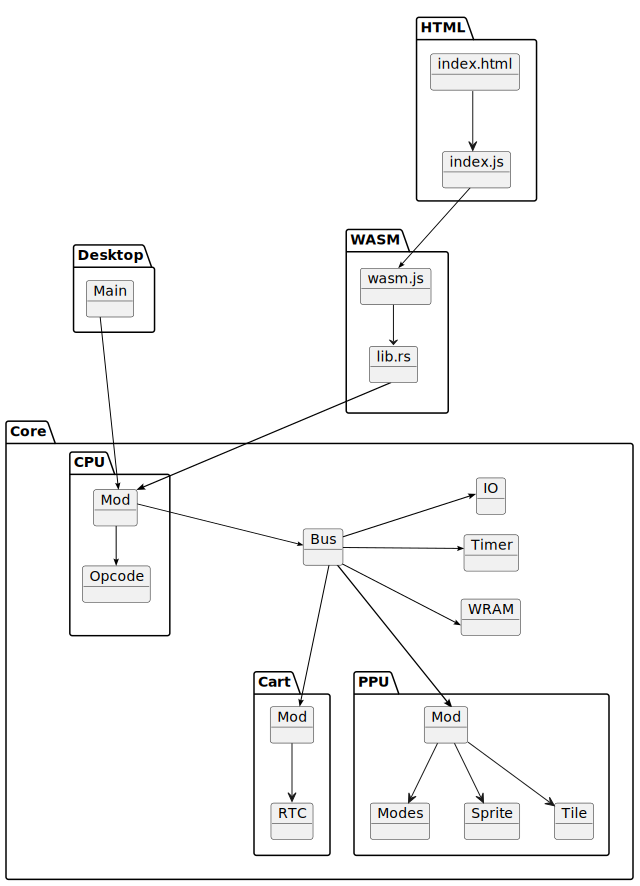

# XIII. Desktop Frontend Setup

[*Return to Index*](../README.md)

[*Previous Chapter*](12-memory-bus.md)

We've spent our entire time thus far working on the emulator `core`, setting up the CPU and now the initial memory bus. In order to use them, we need to turn our attention back to our frontends. They need the ability to read our game ROM file into the core, so that the emulation process has something to execute. If you recall, alongside the `core` we created two other modules -- `desktop` for our SDL-based desktop frontend, and `wasm` for our WebAssembly-based web frontend. This chapter we will set up the basic structure of `desktop`, including creating an empty window and reading in a file, then repeat the same steps in the next chapter for `wasm`.

Navigate to the `desktop` folder, and again open its `Cargo.toml` configuration file. We have already pointed the frontend to the `gb_core` backend module, but there is a 3rd party Rust library we will rely upon, the `sdl2` module. If you aren't familiar with SDL, it is a cross-platform video library which makes it easy to create a window and render graphics upon it (you will need to [install](https://wiki.libsdl.org/SDL2/Installation) the SDL library on your machine if you haven't yet). You likely have used SDL-based software many times in your life, as it is an incredibly widely used library. We will use it here to display our window, render our game, and handle keyboard inputs, with no changes required to run the software on different operating systems. More advanced UI, like having a file selector window, or menu options, won't be covered by this tutorial; our final emulator will display the game and nothing else.

Inside of `Cargo.toml`, add an entry for the `sdl2` package, which at the time of writing is on version 0.36.0 (check https://crates.io/crates/sdl2 for the most recent library version during your time<sup>1</sup>). This package provides the interface between our Rust code and the SDL library, which is written in C. If you're interested, writing your own SDL wrapper is a good example to learn how interoperability between programming languages works, but we'll save that as an exercise for another time and use the standardized implementation.

```toml
# In desktop/Cargo.toml

[dependencies]
gb_core = { path = "../core" }
sdl2 = "0.36.0"
```

We can now access the `sdl2` crate inside our `desktop` project. Our frontend is going to be rather simplistic, and entirely live inside of `src/main.rs`. Feel free to delete the pre-generated code so that we have only an empty `main()` function to work with.

<sup>1</sup>It took me so long to finish this tutorial that SDL3 finally came out... We'll continue with SDL2.

## SDL Window Basics

Let's quickly review the roles that `desktop` and `core` will each serve, and what information will need to cross between them. The `desktop` frontend (and the `wasm` frontend as well) will create a window to draw upon, listen for keyboard presses, and be the creator of our `core` backend, which for our architectural design will be the creation of the `Cpu` object. Between the front and back ends, several pieces of information should flow. Any button presses or releases detected in the front should be sent back. The opened ROM file data needs to be sent to the backend for the game to start. Some data needs to flow the other way as well. We will eventually need to send screen data from the backend the front to be rendered.

Since we also have two frontends, it is also a goal of ours to keep as much in the `core` as we can, to avoid duplicating implementations. We'll begin defining some constants in the core which can be imported in `desktop`. Before we create our screen, we'll need to know how large it is, values we can save in our `core/src/utils.rs` file.

```rust
// In core/src/utils.rs

// Unchanged code omitted

const pub SCREEN_WIDTH: usize = 160;
const pub SCREEN_HEIGHT: usize = 144;
```

If you recall from the initial Game Boy specifications discussion, a Game Boy screen is 160 pixels tall by 144 pixels wide. Since both `wasm` and `desktop` will need to know this, we'll store it as a common constant in our utility file.

Back in `desktop/src/main.rs`, we'll read these values in. If you're familiar with even the basics of computer graphics, you'll note that 160x144 is an *incredibly* small resolution, especially these days. My current monitor is a standard HD resolution, 1920x1080, which is a very common resolution these days. 160x144 is comically small on that sort of monitor, so we'll scale it up to be easier to play on. Personally, I think a scale factor of 3x is pretty reasonable, meaning that every pixel on an original Game Boy screen will be displayed as a 3x3 block of pixels on our monitors. You're welcome to modify this value to your taste, or even create some sort of customizable feature for the user, although we won't cover that here.

```rust
// In desktop/src/mod.rs

use gb_core::utils::{SCREEN_HEIGHT, SCREEN_WIDTH};

const SCALE: u32 = 3;
const WINDOW_WIDTH: u32 = (SCREEN_WIDTH as u32) * SCALE;
const WINDOW_HEIGHT: u32 = (SCREEN_HEIGHT as u32) * SCALE;
```

In addition to creating the `WINDOW_WIDTH` and `WINDOW_HEIGHT` variables, which is what we will use when we create our program window, I also set them as `u32` values, as this is the preferred datatype of the SDL library. Speaking of which, let's begin by adding in the SDL boilerplate code to display a window.

```rust
// In desktop/src/mod.rs

// Unchanged code omitted

fn main() {
    let sdl_context = sdl2::init().unwrap();
    let video_subsystem = sdl_context.video().unwrap();
    let window = video_subsystem.window("My Game Boy Emulator", WINDOW_WIDTH, WINDOW_HEIGHT)
        .position_centered().opengl().build().unwrap();
    let mut canvas = window.into_canvas().present_vsync().build().unwrap();
    canvas.clear();
    canvas.present();
}
```

This section of code first initializes the SDL2 library, saving it in the `sdl_context` variable. We then grab access to the video functionality and use it to create a new desktop window using the width and height we defined earlier, as well as giving it a cheesy name (feel free to change that text to whatever you like). As part of the construction, it's also set to be centered on the user's desktop window, which is a nice touch. We then grab the `canvas` of our new window, which will be the surface that the game is rendered upon. The `canvas` has a number of helpful functions to draw shapes and textures, but for now we will simply clear it. Go ahead and compile and run this code with the `cargo run` command (make sure you're in the `desktop` directory first) and assuming there are no mistakes you'll notice an application window appear... and quickly disappear. We created an SDL window, but once the `main` function concludes it is destroyed as the program ends. We can solve this by creating an infinite loop following the initialization of the SDL window, which will become the basis of our gameplay loop. Note that the code we have now needs to only run once, and should go *before* the loop begins.

```rust
// In desktop/src/mod.rs

// Unchanged code omitted

fn main() {
    let sdl_context = sdl2::init().unwrap();
    let video_subsystem = sdl_context.video().unwrap();
    let window = video_subsystem.window("My Game Boy Emulator", WINDOW_WIDTH, WINDOW_HEIGHT)
        .position_centered().opengl().build().unwrap();
    let mut canvas = window.into_canvas().present_vsync().build().unwrap();
    canvas.clear();
    canvas.present();

    loop {}
}
```

When you run it again you should notice three things. Firstly, our window remains visible! It should have the title you specified at the top, and should be an appropriate size; feel free to edit the `SCALE` variable if you dislike how it looks so far. Secondly, this program will eat up a lot of CPU usage. It should in fact max out an entire CPU core (beware if you're doing this on a single core CPU). This is because our infinite loop never sleeps, it just runs as quickly as it can forever. We'll address that in a moment. Thirdly, you'll notice that clicking the X to close the window doesn't do anything. You will need to cancel the program via Control + C on the command line (or kill your terminal program completely) to end it. This definitely won't do. Let's have the window correctly listen for the close signal to end, and while we're at it, let's add a keyboard shortcut to quit the emulator as well.

```rust
// In desktop/src/mod.rs

use sdl2::event::Event;
use sdl2::keyboard::Keycode;

// Unchanged code omitted

fn main() {
    let sdl_context = sdl2::init().unwrap();
    let video_subsystem = sdl_context.video().unwrap();
    let window = video_subsystem.window("My Game Boy Emulator", WINDOW_WIDTH, WINDOW_HEIGHT)
        .position_centered().opengl().build().unwrap();
    let mut canvas = window.into_canvas().present_vsync().build().unwrap();
    canvas.clear();
    canvas.present();

    let mut events = sdl_context.event_pump().unwrap();
    'gameloop: loop {
        for event in events.poll_iter() {
            match event {
                Event::Quit{..} |
                Event::KeyDown{keycode: Some(Keycode::Escape), ..} => {
                    break 'gameloop;
                },
                _ => {}
            }
        }
    }
}
```

This new code utilizes the SDL "event pump", which maintains a list of events that happen to the window. Each iteration of the loop, we cycle through those events, breaking the main infinite gameplay loop if we detect a "Quit" event (which occurs if the close window X button was clicked) or if the Escape key was pressed. Run the program again, and you should see that both of these actions do in fact close the application window. If you prefer a different key to close the window, feel free to change it. A complete list of SDL keycode values can be found [here](https://rust-sdl2.github.io/rust-sdl2/sdl2/keyboard/enum.Keycode.html)

This has not fixed the 100% CPU utilization however. Once we start actually running the emulator, we'll deal with the timings of things, but for now let's add a temporary `sleep` statement, just so we aren't spinning up all the fans each time we need to run a test. We'll use a 100 ms sleep time, which will reduce the CPU usage levels dramatically.

```rust
// In desktop/src/mod.rs

use sdl2::event::Event;
use sdl2::keyboard::Keycode;

use std::thread::sleep;
use std::time::Duration;

// Unchanged code omitted

fn main() {
    let sdl_context = sdl2::init().unwrap();
    let video_subsystem = sdl_context.video().unwrap();
    let window = video_subsystem.window("My Game Boy Emulator", WINDOW_WIDTH, WINDOW_HEIGHT)
        .position_centered().opengl().build().unwrap();
    let mut canvas = window.into_canvas().present_vsync().build().unwrap();
    canvas.clear();
    canvas.present();

    let mut events = sdl_context.event_pump().unwrap();
    'gameloop: loop {
        for event in events.poll_iter() {
            match event {
                Event::Quit{..} |
                Event::KeyDown{keycode: Some(Keycode::Escape), ..} => {
                    break 'gameloop;
                },
                _ => {}
            }
        }

        sleep(Duration::from_millis(100));
    }
}
```

## Reading in a File

With the basic SDL window creation finished, let's complete the task we came here to achieve -- opening and reading in our game ROM file. As I mentioned, we're not going to be dealing with any GUI file manager dialogues for this project (although we will for the web frontend). Instead, we'll get the ROM location as a command line parameter. In our `main` function, prior to initializing SDL, we will check if the user has specified any other parameters. There is no need to bother spinning up the window if they didn't even provide us with a game; instead we'll provide them with an error message and quit early.

```rust
// In desktop/src/main.rs

// Unchanged code omitted

use std::env;

fn main() {
    let args: Vec<_> = env::args().collect();
    if args.len() == 1 {
        println!("Please specify a ROM location: cargo run path/to/game");
        return;
    }

    // Proceed to set up SDL, etc.
}
```

We'll explicitly be expecting a single input parameter, and if we don't get exactly one, give them an error and bail (you might want to phrase it using a more Windows-looking path, if you prefer). Assuming we're still going, next the program needs to access the input parameter and attempt to open it as a file. If that too succeeds, read the data in. We'll create a separate function to handle this, which `main` can then call.

```rust
// In desktop/src/main.rs

// Unchanged code omitted

use std::env;
use std::fs::File;
use std::io::Read;

fn main() {
    let args: Vec<_> = env::args().collect();
    if args.len() == 1 {
        println!("Please specify a ROM location: cargo run path/to/game");
        return;
    }

    let filename = &args[1];
    let rom = load_rom(filename);

    // Proceed to set up SDL, etc.
}

fn load_rom(path: &str) -> Vec<u8> {
    let mut buffer: Vec<u8> = Vec::new();

    let mut f = File::open(path).expect("Error opening ROM file");
    f.read_to_end(&mut buffer).expect("Error loading ROM");
    buffer
}
```

The final step then is to take the buffer of ROM data we've just read in and pass into... where exactly? We'll need to create a function inside of `core` that will accept ROM data and move it to the proper location. Our emulator's architecture is to have the `Cpu` object as the top level of the `core`, so we will need to expose some API there to read in a file. This new `load_rom` function kicks the can of actually loading the game down to the `Bus`, where RAM currently lives. The `unimplemented!` macro is there to ensure the program actually compiles for now. We'll implement `Bus::load_rom` shortly, but for now we need a placeholder API for our frontend to utilize. We can now complete the final step in our `desktop` frontend, creating the CPU object and passing in our read ROM data.



Emulator inheritance diagram

```rust
// In core/src/cpu/mod.rs

impl Cpu {
    // Unchanged code omitted

    pub fn load_rom(&mut self, rom: &[u8]) {
        unimplemented!();
        // self.bus.load_rom(rom);
    }
}
```

Our Game Boy has dealt exclusively in bytes, and thus is expecting the game ROM to be loaded and provided as a sequence of bytes as well. We'll attempt to read the given file in its entirety into a `Vec<u8>`. Notice that we don't do any error checking here; if the user gives us a valid file, we'll read it, Game Boy ROM or not. Unfortunately, there's not really any good way to detect if a file is a Game Boy ROM or not. You could try looking at the file extensions or part of the header (more on that later), but in order to keep things simple, we're going to trust our users, and if they want to try and play a Word document than we will let them.

```rust
// In desktop/src/main.rs

// Unchanged code omitted

use gb_core::cpu::Cpu;

fn main() {
    let args: Vec<_> = env::args().collect();
    if args.len() == 1 {
        println!("Please specify a ROM location: cargo run path/to/game");
        return;
    }

    let mut gb = Cpu::new();
    let filename = &args[1];
    let rom = load_rom(filename);
    gb.load_rom(&rom);

    // Proceed to set up SDL, etc.
}

fn load_rom(path: &str) -> Vec<u8> {
    let mut buffer: Vec<u8> = Vec::new();

    let mut f = File::open(path).expect("Error opening ROM file");
    f.read_to_end(&mut buffer).expect("Error loading ROM");
    buffer
}
```

Next, we're going to perform these exact same steps -- creating a window, reading in a file and passing to the `core` -- for our WebAssembly `wasm` frontend.

[*Next Chapter*](14-wasm-setup.md)
