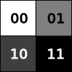
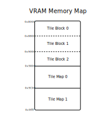
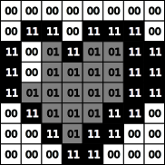
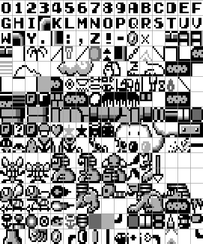
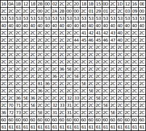
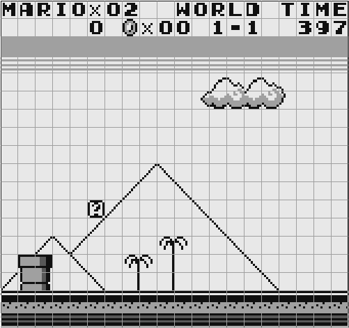

# XVI. Video Introduction

[*Return to Index*](../README.md)

[*Previous Chapter*](15-cartridge-rom.md)

While creating the CPU was (relatively) simple conceptually but tedious to implement, the Pixel Processing Unit (PPU) is the opposite -- not too tricky to program once you understand it, but contains more fine detail to grasp and sift through. We'll begin with a high-level introduction. The PPU is a component of the Game Boy that focuses on its own sections of memory. This includes not only the color data for each pixel, but also information about larger building blocks such as the tiles used in the backgrounds or information about sprites.

## Pixels

When we discussed the CPU, we mentioned that at its core, all it does is perform math via its opcodes. All of the functionality of the CPU can be broken down into parsing and operating upon opcodes. For the video display, it's core goal is to display pixels. The screen and its accompanying circuitry constructs a series of images of 160 pixels wide by 144 pixels tall. On an original Game Boy, these pixels can be one of four colors -- white, light gray, dark gray, or black.

The pixels in a typical modern display are capable of millions of possible colors each. To encode each possible color, you'll often see each shade stored in terms of its red, green, and blue components. The more possible pixel colors you wish to express, the larger the possible RGB values need to be. It's common today to store colors as 24-bit values, giving one byte to each of the RGB components. For our Game Boy's screen though, where each pixel can only display a whopping four options, requiring 24 bits for every pixel is not only wasteful, but also doesn't really make sense. Instead, we can use an "indexing" system, where we simply number all of the possible color combinations, then assign each pixel an index. For the Game Boy, the typical enumeration is that white is 0, light gray is 1, dark gray is 2, and black is 3. With four total combinations, this can be stored as two bits per pixel (bpp), rather than the 24 bits needed for full color.

2-bit color. The original Game Boy was more four shades of sickly green, rather than gray, but the same idea applies.

## VRAM

Let's take another look at our Game Boy memory map.

So far, we've only really touched upon the first half of the available RAM space, which we implemented in the previous chapter. Following the cartridge RAM space comes VRAM -- short for "Video RAM" -- which spans from 0x8000 to 0x9FFF. This is the special section of RAM where the graphics are stored. VRAM works almost like a "staging area" for the graphics. The graphical data is laid out there by the CPU, and then the PPU takes that data and uses it to construct the frame to be shown on screen. To ensure this hand-off from CPU to PPU works as expected, the VRAM is broken up into smaller specified areas, which the developer must adhere to, if they hope for their game to look correct.

The VRAM Memory Map

Actually writing to VRAM is nothing special; the CPU can write data to it the same as any other section of RAM. It's the job of the game developer to ensure that they've built up the graphics in the correct way, and they have complete leeway to do so. Inside the game's ROM, they can store everything in a nice table, use compression, generate images randomly, whatever they want. From the perspective of the emulator developer, that's not our concern at all. We will follow the CPU's instructions to move data to and from VRAM, and our PPU will use those VRAM values to create video images.

## Tiles and Sprites

With the purpose of the VRAM established, we now need to examine how it is structured. As we said, VRAM occupies the memory space from 0x8000 to 0x9FFF, a total of 8 KiB of memory. We also said that the Game Boy screen measures 160 by 144 pixels, or 23,040 pixels in total. If each pixel color only takes two bits to store, then that means we would need 5670 bytes to store a frame's worth of pixel data. Perfect, we have plenty left over!
Alas, the Game Boy does not simply save a "framebuffer" of pixel data in this fashion, as it is inefficient for several reasons. Firstly, many games have a lot of repeated sections displayed on screen. Rather than waste data saying the sky is mostly white, it would be helpful to reuse the same graphic many times, almost like copy and pasting. Secondly, anytime we need to update the screen, such as when the player moves, we would have to track what pixels should display the player, what should display the background, or we'd have to recopy an entire frame's worth of data. While modern hardware is capable of these strategies, the Game Boy was not. Fortunately, the designers of the system had a clever solution.

The pixel indices of a tile

In order to decrease RAM usage and increase asset reuse, the Game Boy uses "tiles", a small image of 8 pixels by 8 pixels. Since each pixel requires two bits each, an entire sprite requires just 16 bytes in total. You've probably seen pixel artists use this exact size when creating 8-bit inspired artwork, but a tile's true usefulness is implied by its name -- they tile together. You'll also see the word "sprite" often used for these graphics. A Game Boy uses both tiles and sprites, and while they are very similar (and even share the same pixel data), the difference between them is tiles must tile together with no overlaps, while sprites are free to be placed anywhere on screen. We'll focus on tiles now and come back to how sprites operate in a later chapter.

The Game Boy again utilizes the indexing technique when its constructing the screen, using a system referred to as a "tile map". 160x144 is 20 tiles wide by 18 tiles tall, so rather than every pixel's color information, we can instead just keep track of which tile should be displayed at each position, like a jigsaw puzzle. By keeping indices of tiles, we can also reuse them easily. For example, it's very common to play Game Boy games where the background is mostly white. Rather than storing all that white pixel data, the developer can simply define a single tile of all white pixels, then reuse that same tile in as many places as they need, with no additional overhead.

The following images are an example taken from the first level of *Super Mario Land*. The first image shows some of the tiles that are loaded into VRAM. They contain pixel information for most of the letters and numbers, as well as the level design elements like background clouds and pipes. These sprites are each given an index value, from 0 to 255.

The background is comprised of a collection of "tiles", which may be reused

The second image is the map. The map is a grid of 20 indices by 18 which specifies which tile should be loaded in each position. If you lean away from your screen, you might be able to discern the outline of a pattern just by looking at the map. Most of the background is the 0x2C tile, with the bottom having solid rows for the ground, the top comprised of the HUD information, and a few differences in the middle, such as some sort of triangle pattern.

The "map" specifies which tile should be loaded where

The third image is the combination of the tiles into the map to construct the background of the frame. Each of the tiles were "pasted in" one by one, completing the puzzle. Hopefully you can see how this method, if a bit complicated, can save a lot of memory space. As we said before, saving color data for every pixel would require 5670 bytes. With this method, we only 4096 bytes for the tiles (256 tiles at 16 bytes each) and just 360 bytes for the entire map. This is just over half of the available VRAM space, enough for us to do some neat things with the rest... but we'll come to that in a moment.

The tiles and map are combined together to create the layer that the player sees

There are some limitations to tiles. First, the tiles must precisely line up side-by-side and can't overlap. This is useful for displaying a background, but prevents us from moving a character freely. The Game Boy also has a finite limit to how many tiles can be defined at once, which results in many Game Boy games obviously reusing assets in the background. The tile map also does not support transparency. This might sound like it isn't needed, since the tiles aren't allowed to overlap each other anyway, but it can cause some odd effects. As a child playing *Pokemon Red*, I noticed that the ground behind the slanted roofs of many buildings didn't quite match the surrounding ground texture. The developers only made a single slanted roof tile, which as part of its 8x8 space would also show some of the ground behind it. If they used a different ground texture adjacent to it, there would be a stark contrast.

## Layers

If Game Boy developers were limited to only using non-overlapping tiles, it would greatly limit the sorts of games they could create. Mario needs to be able to run to any position he wants. Fortunately, there are mechanisms to support this. The tile map is just one of three "layers" that the Game Boy uses to construct a frame image, much like how modern image editing software like *Photoshop* supports layers. What we've been describing here is the foundations for the back-most layer, called the "Background Layer". Remember how we had extra VRAM space to use? Well, the background layer is actually larger than the 20x18 visible tiles, and extends off-screen.

Above it is the "Window Layer", which uses the same tiles as the background layer but has some limitations on how it can be displayed. It can almost be thought of a second background layer that is rendered on top of the first, and it is often used to create UI boxes or menus, among other effects.

Above that is the "Sprite Layer". This is the layer that allows for free range of movement of its "sprites" which again are very similar in structure to tiles, but have some additional freedoms. There is a special section in memory known as the "Object Attribute Memory" (OAM, sometimes called the "Sprite Attribute Table"), which keeps track of the extra data needed for each of the different sprites. This includes the sprite's position on screen, which graphics correspond to them, and if they're flipped vertically or horizontally. Just like the background tiles, sprites are also indexed to use one of the pre-defined pixel images, but they can be placed anywhere on the screen and support transparency. There are limitations to how many sprites can be displayed, both in total due to memory size constraints but also a hard limit to how many can be shown on each horizontal line of the display.

## OAM and I/O Registers

Speaking of the OAM... where is it? All of VRAM is broken up into only two sections, the tile data and tile map, so where is the sprite data stored? It turns out that there are other blocks of RAM utilized by the PPU aside from just VRAM. The first is the OAM from 0xFE00-0xFE9F. This is 160 bytes of space, and it is broken up into four bytes of data for 40 different sprites. We'll discuss its structure in more detail later, but it includes a byte each for the sprite's X and Y position, a byte for the tile index, and a byte for miscellaneous flags.

Besides the OAM, the PPU also relies on several addresses in the I/O space. While this range of memory includes information about the currently pressed buttons and audio output, it also has some of the "control registers" for the PPU. The use of the term "register" is a little confusing, given how closely we've associated it with the CPU, but here the term is just referring to an address in RAM which controls PPU behavior. There are several bytes here used for configuration information, such as whether the screen is even rendering, the positions of the different layers, the palette, etc.

There's a lot of fine detail in creating a single frame of a Game Boy game, but this should be enough to get us started. The VRAM stores the tile pixel data as well as how they are arranged on the different layers. Elsewhere is the OAM, which contains additional data for the sprites. When it's time to render a frame, the PPU combines the three layers one on top of the other, in addition to information from the control registers, and sends that to the screen to be displayed to the player. This process repeats 60 times per second continuously while the game is running.

[*Next Chapter*](17-tiles.html)
