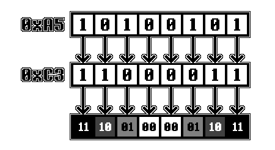

# Chapter XVII - Pixels and Tiles

[*Return to Index*](../README.md)

[*Previous Chapter*](16-video-introduction.md)

While many of the PPU processes remain a mystery to us so far, we can begin some of the implementation. Similarly to how we gave a portion of bus's RAM duties to the `Cart` module, we'll again break off part of the `Bus` RAM array to now live within a new `PPU` module.

First, we need to create it. Add a new directory called `ppu` with a `mod.rs` file inside of it. Then open up `lib.rs` and define this new module.

```rust
// In lib.rs

pub mod bus;
pub mod cart;
pub mod cpu;
pub mod ppu;
pub mod utils;
```

We'll do the same thing we did when creating `Cart`. We'll add constants for the VRAM address range inside of `ppu/mod.rs`, then adjust the Bus `read_ram` and `write_ram` functions to forward any memory access in that range to the PPU. We'll also create a `Ppu` struct with a few placeholder functions for `Bus` to use -- the constructor and VRAM access functions.

```rust
// In ppu/mod.rs

pub const VRAM_START: u16   = 0x8000;
pub const VRAM_STOP: u16    = 0x9FFF;

pub struct Ppu {
}

impl Ppu {
    pub fn new() -> Self {
        Self {}
    }

    pub fn read_vram(&self, addr: u16) -> u8 {
        todo!();
    }

    pub fn write_vram(&mut self, addr: u16, val: u8) {
        todo!();
    }
}
```

Bus will now lose 8 KiB worth of space it its `ram` array, which instead will be forwarded to our `read_vram` and `write_vram` functions. Note also that the offset value also needs to be changed, since the memory address corresponding to the front of the `ram` array has moved.


```rust
// In bus.rs

use crate::ppu::{Ppu, VRAM_START, VRAM_STOP};

// Unchanged Code omitted

pub struct Bus {
    rom: Cart,
    ppu: Ppu,
    ram: [u8; 0x6000],
}

impl Bus {
    pub fn read_ram(&self, addr: u16) -> u8 {
        match addr {
            ROM_START..=ROM_STOP => {
                self.rom.read_cart(addr)
            },
            VRAM_START..=VRAM_STOP => {
                self.ppu.read_vram(addr)
            },
            _ => {
                let offset = addr - VRAM_STOP - 1;
                self.ram[offset as usize]
            }
        }
    }

    pub fn write_ram(&mut self, addr: u16, val: u8) {
        match addr {
            ROM_START..=ROM_STOP => {
                self.rom.write_cart(addr, val);
            },
            VRAM_START..=VRAM_STOP => {
                self.ppu.write_vram(addr, val);
            },
            _ => {
                let offset = addr - VRAM_STOP - 1;
                self.ram[offset as usize] = val;
            }
        }
    }
}
```

We're done with `Bus` for now, so we can turn our attention to `ppu/mod.rs` and how to implement `read_vram` and `write_vram`. The fact this is even a question might seem odd to you. After all, these are not the first memory access functions we've written, let's just create an array inside of `Ppu` and use that. While this wouldn't be incorrect, due to the nature of the PPU I think it's more straight-forward to maintain higher level data structures, such as for our tile data. While the main memory map was broken into a number of different segments, VRAM only has two divisions -- 0x8000-0x97FF is for the tile data (the actual pixels values assigned to each tile) and 0x9800-0x9FFF is for the tile map (which tile index corresponds to which available spot on the background layer). Let's add constants for those and utilize them in our functions.

```rust
// In ppu/mod.rs

const TILE_SET_START: u16   = 0x8000;
const TILE_SET_STOP: u16    = 0x97FF;
const TILE_MAP_START: u16   = 0x9800;
const TILE_MAP_STOP: u16    = 0x9FFF;

impl Ppu {
    // Unchanged code omitted

    pub fn read_vram(&self, addr: u16) -> u8 {
        match addr {
            TILE_SET_START..=TILE_SET_STOP => {
                todo!();
            },
            TILE_MAP_START..=TILE_MAP_STOP => {
                todo!();
            },
            _ => { unreachable!() }
        }
    }

    pub fn write_vram(&mut self, addr: u16, val: u8) {
        match addr {
            TILE_SET_START..=TILE_SET_STOP => {
                todo!();
            },
            TILE_MAP_START..=TILE_MAP_STOP => {
                todo!();
            },
            _ => { unreachable!() }
        }
    }
}
```

Rust `match` statements require the entire `u16` space be accounted for. Since the Bus should have sent any other addresses to other places, none of those should have ended here. If they did, we should throw an `unreachable!()` error.

## Tile Data

Let's first deal with the tiles. The tile data portion of VRAM spans from 0x8000 to 0x97FF, which is 6144 bytes of data. As mentioned before, each tile is an 8x8 grid of pixels, which at 2 bbp comes out to 16 bytes per tile. In total, this results in there being enough space for 384 tiles worth of data. The tiles are nothing more than a block of pixel values, and that it's the offset from the start of the tile data VRAM start (address 0x8000) that determines which tile the memory address is targeting. While we could treat each tile as an array of 16 bytes, we'll instead unpack the pixel values from the data and store them as an 8x8 array.

Let's create a new struct to hold our tile data, which will live in a new file at `ppu/tile.rs`. Create that file, and don't forget to define a new `mod tile` at the start of `ppu/mod.rs`.

```rust
// In ppu/mod.rs

mod tile;

// Unchanged code omitted
```

Inside of `ppu/tile.rs`, we will define a struct for a single tile, along with some functions to modify its data. Since these `Tile` objects will need to be plugged into the `read_vram` and `write_vram` functions, they will need to handle being given or being asked for a `u8` value. For a Tile, an entire 8-bit value is several pixels worth of data, so to implement these data modification functions, we'll need to do some unpacking. First, we'll add the general set up.

```rust
// In ppu/tile.rs

#[derive(Copy, Clone)]
pub struct Tile {
    pixels: [[u8; 8]; 8]
}

impl Tile {
    pub fn new() -> Self {
        Self {
            pixels: [[0; 8]; 8]
        }
    }

    pub fn read_u8(&self, offset: u16) -> u8 {
        todo!();
    }

    pub fn write_u8(&mut self, offset: u16, val: u8) {
        todo!();
    }
}
```

At two bits per pixel, a single byte could theoretically hold four pixels worth of data, with bits 0 and 1 being one pixel, bits 2 and 3 another, and so on. This would mean a single byte would equal half a row of pixels. That might make perfect sense, but it's not how the Game Boy pixel data is laid out. While a row of pixels does require two bytes, each pair of bits is broken up between the two bytes, with the least significant bit belonging to the first (or even) byte, and the most significant to the odd bytes. It's like taking two bytes and zipping them together bit by bit. This means that anytime a byte is written into tile memory, it updates half the bits of an entire row.



Each row of pixels is stored in two bytes, with all of the low bits in the first byte, and the high bits in the second.

[Source - GBEDG](https://hacktix.github.io/GBEDG/ppu/#pixel-data)

To make matters even worse, the bits are stored in the opposite direction as the pixels. The left most pixel corresponds to the least significant (right-most) bit, and vice versa. This means that when we're accessing the tile data, we'll have to modify the index to flip things around, or else every tile in the game would be mirrored left to right. It's a bit of an unintuitive system the first time you see it, but the implementation is pretty straight-forward.

```rust
// In ppu/tile.

impl Tile {
    // Unchanged code omitted

    pub fn read_u8(&self, offset: u16) -> u8 {
        if offset > 16 {
            panic!("Offset too large to fit in this tile");
        }
        let row = (offset / 2) as usize;
        let bit = (offset % 2) as u8;
        let mut ret = 0;
        for i in 0..8 {
            ret <<= 1;
            ret |= if self.pixels[row][7 - i].get_bit(bit) { 1 } else { 0 };
        }
        ret
    }

    pub fn write_u8(&mut self, offset: u16, val: u8) {
        if offset > 16 {
            panic!("Offset too large to fit in this tile");
        }
        let row = (offset / 2) as usize;
        let bit = (offset % 2) as u8;
        for i in 0..8 {
            self.pixels[row][7 - i].set_bit(bit, val.get_bit(i as u8))
        }
    }
}
```

These two functions are very similar, the difference being whether they are reading or writing from the `pixel` array. First we get what tile row we're targeting. At two bytes per row, we simply need to divide the offset by two. The remainder is which of the two bits for each pixel we want, with the even rows being the low pixel and the odd rows the high. We then need to iterate over each pixel in that row, fetching or writing the specified bit. Note the `7 - i` in the array access, this is what performs the left pixel to right bit pairing mentioned above.

Back in `ppu/mod.rs`, we'll first need to store all of our tiles, and then plug these memory access functions in.

```rust
// In ppu/mod.rs

use tile::Tile;

// Unchanged code omitted

const BYTES_PER_TILE: u16 = 16;
const NUM_TILES: usize    = 384;

pub struct Ppu {
    tiles: [Tile; NUM_TILES],
}

impl Ppu {
    pub fn new() -> Self {
        Self {
            tiles: [Tile::new(); NUM_TILES],
        }
    }
}
```

As mentioned before, the section of VRAM allotted for tile data can fit a total of 384 tiles, found by dividing the size of the tile set RAM region by the number of bytes per tile. We then populate the `tiles` entry in our struct, and we are now ready to modify our read and write functions.

```rust
// In ppu/mod.rs

impl Ppu {
    // Unchanged code omitted

    pub fn read_vram(&self, addr: u16) -> u8 {
        match addr {
            TILE_SET_START..=TILE_SET_STOP => {
                let relative_addr = addr - TILE_SET_START;
                let tile_idx = relative_addr / BYTES_PER_TILE;
                let offset = relative_addr % BYTES_PER_TILE;
                self.tiles[tile_idx as usize].read_u8(offset)
            },
            TILE_MAP_START..=TILE_MAP_STOP => {
                todo!();
            },
            _ => { unreachable!() }
        }
    }

    pub fn write_vram(&mut self, addr: u16, val: u8) {
        match addr {
            TILE_SET_START..=TILE_SET_STOP => {
                let relative_addr = addr - TILE_SET_START;
                let tile_idx = relative_addr / BYTES_PER_TILE;
                let offset = relative_addr % BYTES_PER_TILE;
                self.tiles[tile_idx as usize].write_u8(offset, val);
            },
            TILE_MAP_START..=TILE_MAP_STOP => {
                todo!();
            },
            _ => { unreachable!() }
        }
    }
}
```

Both read and write perform the same calculations, only calling a different function inside of the `Tile` object. Since the functions are given an absolute memory address, we first need to subtract the start of our block, then divide by the size of each tile in bytes, 16, which since it's `u16` division will round to the nearest whole value. These are the indices for the tiles, which we can use in our `tiles` array. We then need to get the remainder to know which section of pixels we're interested in. This is now enough to specify the exact `Tile` and pixels we want to access.

[*Next Chapter*](18-tile-maps.md)
