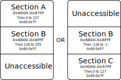

# Chapter XVIII. Tile Maps and Sets

[*Return to Index*](../README.md)

[*Previous Chapter*](17-tiles.md)

Picture trying to fill out a puzzle. This puzzle is 32 by 32 puzzle pieces in size. Each of the puzzle pieces are exactly the same square size and shape. The pieces could interchangeably fit anywhere, but we know how to fill out the puzzle because a number is written at each space on the board. On the back of all the puzzle pieces are written the matching numbers. By placing the correct pieces at their correct locations, we can construct the puzzle. While each puzzle piece has a unique number written on the back, the puzzle itself might reuse some numbers. That's okay, we have extra copies of puzzle pieces we can use if needed.

The designers of this puzzle were clever. They realized that they could reuse the puzzle boards but still create a whole new puzzle solution by just providing a different set of puzzle pieces. These pieces would plug into the board in a similar fashion to the first set, but since they have different designs on them, the resulting image would be totally different. Likewise, if the puzzle was designed very carefully, you could reuse the puzzle pieces on a different board, arranging them in a different order to achieve a different picture.

This puzzle scenario is an analogy for the Game Boy frame rendering process. The puzzle pieces are our tiles -- 8x8 pixel squares which together construct a larger image. The puzzle board is the tile map. The map is made up of indices which determine which puzzle piece should belong at each position. Only a window of 20 by 18 tiles are actually visible on a Game Boy screen, but the map itself extends for 32 by 32 tiles, allowing the developer to set up objects just off-screen for later use. Finally, the collection of puzzle pieces is our tile set. The Game Boy can hold more than one tile set in memory at a time, allowing for the game to switch between the image being shown by just swapping out the graphical tile set, while leaving the map alone.

The tile maps live at the second defined region of VRAM, from address 0x9800 to 0x9FFF, a total of 2 KiB. While the screen of a Game Boy is 160x144 pixels in size, or 20x18 tiles, the tile map actually extends off screen beyond this. In total, the tile map defines 32x32 tiles, and the Game Boy screen only displays a section of that. The region that the Game Boy shows can be moved during gameplay, which we'll cover later on.


Although the screen can only display 20x18 tiles, the background layer actually holds 32x32

[Source - GBEDG](https://hacktix.github.io/GBEDG/ppu/#the-background)

You might think that this works out perfectly. We have 384 tiles to index, which would require each index to be two bytes. A 32x32 map is 1024 indices in total, and at two bytes per index we would require 2 KiB to store them all, exactly the space that we have. However, the Game Boy actually stores *two* tile maps, which both the Background and Window layers can switch between at will. Where does the extra space come from?

While it's true that the system does store 384 tiles, not all of these tiles are accessible at the same time. Instead, a map can only use 256 of them at once, with the other 128 inaccessible. Which of the 256 tiles can be used comprises a tile set, and can be toggled between by accessing a flag. This allows us to use only a single byte to index the tiles, halving the amount of storage needed per map, and frees enough space to fit two maps altogether. The 384 tiles are broken up into two tile sets, which overlap in half of their tiles. You can think of the total group of tiles being broken up into three sections. Section A has the first 128 tiles from address 0x8000-0x87FF, Section B the next 128 from 0x8800-0x8FFF, and Section C the final 128 from 0x9000-0x97FF. Sections A and B together form the first tile set, and Sections B and C together the other, thus providing two potential sets of 256.


The available tiles are broken into three groups

Let's look at the first tile set. As we said, it will comprise Sections A and B together, so it will be stored in the space from 0x8000-0x8FFF. The tiles in Section A will be given the indices 0 through 127, as expected. Section B then immediately follows, and its tiles will be indexed 128 through 255. Since tile map indices are only a single byte, we can't index any more values, which is why Section C can't be included in this set.

There's nothing special about that, it functions exactly as you would expect. The second tile set, though, is indexed a little differently. Section B keeps the exact same index values as it does in the first tile set, so 128 through 255. This leaves only indices 0 through 127 free, which we'll give to Section C, now available. This might seem like a strange way to do things, until you take a look at the indices in hexadecimal. The indices for this tile set would start at 0x80, increase to 0xFF, then jump back to 0x00, and finally finish at 0x7F.

This is a good time to remember that the Game Boy is only dealing with raw numerical values, it's up to the developer to provide context to what the values mean. In this case, if we treat these indices as *signed* values, we get a range of -128 through -1 for Section B, then from 0 to 127 for Section C, a continuous numerical sequence. This is a neat trick the Game Boy architects pulled, allowing two ranges to overlap with the same values, while still allowing for continuous ranges.



The tile indexing can be done one of two ways, leaving the third section unused

For our uses, the takeaway is this -- when we're using an index to get a value out of the first tile set, the index can be treated as an unsigned value and we begin counting from 0x8000. For the second tile set, we'll instead treat the index as a signed value, but start counting from 0x9000. This is easier said than done, as we need to translate this concept to Rust arrays, but it's a fairly straight-forward rule for grasping a clever, but potentially confusing system.

I wanted to cover this concept now, but we're not quite ready to implement it. This signed/unsigned system is only relevant when the PPU is stitching all the tiles and sprites into a frame. When the CPU and Bus are providing this data, it doesn't care about any of this. It simply has an address to access and an expectation of a byte to be there. We'll create a new `maps` array which will hold this raw data, and extend our `read_vram` and `write_vram` functions to handle it accordingly.

```rust
// In ppu/mod.rs

// Unchanged code omitted

const TILE_MAP_SIZE: usize = (TILE_MAP_STOP - TILE_MAP_START + 1) as usize;

pub struct Ppu {
    tiles: [Tile; NUM_TILES],
    maps: [u8; TILE_MAP_SIZE],
}

impl Ppu {
    pub fn new() -> Self {
        Self {
            tiles: [Tile::new(); NUM_TILES],
            maps: [0; TILE_MAP_SIZE],
        }
    }

    pub fn read_vram(&self, addr: u16) -> u8 {
        match addr {
            TILE_SET_START..=TILE_SET_STOP => {
                let relative_addr = addr - TILE_SET_START;
                let tile_idx = relative_addr / BYTES_PER_TILE;
                let offset = relative_addr % BYTES_PER_TILE;
                self.tiles[tile_idx as usize].read_u8(offset)
            },
            TILE_MAP_START..=TILE_MAP_STOP => {
                let relative_addr = addr - TILE_MAP_START;
                self.maps[relative_addr as usize]
            },
            _ => { unreachable!() }
        }
    }

    pub fn write_vram(&mut self, addr: u16, val: u8) {
        match addr {
            TILE_SET_START..=TILE_SET_STOP => {
                let relative_addr = addr - TILE_SET_START;
                let tile_idx = relative_addr / BYTES_PER_TILE;
                let offset = relative_addr % BYTES_PER_TILE;
                self.tiles[tile_idx as usize].write_u8(offset, val);
            },
            TILE_MAP_START..=TILE_MAP_STOP => {
                let relative_addr = addr - TILE_MAP_START;
                self.maps[relative_addr as usize] = val;
            },
            _ => { unreachable!() }
        }
    }
}
```

The `maps` array will hold the indices for both tile maps. As mentioned earlier, we still need to set up some flags so the PPU knows which of the tile maps and sets are used when constructing a frame. We'll explore that, and the other various control flags soon.

[*Next Chapter*](19-ppu-modes.md)
