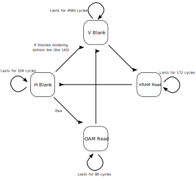

# XIX. CPU Cycles and PPU Modes

[*Return to Index*](../README.md)

[*Previous Chapter*](18-tile-maps.md)

With the tiles and maps in place, we have enough to stitch together a very basic version of our background. To do so, we need place tiles into their corresponding spot in the map to create a frame. Once created, this frame data will be sent up to whichever frontend is being used, where they will use their respective techniques to display it. Right now, we have enough to create some incomplete frames -- we can load a game ROM into our emulator which the system can then load into its RAM, our CPU can use that data to execute commands, some of those commands will store data into the tile and map sections of VRAM, and we can piece those two together to create a frame. We can go through this entire process to create a frame and... then what? After we create a frame, when should we create the next one? For that matter, at what point can we be sure that the current frame is actually completed and ready to be shown? And while we're asking questions, when are we going to finally use those CPU instruction return values?

That is a big hint to the solution to this problem. The PPU needs to operate on a schedule so that it can render a frame within the correct time frame. If you recall, when we implemented all the instructions for the CPU, we also noted how long each of them took in cycles. Accompanying the CPU is a "clock", an electronic component that sends an alternating on/off signal on a fixed time schedule. That means that the clock emits an on signal for a set period of time, then changes to off. Then back on, then back off, over and over again. This is what the speed of a CPU refers to -- if you have a 1 MHz CPU, its clock is alternating one million times per second.

The CPU uses this clock to pace itself when it is performing operations, in fact the CPU can *only* execute when the clock "ticks", or changes from off to on, to ensure synchronization between all its parts. The number of cycles each instruction takes is in terms of the CPU clock, where the more complicated the instruction, the more cycles the CPU needs to take before it is finished. It's important to note that even simple instructions might require more than one clock cycle. In fact, the `NOP` instruction, which does nothing, actually takes four clock cycles. This should sound very familiar by this point, as all of those mysterious values we returned from every CPU opcode are how many cycles each of those instructions takes. It's finally time for use to put those cycle counts to use.

Every "machine cycle" is actually a multiple of four "clock cycles", and you'll sometimes see the opcode table have all its values as a multiple of four to account for this. For our introductory emulator, we've been using M-cycles to keep things simple. To achieve superb accuracy, this distinction does need to be taken into account, but that's beyond the scope of this tutorial. I mention it simply in case you run into an opcode diagram with different values than the one we've been using.

## History Lesson: How an old CRT Television Works

Despite the fact that a Game Boy uses an LCD display, it still goes through the same process of drawing a frame as an old CRT television would, as that was the standard at the time, and what developers would've been familiar with. For those over a certain age, CRTs were a staple of every household. CRT stands for "Cathode Ray Tube", which refers to the main mechanism it used to light the screen. These TVs are comprised of a few different parts working together. First is the glass screen seen by the viewer, which has a florescent coating on the inner side which briefly glows when hit with a particle. This coating is segmented into a grid which will make up the pixels of the display. Depending on how the coating is hit, different colors can be emitted.

The particle is fired by said cathode ray tube, sometimes referred to as an "electron gun". This gun fires electrons from the back of the unit towards the screen (and towards your face), which causes the pixels to glow the desired colors when they collide with the screen. In order to aim the electron stream, carefully calibrated electromagnets are placed next to the gun and deflect the electron as it is moving to its target. When it is drawing a frame, the screen aims the electron gun to draw row by row, pixel by pixel. Because of this pattern, there's actually some periods of time where the nothing is being drawn on screen, as the gun needs time to readjust back to the left to begin the next row <sup>1</sup>, or move back to the top left after it's finished drawing in the bottom right.

[](https://www.youtube.com/watch?v=3BJU2drrtCM)

Here's a useful explanation with slow motion footage of a CRT in operation

These periods of time, known as "horizontal blank" (HBlank) and "vertical blank" (VBlank) respectively, present a useful opportunity to a game console. Since the screen can't actually draw anything during that alignment period, it's a good time to perform some tasks without risk of drawing garbage on screen. For example, since VBlank is the longer of the two (it's farther to align from the bottom right to top left than just starting over a row), the system can use this time to load any new data into VRAM. Even during HBlank there's enough time to perform instructions that might allow us to do neat effects differently from line to line.

<sup>1</sup> Like a typewriter<sup>2</sup>

<sup>2</sup> If you don't know what a typewriter is, that's beyond the scope of this history lesson.

### Okay... but a Game Boy isn't a CRT
I bring this up now because while the Game Boy doesn't have a CRT, it does still rely on the HBlank and VBlank concepts in the same way a home console like an NES would. This means that the Game Boy needs to carefully keep track of the position of where it is drawing so that everything syncs up correctly. This is where our CPU cycles come in, as they are in a sense the measurement of time for a Game Boy. The Game Boy does not stop what it's doing to draw the screen, it continues to execute code during that time, so as cycles are completed, the PPU uses those cycle times to transition between a few different "modes", which include HBlank and VBlank. These have fixed timings and a fixed pattern, and are the determining factor for when one frame ends and another begins.



A state machine diagram showing the different PPU modes and the order the system travels between them.

The PPU has four of these different modes, each of which is numbered. Mode 0 is the HBlank period. As mentioned above, this is when the unit has finished drawing a row of pixels (often referred to as a "scanline") and is preparing to draw the next. For our purposes it lasts for 204 cycles <sup>1</sup>. Once the final line is drawn and its HBlank is finished, this is when we will tell our frontend to render the screen.

Mode 1 is VBlank. It lasts the equivalent of 10 scanlines, which at 456 cycles each is a total of 4560 cycles <sup>2</sup>. After this is mode 2, called "OAM Read". OAM is the "Object Attribute Memory", which stores information about the sprites drawn on screen. We haven't looked at how the OAM works yet, but this period is for the PPU to lookup which, if any, sprites should be drawn on the current horizontal line. This mode lasts for 80 cycles. Finally is mode 3, which I'll call "VRAM Read", where the drawing actually occurs. It should be noted that there are some limitations to actions that can occur during some of these periods. VBlank and HBlank are relatively free, but during OAM read, the OAM cannot be edited (seems logical), and likewise when render is occurring, VRAM and the OAM cannot be edited at all, as they are being read. Attempting to do so results in no changed memory, something we'll need to also handle. VRAM Read lasts for 172 cycles.

<sup>1</sup>Scanline draw time + HBlank time is always the same length, so if the pixel drawing took longer (which it can when drawing objects) then HBlank needs to be shorter to compensate. We won't worry about this for our emulator, but it's an easy accuracy optimization to make if you so choose.

<sup>2</sup>456 comes from 172 from VRAM Read (of which 160 of them is to draw the 160 pixels per line), plus 80 for the OAM Read, and 204 for Hblank. If you're curious, the [Pan Docs](https://gbdev.io/pandocs/Rendering.html) goes into more detail.

## Implementing the PPU Modes

Let's begin by creating a new file for our PPU modes to live in, in `ppu/modes.rs`. We'll create an enum for the four mode types, a function to get their defined mode index, as well as some constants defining how long each of them last in cycles.

```rust
// In ppu/modes.rs

const HBLANK_LEN: usize = 204;
const VBLANK_LEN: usize = 456;
const OAM_READ_LEN: usize = 80;
const VRAM_READ_LEN: usize = 172;

#[derive(PartialEq, Clone, Copy)]
pub enum LcdModeType {
    HBLANK,
    VBLANK,
    OAMReadMode,
    VRAMReadMode,
}

impl LcdModeType {
    pub fn get_idx(&self) -> u8 {
        match *self {
            LcdModeType::HBLANK => { 0 },
            LcdModeType::VBLANK => { 1 },
            LcdModeType::OAMReadMode => { 2 },
            LcdModeType::VRAMReadMode => { 3 },
        }
    }
}
```

Next, we'll create a struct that contains the information we'll need to determine which mode we're in. This includes the current mode itself, how many cycles long the current mode has elapsed, and which scanline we are drawing. We will be creating a state machine based on our flowchart above to handle these modes, with these three variables determining which mode the machine should switch to.


```rust
// In ppu/modes.rs

// Unchanged code omitted

pub struct Lcd {
    mode: LcdModeType,
    cycles: usize,
    line: u8,
}

impl Lcd {
    pub fn new() -> Self {
        Self {
            mode: LcdModeType::HBLANK,
            cycles: 0,
            line: 0,
        }
    }

    pub fn get_line(&self) -> u8 {
        self.line
    }

    pub fn get_mode(&self) -> LcdModeType {
        self.mode
    }
}
```

At the beginning of this machine, we are in the HBlank state at the top left of the screen, so at line zero, and with zero cycles elapsed. Next comes the state machine step function. Let's go over what each of these modes does in more clearly, and what this function should do over all.

This function will accept the elapsed CPU cycle count from the previous instruction, which will inform the state machine how much time has elapsed. By default, the modes remain in their current state unless the total cycle count since they've started surpasses their allowed length, which we defined in the four constant values.

Most of the modes always default to the same subsequent one; such as VBlank, which begins the first scanline's OAM Read when it's done, OAM Read, which begins drawing the scanline (VRAM Read mode) once it's finished, and VRAM Read, which transitions into HBlank. HBlank will typically switch to the next line's OAM Read, unless it's at the bottom of the screen, at which point we need to move back up to the top via VBlank. Here's the state machine flowchart again to illustrate these relationships.


In addition to keeping track of the current PPU mode for RAM access reasons, this function also lets us know when the frame has completed being constructed and is ready for our frontend to render. This happens at the end of the final HBlank period, right when we switch to VBlank. At that time, the drawing "cursor" is moving back up to the top, indicating a frame is complete. We could simply return a boolean for if the frame is finished or not, but I'm going to return an enum value instead, as there's some additional drawing behavior we'll need to account for once we start looking into scanlines. For now, our return enum will only have two possible values.

```rust
// In ppu/modes.rs

// Unchanged code omitted

const VBLANK_LINE_START: u8 = 143;
const VBLANK_LINE_END: u8   = VBLANK_LINE_START + 10;

#[derive(PartialEq)]
pub enum LcdResults {
    NoAction,
    RenderFrame,
}


impl Lcd {
    pub fn step(&mut self, cycles: u8) -> LcdResults {
        self.cycles += cycles as usize;
        let mut result = LcdResults::NoAction;

        match self.mode {
            LcdModeType::HBLANK => {
                if self.cycles >= HBLANK_LEN {
                    self.cycles = 0;
                    self.line += 1;

                    // If we've finished line 143, we've finished a frame, time for VBLANK
                    if self.line == VBLANK_LINE {
                        self.mode = LcdModeType::VBLANK;
                        result = LcdResults::RenderFrame;
                    } else {
                        self.mode = LcdModeType::OAMReadMode;
                    }
                }
            },
            LcdModeType::VBLANK => {
                if self.cycles >= VBLANK_LEN {
                    self.cycles = 0;
                    self.line += 1;

                    if self.line > VBLANK_LINE_END {
                        self.mode = LcdModeType::OAMReadMode;
                        self.line = 0;
                    }
                }
            },
            LcdModeType::OAMReadMode => {
                if self.cycles >= OAM_READ_LEN {
                    self.cycles = 0;
                    self.mode = LcdModeType::VRAMReadMode;
                }
            },
            LcdModeType::VRAMReadMode => {
                if self.cycles >= VRAM_READ_LEN {
                    self.cycles = 0;
                    self.mode = LcdModeType::HBLANK;
                }
            }
        }

        return result;
    }
}
```

If you recall, the Game Boy screen is 144 rows tall. This means that once the scanline index surpasses 143, VBlank can begin. I've saved that value into a constant for our convenience. Aside from that, it's a pretty simplistic state machine.

## Connective Tissue

To utilize the PPU mode state machine, we'll add as a member to our `Ppu` struct, and incorporate this behavior as part of its `update` function... which doesn't exist, let's go ahead and create that too.

```rust
// In ppu/mod.rs

// Don't forget to define ppu/modes.rs here if you haven't. It will need to be public.
pub mod modes;

// Unchanged code omitted

use modes::{Lcd, LcdModeType, LcdResults};

pub struct PpuUpdateResult {
    pub lcd_result: LcdResults,
}

pub struct Ppu {
    mode: Lcd,
    tiles: [Tile; NUM_TILES],
    maps: [u8; TILE_MAP_SIZE],
}

impl Ppu {
    pub fn new() -> Self {
        Self {
            mode: Lcd::new(),
            tiles: [Tile::new(); NUM_TILES],
            maps: [0; TILE_MAP_SIZE],
        }
    }

    pub fn update(&mut self, cycles: u8) -> PpuUpdateResult {
        let lcd_result = self.mode.step(cycles);
        PpuUpdateResult{ lcd_result }
    }
}
```

The `update` function isn't terribly exciting, but we'll be adding to it in time. For now, it simply forwards the CPU cycle count on to the mode state machine. I did create a new struct to use as a return value. For now, we only need to return the status of the PPU, but we may want to include other data later. Speaking of uninteresting functions, we'll need a way to pass that cycle count from the CPU to the PPU, and that means creating a function in `Bus` that links the two together. The `modes` module needs to be public so that `Bus` has access to its return value.

```rust
// In bus.rs

// Unchanged code omitted

use crate::ppu::PpuUpdateResult;

impl Bus {
    pub fn update_ppu(&mut self, cycles: u8) -> PpuUpdateResult {
        return self.ppu.update(cycles)
    }
}
```

Finally, we can return to `cpu/mod.rs` and use this as part of the CPU's `tick` function. Up until now, we called our opcode's `execute` function, but we never actually did anything with the output, or anything else in here for that matter. We will now take the `cycles` result, pass it to the PPU so it can update its state machine, and if it tells us it's time to render a frame, then we'll inform the frontends. For that, we'll need to change our function call to return a boolean, in this case true if it's time to render.

```rust
// In cpu/mod.rs

// Unchanged code omitted

use crate::ppu::modes::LcdResults;

impl Cpu {
    pub fn tick(&mut self) -> bool {
        let cycles = if self.halted { 1 } else { opcodes::execute(self) };
        let ppu_result = self.bus.update_ppu(cycles);
        return ppu_result == LcdResults::RenderFrame;
    }
}
```

We seem to be climbing a ladder with no end in sight. What then, do we do with the CPU's `tick` function? As I stated when we first added it, it's more or less the "heartbeat" of the emulator core. It's the function that initiates the CPU opcodes to run, and to update the PPU's modes. Due to the differences between platforms, rather than attempt the `core` to manage its own ticking, this function will be exposed to the frontends, which will handle it using their respective timing functionality. They will tick over and over again until finally told a frame is ready for them, at which point they will tell the `core` to give it to them. Before we do that though, we'll need to implement the rest of the PPU.

[*Next Chapter*](20-interrupts.md)
