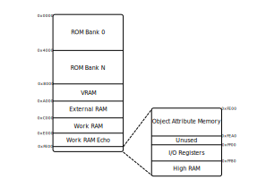

# Chapter XXI. PPU - Control Registers

[*Return to Index*](../README.md)

[*Previous Chapter*](20-interrupts.md)

So far we have only looked at the sections of the memory map belonging to game data and VRAM, 0x0000-0x7FFF and 0x8000-0x9FFF respectively. Everything from 0xA000 onward we have yet to cover. The next region of memory we'll explore is near the end of the RAM map, but serves a vital purpose in helping the PPU render each frame. These are the VRAM control registers we mentioned in the previous chapter. They live as part of a larger block of "I/O Registers" which also stores things such as which buttons are pressed or the audio data.



We'll cover the rest of the I/O Registers in time, but of immediate interest to us is the range from 0xFF40 to 0xFF4B. We're going to go through all of these now, as their implementation is vital to correct Game Boy video rendering. Each of the RAM addresses in this region is given a specific role, as seen below.

| Address | Purpose                     |
| ------- | --------------------------- |
| 0xFF40  | LCD Control (LCDC)          |
| 0xFF41  | LCD Status (STAT)           |
| 0xFF42  | Background Viewport Y (SCY) |
| 0xFF43  | Background Viewport X (SCX) |
| 0xFF44  | LCD Y Coordinate (LY)       |
| 0xFF45  | LY Compare (LYC)            |
| 0xFF46  | DMA Transfer<sup>1</sup>    |
| 0xFF47  | Background Palette (BGP)    |
| 0xFF48  | Object Palette 0            |
| 0xFF49  | Object Palette 1            |
| 0xFF4A  | Window Y Position (WY)      |
| 0xFF4B  | Window X Position (WX)      |

<sup>1</sup> DMA Transfer is handled by the Bus, we'll look at this in a later chapter

These are a lot of acronyms and terminology that don't make any sense to us for now, but we will walk through these one at a time. Before that, we need to add support for this area of RAM to our read and write `Bus` functions. While strictly speaking this RAM is not a part of VRAM, their function is so integral to the operation of the PPU that it's an ideal place for it to be stored. We'll begin with something similar to what we did for the VRAM definition -- adding constants to `ppu/mod.rs` for these memory address ranges, then using them in the bus.

```rust
// In ppu/mod.rs

// Unchanged code omitted

pub const LCD_REG_START: u16    = 0xFF40;
pub const LCD_REG_STOP: u16     = 0xFF4B;

impl Ppu {
    pub fn read_lcd_reg(&self, addr: u16) -> u8 {
        unimplemented!();
    }


    pub fn write_lcd_reg(&mut self, addr: u16, val: u8) {
        unimplemented!()
    }
}
```

With these constants and two stubbed functions in place, we can add that range to our read and write functions in the bus.

```rust
// In bus.rs

use crate::ppu::{Ppu, VRAM_START, VRAM_STOP, LCD_REG_START, LCD_REG_STOP};

// Unchanged code omitted

impl Bus {
    pub fn read_ram(&self, addr: u16) -> u8 {
        match addr {
            ROM_START..=ROM_STOP => {
                self.rom.read_cart(addr)
            },
            VRAM_START..=VRAM_STOP => {
                self.ppu.read_vram(addr)
            },
            LCD_REG_START..=LCD_REG_STOP => {
                self.ppu.read_lcd_reg(addr)
            },
            _ => {
                let offset = addr - VRAM_STOP - 1;
                self.ram[offset as usize]
            }
        }
    }

    pub fn write_ram(&mut self, addr: u16, val: u8) {
        match addr {
            ROM_START..=ROM_STOP => {
                self.rom.write_cart(addr, val);
            },
            VRAM_START..=VRAM_STOP => {
                self.ppu.write_vram(addr, val);
            },
            LCD_REG_START..=LCD_REG_STOP => {
                self.ppu.write_lcd_reg(addr, val)
            },
            _ => {
                let offset = addr - VRAM_STOP - 1;
                self.ram[offset as usize] = val;
            }
        }
    }
}
```

There's a small problem with this, and that's what to do about our Bus's `ram` array. Previously we had cut away blocks from the beginning, so it was easy to just resize the array to only include the areas that weren't handled elsewhere. Here, we've just removed a small section in the middle. For now I would advise we do nothing about it. Yes, there is a section in the middle of the array that will never get used, but it seems likely that we'll continue to move more and more of that array into its own classes (spoilers, we will), so it would be a waste of time to create some solution we'll just throw away soon.

Back in the PPU, we need to decide what to do with the LCD register data once we receive it. We could create different member variables for all of the registers I listed above, but that seems like more trouble than it's worth. Instead, we'll just store them into their own array, and create functions to access the specified register. After all, these are meant to be modified by writing to like any other memory address, it's the reading of them that has the additional context.

```rust
// In ppu/mod.rs

use crate::utils;

// Unchanged code omitted

const LCD_REG_SIZE: usize = (LCD_REG_STOP - LCD_REG_START + 1) as usize;

pub struct Ppu {
    tiles: [Tile; NUM_TILES],
    maps: [u8; TILE_MAP_SIZE],
    lcd_regs: [u8; LCD_REG_SIZE],
}

impl Ppu {
    pub fn new() -> Self {
        Self {
            tiles: [Tile::new(); NUM_TILES],
            maps: [0; TILE_MAP_SIZE],
            lcd_regs: [0; LCD_REG_SIZE],
        }
    }

    pub fn read_lcd_reg(&self, addr: u16) -> u8 {
        let relative_addr = addr - LCD_REG_START;
        self.lcd_regs[relative_addr as usize]
    }

    pub fn write_lcd_reg(&mut self, addr: u16, val: u8) {
        let relative_addr = addr - LCD_REG_START;
        self.lcd_regs[relative_addr as usize] = val;
    }
}
```

This should look very similar to what we did when setting up the tile map region. However, given the purpose of each of these entries in the `lcd_regs` array, we're going to create functions for each of the different addresses to assist with their purpose (and for some registers, more than one function).

Let us now go through each of the registers individually to discuss what they store, how the PPU will use that information, and we'll create functions to properly access that data.

## 0xFF40 -- LCD Control (LCDC)

Memory address 0xFF40 stores the LCD control register, eight 1-bit flags combined into a single byte. These flags deal with several of the concepts we covered when implementing the PPU tiles, and are as follows.

| Bit | Purpose                         | 0/1 Meaning                           |
| --- | ------------------------------- | ------------------------------------- |
|  7  | LCD Enabled                     | 0 = Off, 1 = On                       |
|  6  | Window tile map                 | 0 = 0x9800-0x9BFF, 1 = 0x9C00-0x9FFF  |
|  5  | Window Layer enabled            | 0 = Off, 1 = On                       |
|  4  | Background & Window tile set    | 0 = 0x8800-0x97FF, 1 = 0x8000-0x8FFF  |
|  3  | Background tile map             | 0 = 0x9800-0x9BFF, 1 = 0x9C00-0x9FFF  |
|  2  | Sprite size                     | 0 = 8x8, 1 = 8x16                     |
|  1  | Sprite layer enabled            | 0 = Off, 1 = On                       |
|  0  | Background/Window layer enabled | 0 = Off, 1 = On                       |

Recall that we number the bits going from right to left, so the 0th bit is the least significant one. Before we go though each of these and explain their purpose, we'll do a bit of set up in our `ppu/mod.rs` file. While some of you might be fine memorizing this table, I personally couldn't, so we'll add some constants to name all of these bits.

```rust
// In ppu/mod.rs

// Unchanged code omitted

const LCDC: u16 = 0xFF40;

// Bit flags for LCDC
const LCDC_LCD_ENABLED_BIT: u8      = 7;
const LCDC_WNDW_MAP_BIT: u8         = 6;
const LCDC_WNDW_ENABLED_BIT: u8     = 5;
const LCDC_BG_WNDW_TILE_BIT: u8     = 4;
const LCDC_BG_MAP_BIT: u8           = 3;
const LCDC_SPR_SIZE_BIT: u8         = 2;
const LCDC_SPR_ENABLED_BIT: u8      = 1;
const LCDC_BG_WNDW_ENABLED_BIT: u8  = 0;
```

### LCDC Bit 7 -- LCD Enabled

This is exactly as its name implies. If this bit is set to 1, the screen is on and displaying. If 0, the screen is turned off. It might go without saying, but there are limitations to when and where this is allowed to be changed, as turning off the screen at any given time could lead to hardware damage. While it might be trivial to implement, I'm going to create functions for all of these flags and registers, as I find they greatly help with readability once we get into the thick of it.

```rust
// In ppu/mod.rs

impl Ppu {
    // Unchanged code omitted
    fn is_lcd_enabled(&self) -> bool {
        let lcdc = self.read_lcd_reg(LCDC);
        lcdc.get_bit(LCDC_LCD_ENABLED_BIT)
    }
}
```

### LCDC Bit 6 -- Window Tile Map

This flag is for which tile map is currently in use for the Window layer, the Background layer is not forced to use the same tile map as the Window layer. Note that this is not the same as the tile set, of which the Background and Window must use the same one. This is the layout of which tile goes where, which the layer has two possible layouts to switch between. There's a few different ways to set up the return value for this function, but I'm going to have it return the tile map index, either a 0 or a 1. The caller can then convert that into an actual address, and I think returning a number is clearer in this context than returning a boolean.

```rust
// In ppu/mod.rs

impl Ppu {
    // Unchanged code omitted
    fn get_wndw_tile_map_index(&self) -> u8 {
        let lcdc = self.read_lcd_reg(LCDC);
        if lcdc.get_bit(LCDC_WNDW_MAP_BIT) { 1 } else { 0 }
    }
}
```

### LCDC Bit 5 -- Window Layer Enabled

As bit 7 turned the entire screen on or off, individual layers can also be shown or hidden by the system. In this case, bit 5 toggles the display of the Window layer.

```rust
// In ppu/mod.rs

impl Ppu {
    // Unchanged code omitted
    fn is_window_layer_displayed(&self) -> bool {
        let lcdc = self.read_lcd_reg(LCDC);
        lcdc.get_bit(LCDC_WNDW_ENABLED_BIT)
    }
}
```

### LCDC Bit 4 -- Background & Window Tile Set

In the previous chapter, we detailed how the Game Boy stores its tile sets, specifically how there are two different sets that overlap. I mentioned vaguely that there was a flag to toggle between which tile set was in use, which is located here in the LCDC RAM register. While the Background and Window layers can use different tile maps at the same time, they are constricted to using the same tile set. Somewhat confusingly, when this bit is set to 1, the first set of tile data is used (0x8000-0x8FFF), and if 0 then the second is used instead (0x8800-0x97FF). For this function, I'm again going to return an index and leave it up to the caller to convert it to an address if it wishes.

```rust
// In ppu/mod.rs

impl Ppu {
    // Unchanged code omitted
    fn get_bg_wndw_tile_set_index(&self) -> u8 {
        let lcdc = self.read_lcd_reg(LCDC);
        if lcdc.get_bit(LCDC_BG_WNDW_TILE_BIT) { 1 } else { 0 }
    }
}
```

### LCDC Bit 3 -- Background Tile Map

This is exactly the same as bit 6, except it indicates which tile map the Background layer will use, rather than the Window layer. The associated function will look nearly identical.

```rust
// In ppu/mod.rs

impl Ppu {
    // Unchanged code omitted
    fn get_bg_tile_map_index(&self) -> u8 {
        let lcdc = self.read_lcd_reg(LCDC);
        if lcdc.get_bit(LCDC_BG_MAP_BIT) { 1 } else { 0 }
    }
}
```

### LCDC Bit 2 -- Sprite Size

Finally we get to the sprites. The sprite layer is similar to the Background and Window in some ways, such as how they're comprised of tiles stored in a set. Unlike the Background though, the sprites aren't limited to a map and can freely move across the screen. We'll see how that's handled soon, but there are two global sprite settings stored in this LCDC register. The first is how large each sprite is, either 8x8 pixels or 8x16. In 8x16 mode, each sprite reads from from two consecutive tiles to stitch together a single sprite that moves as one. Here, we'll phrase the name of the function to return a boolean.

```rust
// In ppu/mod.rs

impl Ppu {
    // Unchanged code omitted
    fn are_sprites_8x16(&self) -> bool {
        let lcdc = self.read_lcd_reg(LCDC);
        lcdc.get_bit(LCDC_SPR_SIZE_BIT)
    }
}
```

### LCDC Bit 1 -- Sprite Layer Enabled

Just as its description implies, this bit toggles the entire sprite layer on or off, in the same way that the Window layer could be enabled with bit 5.

```rust
// In ppu/mod.rs

impl Ppu {
    // Unchanged code omitted
    fn is_sprite_layer_displayed(&self) -> bool {
        let lcdc = self.read_lcd_reg(LCDC);
        lcdc.get_bit(LCDC_SPR_ENABLED_BIT)
    }
}
```

### LCDC Bit 0 -- Background/Window Layer Enabled

Last but not least is a bit to toggle *both* the Background and Window layers. This might seem odd, as bit 5 also toggles the Window layer, but if you wish to disable the Background layer using this flag, the Window layer must go with it. In the event of disagreement between bits 0 and 5, bit 0 takes priority, so if bit 0 is disabled then the Window layer is disabled, regardless of the value in bit 5. We'll add a new function to check for the Background layer, and we'll update our Window layer function to reflect this change.

```rust
// In ppu/mod.rs

impl Ppu {
    // Unchanged code omitted
    fn is_bg_layer_displayed(&self) -> bool {
        let lcdc = self.read_lcd_reg(LCDC);
        lcdc.get_bit(LCDC_BG_WNDW_ENABLED_BIT)
    }

    fn is_window_layer_displayed(&self) -> bool {
        let lcdc = self.read_lcd_reg(LCDC);
        lcdc.get_bit(LCDC_BG_WNDW_ENABLED_BIT) && lcdc.get_bit(LCDC_WNDW_ENABLED_BIT)
    }
}
```

One other important thing to note with the LCDC register is that it can be updated pretty much at any time, even while the screen is still drawing, although it will only take effect at the start of the next horizontal line. This means that between each drawn line of pixels, settings such as which layers are visible can be changed. We'll cover that in further detail once we're implementing the rendering, although some of you might begin to feel a headache coming on.

## 0xFF44 -- LCD Y Coordinate (LY)

I'm going to go a little bit out of order here, because we need to understand this register before we look at 0xFF41. 0xFF44 contains the LCD Y Coordinate `LY`. This byte stores the current scanline being rendered, that's it. This register is automatically adjusted as the PPU goes through its rendering phase. The current scanline can change anytime the PPU modes are updated, which happens in its `update` function, so we'll need to ensure the `LY` register is always updated there. The PPU state machine contains the information on which scanline is currently being rendered, so we can access it from there.

```rust
// In ppu/mod.rs

// Unchanged code omitted

const LY: u16 = 0xFF44;

impl Ppu {
    pub fn update(&mut self, cycles: u8) -> PpuUpdateResult {
        let lcd_result = self.mode.step(cycles);

        let scanline = self.mode.get_line();
        self.write_lcd_reg(LY, scanline);

        PpuUpdateResult{ lcd_result }
    }
}
```

## 0xFF45 -- LY Compare (LYC)

But, what good is it to know the current scanline? One useful trick the Game Boy provides its developers is the ability to specify an interrupt to trigger whenever any scanline is reached. This means that effects can be written, and changed, on a per-scanline basis. The `LYC` register is how the developer sets which scanline should trigger the interrupt. The interrupt should only fire when the scanline is first reached, so we will need to check if our current scanline has changed from the previous value. However, there actually isn't any code to add for this section. The `LYC` register just holds the target scanline for the interrupt, it doesn't tell us how we should actually use it. Instead, that job falls to the `STAT` register.

## 0xFF41 -- LCD Status (STAT)
When we covered the different interrupt types, perhaps the most mysterious was the "STAT" interrupt, which I mentioned was utilized by the PPU. The parameters for the STAT interrupt are set within the `STAT` register, at address 0xFF41. It can be set to trigger if the rendering has reached a specified scanline, or if a certain PPU rendering mode has been entered. Like the `LCDC` register, `STAT` also is broken up into several distinct purposes, although several of them have similar functions.

| Bit(s) | Purpose                          |
| ------ | -------------------------------- |
| 7      | Unused                           |
| 6      | LY == LYC STAT Interrupt Enabled |
| 5      | OAM Read STAT Interrupt Enabled  |
| 4      | VBlank STAT Interrupt Enabled    |
| 3      | HBlank STAT Interrupt Enabled    |
| 2      | If LY == LYC                     |
| 0-1    | PPU Mode                         |

### STAT Bits 0 and 1 -- PPU Mode

As discussed, the PPU modes are the states of the PPU machine as it goes through the rendering process. Having access to what phase the rendering has entered would be useful, and so the PPU mode is stored using the numbering system previously described in bits 0 and 1 of the `STAT` register. This is a read-only value. It's meant only to reference what the PPU is doing, so even if you could write to it, it would almost immediately be overwritten with the current state. This needs to be kept up to date at all times, which we will do in our PPU's `update` function, right after updating the mode itself.

```rust
// In ppu/mod.rs

impl Ppu {
    // Unchanged code omitted
    pub fn update(&mut self, cycles: u8) -> PpuUpdateResult {
        let lcd_result = self.mode.step(cycles);
        let mut stat = self.read_lcd_reg(STAT);

        let scanline = self.mode.get_line();
        self.write_lcd_reg(LY, scanline);

        let mode = self.mode.get_mode();
        stat &= 0b1111_1100;
        stat |= mode.get_idx();
        self.write_lcd_reg(STAT, stat);

        PpuUpdateResult{ lcd_result }
    }
}
```

We only want to replace the last two bits of the `STAT` register, so we will use a bitwise AND operation to clear the final two, then OR in the replacement value.

### STAT Bits 3, 4, and 5 -- STAT Interrupt Modes

Merely knowing what mode the PPU is in might not be enough for some effects. It would even better if the system could trigger an interrupt for us if we entered into a specific mode. Good news then, as this is what bits 3 through 5 do. Each of these correspond to a specific PPU mode -- Bit 3 for HBlank, bit 4 for VBlank, and bit 5 for OAM Read. The game developer can set one or more of these bits to be set, and if we enter the corresponding mode, an interrupt is triggered. The developer can lookup the mode with the lowest two `STAT` bits if needed. We only want to signify this interrupt should happen if the mode has just changed, so we'll store the previous mode and compare it to its value following the `step` call. To accomplish this, we'll need to expand what the `update` function returns, as we need to send both the LCD status *and* if an interrupt needs to occur up to the CPU.

```rust
// In ppu/mod.rs

// Unchanged code omitted

// Bit flags for STAT
const STAT_OAM_IRQ_BIT: u8          = 5;
const STAT_VBLANK_IRQ_BIT: u8       = 4;
const STAT_HBLANK_IRQ_BIT: u8       = 3;

pub struct PpuUpdateResult {
    pub lcd_result: LcdResults,
    pub irq: bool,
}

impl Ppu {
    // Unchanged code omitted

    pub fn update(&mut self, cycles: u8) -> PpuUpdateResult {
        let old_mode = self.mode.get_mode();
        let lcd_result = self.mode.step(cycles);
        let mut stat = self.read_lcd_reg(STAT);
        let mut irq = false;

        let scanline = self.mode.get_line();
        self.write_lcd_reg(LY, scanline);

        let mode = self.mode.get_mode();
        if old_mode != mode {
            match mode {
                LcdModeType::HBLANK => {
                    irq |= stat.get_bit(STAT_HBLANK_IRQ_BIT);
                },
                LcdModeType::VBLANK => {
                    irq |= stat.get_bit(STAT_VBLANK_IRQ_BIT);
                },
                LcdModeType::OAMReadMode => {
                    irq |= stat.get_bit(STAT_OAM_IRQ_BIT);
                }
                _ => {},
            }
        }

        stat &= 0b1111_1100;
        stat |= mode.get_idx();
        self.write_lcd_reg(STAT, stat);

        PpuUpdateResult{ lcd_result, irq }
    }
}
```

This is why we created the `PpuUpdateResult` struct, so we could pack other needed data in with it. We'll look at what the CPU should do once it receives an interrupt from the PPU once we're finished going through all the control registers.

### STAT Bits 2 and 6 -- LYC == LY

As mentioned, `STAT`, `LY` and `LYC` all interact together. `LY` stores the current PPU scanline and `LYC` stores the target scanline for an interrupt. Bit 2 of the `STAT` register is a read-only flag to show whether or not they're equal. Pretty straight-forward.

Bit 6 is the one we're more interested in, it's the one that sets whether the `LY == LYC` condition should trigger an interrupt. Note that there's no invalid value to set `LYC` to be. 0x00 is a perfectly acceptable target scanline, and while something like 0xFF would be taller than a Game Boy screen and thus an acceptable "don't throw an interrupt" value, it's good to future proof as that might not be the case in some (non-existent) Game Boy revision. Instead, a flag was added to determine if that value in `LYC` should even be used at all. For the implementation, bit 2 will be set whenever we update the `LY` register (in `update`), and bit 6 will be used in the calculation for the return value. Recall we only need to check if `LY == LYC` whenever a new scanline is reached, and we only need to update the `LY` register at that point as well.

```rust
// In ppu/mod.rs

// Unchanged code omitted

const LYC: u16                      = 0xFF45;

// Bit flags for STAT
const STAT_LY_LYC_IRQ_BIT: u8       = 6;
const STAT_OAM_IRQ_BIT: u8          = 5;
const STAT_VBLANK_IRQ_BIT: u8       = 4;
const STAT_HBLANK_IRQ_BIT: u8       = 3;
const STAT_LY_EQ_LYC_BIT: u8        = 2;

impl Ppu {
    pub fn update(&mut self, cycles: u8) -> PpuUpdateResult {
        let old_mode = self.mode.get_mode();
        let old_line = self.mode.get_line();
        let lcd_result = self.mode.step(cycles);
        let mut stat = self.read_lcd_reg(STAT);
        let mut irq = false;

        let scanline = self.mode.get_line();
        if old_line != scanline {
            let lyc = self.read_lcd_reg(LYC);
            stat.set_bit(STAT_LY_EQ_LYC_BIT, scanline == lyc);
            irq = (scanline == lyc) && stat.get_bit(STAT_LY_LYC_IRQ_BIT);
            self.write_lcd_reg(LY, scanline);
        }

        let mode = self.mode.get_mode();
        if old_mode != mode {
            match mode {
                LcdModeType::HBLANK => {
                    irq |= stat.get_bit(STAT_HBLANK_IRQ_BIT);
                },
                LcdModeType::VBLANK => {
                    irq |= stat.get_bit(STAT_VBLANK_IRQ_BIT);
                },
                LcdModeType::OAMReadMode => {
                    irq |= stat.get_bit(STAT_OAM_IRQ_BIT);
                }
                _ => {},
            }
        }

        stat &= 0b1111_1100;
        stat |= mode.get_idx();
        self.write_lcd_reg(STAT, stat);

        PpuUpdateResult{ lcd_result, irq }
    }
}
```

The last step is to modify the CPU's `tick` function to correctly handle a STAT interrupt if it receives one. In the previous chapter we modified `tick` to handle the VBlank interrupt when told, and now it needs to use the `irq` field in the return struct to decide if the STAT interrupt should fire as well.

```rust
// In cpu/mod.rs

impl Cpu {
    // Unchanged code omitted
    pub fn tick(&mut self) -> bool {
        let mut draw_time = false;
        let cycles = if self.halted { 1 } else { opcodes::execute(self) };
        let ppu_result = self.bus.update_ppu(cycles);
        if ppu_result.irq {
            self.enable_irq_type(Interrupts::Stat, true);
        }
        match ppu_result.lcd_result {
            LcdResults::RenderFrame => {
                self.enable_irq_type(Interrupts::Vblank, true);
                draw_time = true;
            },
            _ => {},
        }
        if let Some(irq) = self.check_irq() {
            self.trigger_irq(irq);
        }
        draw_time
    }
}
```

With `STAT`, `LY`, and `LYC` all implemented, the PPU can now be used to trigger interrupts both for reaching a target scanline as well as reaching a target PPU mode.

## 0xFF42 & 0xFF43 -- Background Viewports (SCY & SCX)
As we've discussed previously, the Game Boy screen displays 160x144 pixels, while the background layer tile map is sized for 32x32 tiles, or 256x256 pixels. The reason for this larger layer is so the region actually shown on screen, called the "viewport", can be scrolled around without having to load in new assets. The X,Y coordinates of the top left corner of the viewport is stored in two bytes of memory, with the Y position (SCY) at address 0xFF42 and the X position (SCX) at 0xFF43. As these are one byte values, the viewport corner can be placed anywhere on the background layer, and if the viewport were to go off the edge, it wraps around to the other side.
Given how these two value will always be used together, let's create a single function that returns the XY position of the viewport together. While we could return them as a tuple, I'm going to define a new `Point` struct in `utils.rs`, to give things a little more structure.

```rust
// In utils.rs
// Unchanged code omitted

#[derive(Clone, Copy)]
pub struct Point {
    pub x: u8,
    pub y: u8,
}

impl Point {
    pub fn new(x: u8, y: u8) -> Self {
        Point{x, y}
    }
}
```

With that in place, we can use our new `Point` to better encapsulate the two values together. We'll also add constants for the memory addresses of the two registers.

```rust
// In ppu/mod.rs

// Unchanged code omitted
const SCY: u16 = 0xFF42;
const SCX: u16 = 0xFF43;

impl Ppu {
    fn get_viewport_coords(&self) -> Point {
        let x = self.read_lcd_reg(SCX);
        let y = self.read_lcd_reg(SCY);
        Point::new(x, y)
    }
}
```

## 0xFF4A & 0xFF4B -- Window Position (WX & WY)

I'm again going to skip around, and we'll come back to the palette registers in a moment. Since we were just discussing layer positioning, the Window layer also has functionality to be positioned in different places, although it almost works "in reverse" to how the background layer behaves. The background layer is 32x32 tiles in size, and the Game Boy screen just displays a viewport into that layer somewhere. WX and WY, on the other hand, define the position of the top left corner of the Window layer relative to the Game Boy screen. Think of the Background layer always remaining in the same place, with the Window layer able to shift around on top of it -- with the viewport shining onto both and being the only sections the player gets to see. WX and WY are treated as unsigned values, so the Window layer can't be positioned farther to the top or left than the Background layer, although it too is 32x32 tiles in size.


The viewport only shows a section of the larger Background Layer, with the second Window Layer able to be repositioned on top of it.

[Source - GBEDG](https://hacktix.github.io/GBEDG/ppu/#the-window)

There is one caveat to this however. While the background layer's SCX and SCY values returned the viewport position exactly, the Window X position returns the X-coordinate of the window... plus 7. It's a bit of an unusual convention, but it means that if you want the window layer to precisely cover the screen, you need to set WY to be 0 and WX to be 7, not 0. This also poses a potential issue in Rust, as when we subtract 7 to get the actual screen coordinate, we run the risk of underflow. To fix this, we'll use the `saturating_sub` function to clamp ourselves to 0 if ever we were to underflow. We don't want to wrap around as we normally do, as this isn't a design feature of the Game Boy, it's a limitation of us using unsigned 8-bit integers to store our values.

```rust
// In ppu/mod.rs

// Unchanged code omitted

const WY: u16 = 0xFF4A;
const WX: u16 = 0xFF4B;

impl Ppu {
    fn get_window_coords(&self) -> Point {
        let x = self.read_lcd_reg(WX);
        let y = self.read_lcd_reg(WY);
        Point::new(x.saturating_sub(7), y)
    }
}
```

## 0xFF47 -- Background Palette (BGP)

While the Game Boy can display four different colors -- white, light gray, dark gray, and black -- and while each of these four colors are assigned a two bit value -- 00 for white, 01 for light gray, 10 for dark gray, and 11 for black -- the method for determining what pixel is given what color does not end here. There is an additional piece of indirection for choosing a color known as a "color palette". Each pixel in our tile data is stored as two bits. These two bits do not directly correspond to one of our four colors, but instead to one of four entries in the "palette table". It's this palette table that actually references the colors. Let me give an example; say that all four entries in the palette table are 0b11 -- black. Since the pixels store a palette table index, when they go to look up what color they should actually be, they're always mapped to the same value. The current pixel holds the 0b10 index? Well that index maps to black. The 0b00 index? Black. Any of the indices? Black.


By only changing the values stored in the palette, the same sprite can be colored many different ways.

Why bother with palettes at all? This seems overly complicated, just store your exact color value and be done with it. I'll admit that for two bit color it might seem a bit silly. However, for systems which have a greater range of colors, and thus require more data to index all those colors, this can save a substantial amount of space. It also allows for interesting effects like flashing or fading out simply by adjusting the palette while leaving the sprite data itself alone.

For our implementation, we'll need to extract the four element array from the single byte stored at 0xFF47. For this, we can create an `unpack_u8` function (and a reverse `pack_u8` function for good measure) inside of `utils.rs`. These functions should extract all of the two bit pairs from a byte, or vice versa.

```rust
// In utils.rs

// Unchanged code omitted
pub fn unpack_u8(val: u8) -> [u8; 4] {
    let mut output = [0; 4];
    output[0] = val & 0b0000_0011;
    output[1] = (val & 0b0000_1100) >> 2;
    output[2] = (val & 0b0011_0000) >> 4;
    output[3] = (val & 0b1100_0000) >> 6;
    return output;
}

pub fn pack_u8(a: &[u8]) -> u8 {
    let mut output = a[0];
    output |= a[1] << 2;
    output |= a[2] << 4;
    output |= a[3] << 6;
    return output;
}
```

With these available to us, we can define a function to give us the current color palette, although keep in mind that address 0xFF47 only stores the color palette for the background layer. Other layers have their own separately defined tables to use.

```rust
// In ppu/mod.rs

// Unchanged code omitted

const BGP: u16 = 0xFF47;

impl Ppu {
    fn get_bg_palette(&self) -> [u8; 4] {
        unpack_u8(self.read_lcd_reg(BGP))
    }
}
```

## 0xFF48 & 0xFF49 -- Sprite Palettes (OBP0 & OBP1)

That's right, the background layer has its palette, and the sprites (or "objects") have not only one palette, but two they can choose from. The basic idea is the same as the background; the additional palettes simply gives the developer more options in how they wish to "color" their scene. Each sprite is able to specify which of the two palettes they wish to use, OBP0 or OBP1, so for this implementation we're going to take in a parameter for sprite palette index, then return the one they request. When we begin to look deeper into how sprites are stored, we'll see where we get the palette index from.

```rust
// In ppu/mod.rs

// Unchanged code omitted

const OBP0: u16                     = 0xFF48;
const OBP1: u16                     = 0xFF49;

impl Ppu {
    fn get_sprite_palette(&self, index: u8) -> [u8; 4] {
        match index {
            0 => { unpack_u8(self.read_lcd_reg(OBP0)) },
            1 => { unpack_u8(self.read_lcd_reg(OBP1)) },
            _ => { unreachable!() }
        }
    }
}
```

## 0xFF45 -- DMA Transfer

While this register is assigned a memory address within the other PPU registers, it's actually handled more by the bus, as it signals that a large block memory needs to be transferred from one area to another. This process is a bit complicated, and isn't needed right now, so we'll circle back around it to it later. For now, let's move on to rendering the background.

[*Next Chapter*](22-constructing-background.md)
