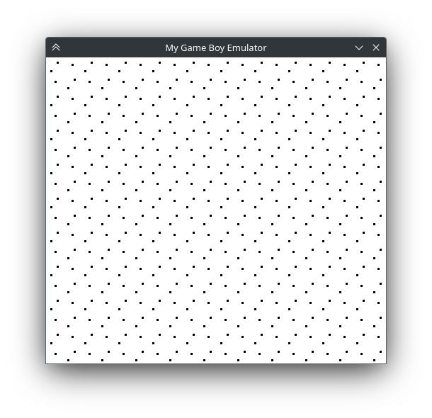
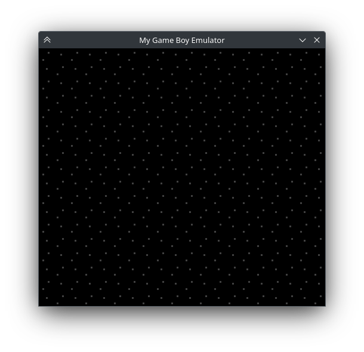
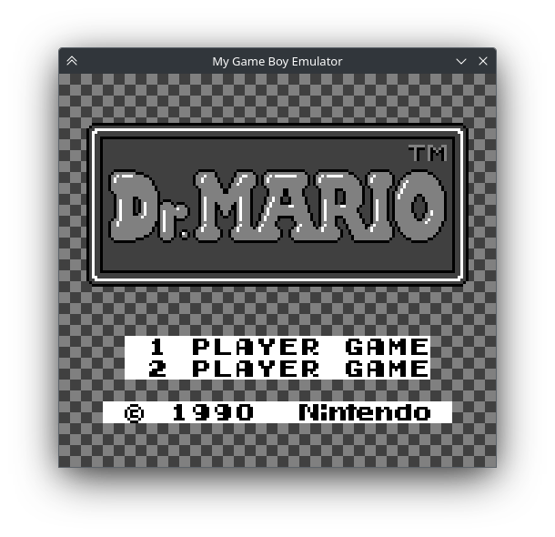
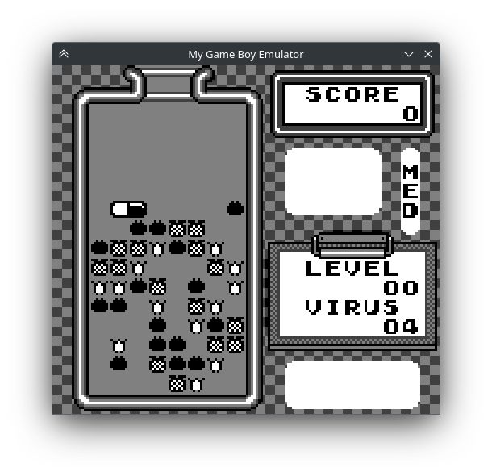

# Chapter XXII. Constructing the Background

[*Return to Index*](../README.md)

[*Previous Chapter*](21-control-registers.md)

The time has finally come to begin putting it all together. We have created two different frontends which can read in a ROM file and send it to the emulation core. We have implemented a full CPU and its many, many instructions. We have created a basic memory map which connects to the cartridge ROM storage, to VRAM, and the control registers for the PPU. We have established the structure of tile data and maps for the different video layers to display. It is time to begin rendering a game.

While the goal for this chapter is to render the background of a game, we're going to implement it in a few stages to assist in helping to understand what exactly is happening. We discussed in the previous chapters about scanlines, and they play a crucial part in the display of a correct image. However, to keep things simple we're going to start with rendering the entire background layer all at once, then introduce the other layers and scanline concepts (and their control registers) following that.

First, we need to decide what the end result should actually be. We'll create a `render` function in the PPU, which will put the pieces together and return some data type that is acceptable for the frontends to render. The simplest way to accomplish this is to return an array of pixel values. While it might be more logical to make this a 2D array, we have to keep the needs of the frontend rendering libraries in mind, which largely prefer a 1D array, with several elements belonging to each pixel. In fact, while every pixel will be completely opaque, I'm actually going to return RGBA values for each pixel, with the alpha channel always set to maximum. The frontend functions we'll end up using will want an alpha channel value, and it's easier if the backend adds it now than leaving it to the frontends to splice it in.

The frontends will need to know how large the data buffer is, so we'll add a new public constant to our `utils.rs` file, which will be large enough for 160 pixels wide by 144 pixels tall with 4 color channels.

```rust
// In utils.rs

// Unchanged code omitted

pub const DISPLAY_BUFFER: usize = SCREEN_WIDTH * SCREEN_HEIGHT * 4;
```

We'll next create the `render` function which will return a `u8` array of that size. We'll default this array to be the maximum value, 0xFF, so that we don't have to edit the alpha channel after. This function will eventually have three stages -- rendering the background, window, and sprite layers, if shown. We'll worry just about the background layer for now.

```rust
// In ppu/mod.rs

// Unchanged code omitted

impl Ppu {
    pub fn render(&self) -> [u8; DISPLAY_BUFFER] {
        let mut result = [0xFF; DISPLAY_BUFFER];

        if self.is_bg_layer_displayed() {
            self.render_bg(&mut result);
        }

        return result;
    }
}
```

You'll recall that we created the `is_bg_layer_displayed` function when we handled the PPU control registers. So what should the `render_bg` function do? While we'll eventually need to take the viewport into account, we'll keep things simple for now and just render the top left corner of the background layer. Our process then is to iterate through the tile map, getting the indices for all of those tiles, then "pasting" the 8x8 pixel tile into the correct spot in the buffer. Getting the map indices isn't too bad, but we never created any functions to return the pixel data from our `Tile` objects, we only handled memory access, so let's begin there.

While we could return the entire pixel array, when we paste into our buffer we will only need one line at a time, so we can add a simple `get_row` function which will return an eight element array.

```rust
// In ppu/tiles.rs

// Unchanged code omitted

impl Tile {
    pub fn get_row(&self, row: u8) -> [u8; 8] {
        self.pixels[row as usize]
    }
}
```

## Stitching together the Tile Map

With that in place, we can get to work. The `render_bg` function is arguably the most complicated we've had to create yet, so I'm going to introduce it over the course of a few steps. We will need to iterate over the 20 tile columns and 18 tile rows, looking into the tile map data (the `maps` array) for the index of the tile that should go there. We can then grab the corresponding tile out of the `tiles` array and place its pixel data into the right spot in the output `buffer`.

```rust
// In ppu/mod.rs

const NUM_TILE_COLS: usize = SCREEN_WIDTH / 8;
const NUM_TILE_ROWS: usize = SCREEN_HEIGHT / 8;
const LAYER_WIDTH: usize   = 32;

impl Ppu {
    // Unchanged code omitted
    fn render_bg(&self, buffer: &mut [u8]) {
        // Iterate over each screen row and column
        for ty in 0..NUM_TILE_ROWS {
            for tx in 0..NUM_TILE_COLS {
                // Get the appropriate pixel data for that spot
                let map_num = ty * LAYER_WIDTH + tx;
                let tile_index = self.maps[map_num] as usize;
                let tile = self.tiles[tile_index];
                // TODO: Place tile pixels into buffer
            }
        }
    }
}
```

Tiles are stored as an 8x8 2D array of pixels, so we first loop over each row, getting the data for that row, then loop over each pixel. Don't forget that the values stored in the tiles aren't the colors themselves, but the index of the palette table, which in turn holds the actual pixel color. The palette values won't change as we render, so we can access those first. We also need to actually define the colors we want the frontends to use. So far we've made references to the white, light gray, dark gray, and black colors the Game Boy renders, but we need to actually define their RGBA values somewhere. We'll do that in an array stored in `utils.rs`.

```rust
// In utils.rs

pub const GB_PALETTE: [[u8; 4]; 4] = [
    [255, 255, 255, 255],
    [128, 128, 128, 255],
    [64,  64,  64,  255],
    [0,   0,   0,   255],
];
```

If you prefer your Game Boy to have the original green -- or any other colorscheme for that matter -- you can tweak these values here. The `render_bg` function can then index into this array to get the right RGBA values, which a final loop will put into place.

```rust
// In ppu/mod.rs

fn render_bg(&self, buffer: &mut [u8]) {
    let palette = self.get_bg_palette();
    // Iterate over each screen row and column
    for ty in 0..NUM_TILE_ROWS {
        for tx in 0..NUM_TILE_COLS {
            // Get the appropriate pixel data for that spot
            let map_num = ty * LAYER_WIDTH + tx;
            let tile_index = self.maps[map_num] as usize;
            let tile = self.tiles[tile_index];
            // Iterate over each pixel
            for y in 0..8 {
                let row = tile.get_row(y);
                let pixel_y = 8 * ty + y;
                for x in 0..8 {
                    // Use the palette table to get the right RGBA value
                    let pixel_x = 8 * tx + x;
                    let cell = row[x];
                    let color_idx = palette[cell as usize];
                    let color = GB_PALETTE[color_idx as usize];
                    // Copy the RGBA channels into the right spot in the buffer
                    let buffer_idx = 4 * (pixel_y * SCREEN_WIDTH + pixel_x);
                    for i in 0..4 {
                        buffer[buffer_idx + i] = color[i];
                    }
                }
            }
        }
    }
}
```

For the simple demos we're going to be initially testing, this is likely enough to render a fairly accurate background layer, but there's a lot we haven't handled yet. We're assuming the background viewport is always at (0, 0), we're assuming it's always using the first tile map, and we're assuming it's always using the first set of tiles.

We'll wait on handling the viewport scrolling until we've actually seen this working, as it will require us to refactor this a bit, but the other two behaviors we can add in now. First which tile map we're using. There are two maps stored in VRAM, and the index defining which to use was stored in our `get_bg_tile_map_index` function, which returns either a 0 or a 1. We can then multiply this index by the size of the map table (which we'll add as a constant) to find the address where our indices live.

```rust
// In ppu/mod.rs

const TILE_MAP_TABLE_SIZE: usize = TILE_MAP_SIZE / 2;

impl Ppu {
    fn render_bg(&self, buffer: &mut [u8]) {
        let map_offset = self.get_bg_tile_map_index() as usize * TILE_MAP_TABLE_SIZE;
        let palette = self.get_bg_palette();
        // Iterate over each screen row and column
        for ty in 0..NUM_TILE_ROWS {
            for tx in 0..NUM_TILE_COLS {
                // Get the appropriate pixel data for that spot
                let map_num = ty * LAYER_WIDTH + tx;
                let tile_index = self.maps[map_offset + map_num] as usize;
                let tile = self.tiles[tile_index];
                // Iterate over each pixel
                for y in 0..8 {
                    let row = tile.get_row(y);
                    let pixel_y = 8 * ty + y;
                    for x in 0..8 {
                        // Use the palette table to get the right RGBA value
                        let pixel_x = 8 * tx + x;
                        let cell = row[x];
                        let color_idx = palette[cell as usize];
                        let color = GB_PALETTE[color_idx as usize];
                        // Copy the RGBA channels into the right spot in the buffer
                        let buffer_idx = 4 * (pixel_y * SCREEN_WIDTH + pixel_x);
                        for i in 0..4 {
                            buffer[buffer_idx + i] = color[i];
                        }
                    }
                }
            }
        }
    }
}
```

That adjustment is pretty minor. `map_offset` will either be 0 or `TILE_MAP_TABLE_SIZE` and we use it only for determining what the correct `maps` index should be.

With all the tile indices at our disposal, we need to then check which tile set the background layer is using, via our `get_bg_wndw_tile_set_index` function. Again that returns a 0 or a 1 and we'll have to convert it to an actual array offset. Recall our discussion of the LCDC bit 4 in the previous chapter. When this function returns a 1, we can use the value from the tile map as an unsigned value with no extra work. If it's a 0 however, it's a signed value *and* begins at address 0x8800 rather than at 0x8000. This sounds complicated, but it's simpler than it seems.

```rust
impl Ppu {
    fn render_bg(&self, buffer: &mut [u8]) {
        let map_offset = self.get_bg_tile_map_index() as usize * TILE_MAP_TABLE_SIZE;
        let palette = self.get_bg_palette();
        // Iterate over each screen row and column
        for ty in 0..NUM_TILE_ROWS {
            for tx in 0..NUM_TILE_COLS {
                // Get the appropriate pixel data for that spot
                let map_num = ty * LAYER_WIDTH + tx;
                let tile_index = self.maps[map_offset + map_num] as usize;
                // Calculate the correct tile index if needed
                let adjusted_tile_index = if self.get_bg_wndw_tile_set_index() == 1 {
                    tile_index as usize
                } else {
                    (256 + tile_index as i8 as isize) as usize
                };
                let tile = self.tiles[adjusted_tile_index];
                // Iterate over each pixel
                for y in 0..8 {
                    let row = tile.get_row(y);
                    let pixel_y = 8 * ty + y;
                    for x in 0..8 {
                        // Use the palette table to get the right RGBA value
                        let pixel_x = 8 * tx + x;
                        let cell = row[x];
                        let color_idx = palette[cell as usize];
                        let color = GB_PALETTE[color_idx as usize];
                        // Copy the RGBA channels into the right spot in the buffer
                        let buffer_idx = 4 * (pixel_y * SCREEN_WIDTH + pixel_x);
                        for i in 0..4 {
                            buffer[buffer_idx + i] = color[i];
                        }
                    }
                }
            }
        }
    }
}
```

As I said, `render_bg` is the most complicated function of this project so far (and will more or less remain so). There is still some functionality missing, but this is enough to allow us to test our emulator.

## Connecting to the Frontends

With `render` finally in place, let's use it. We'll do a similar process as we did for the PPU's `update` function. We'll add a function in the `Bus` that calls down the PPU, and itself can be called by the CPU. We'll also need to import `utils` for the first time into here, as it needs access to `DISPLAY_BUFFER`.

```rust
// In bus.rs

// Unchanged code omitted

use crate::utils::*;

impl Bus {
    pub fn render(&self) -> [u8; DISPLAY_BUFFER] {
        self.ppu.render()
    }
}
```

In the CPU, we're actually going to do basically the same thing. Remember that the CPU's `tick` function will be controlled by the frontend, and it is the frontend that will look at the output to see if it is time to render a frame or not. If it is, then it will need API to call to retrieve the frame data, which is exactly what we have here waiting for it.

```rust
// In cpu/mod.rs

// Unchanged code omitted

impl Cpu {
    pub fn render(&self) -> [u8; DISPLAY_BUFFER] {
        self.bus.render()
    }
}
```

### Desktop Frontend

This is everything the `core` needs to do to prepare a (rudimentary) frame to display. At this point, we need to go back to both of our frontends and hook up both `tick` and `render`, as well as write the actual image rendering code. We'll begin with the `desktop`. The `desktop` is actually pretty straight-forward. We will run the `tick` function continuously until it signals it has a frame ready, then go pixel by pixel drawing rectangles (remember we scaled the desktop window up, single pixels will be displayed as filled rectangles) in their proper locations. This will replace the `sleep` call, as SDL's vsync will take care of the timing for us (more on that in a moment).

```rust
// In desktop/src/main.rs

fn main() {
    // Unchanged code omitted
    'gameloop: loop {
        for event in events.poll_iter() {
            match event {
                Event::Quit{..} |
                Event::KeyDown{keycode: Some(Keycode::Escape), ..} => {
                    break 'gameloop;
                },
                _ => {}
            }
        }

        // Keep ticking until told to stop
        while !gb.tick() {}
        let frame = gb.render();
        draw_screen(&frame, &mut canvas);
    }
}
```

The event polling is still the same, but now we let the `tick` function do its thing as many times as it needs to until it finally returns a true value, indicating that VBlank has begun and a frame needs to be rendered. We then call the `render` function, which gives us a frame buffer containing four RGBA values for each of the 160x144 pixels. That data is passed into a new `draw_screen` along with the `canvas` variable, which will do the rendering.

`draw_screen` is pretty straight-forward. It goes through pixel by pixel, setting the active draw color to the RGBA values stored in the array. It then draws a rect of size `SCALE` in the right position, and when everything is finished, displays the completed canvas.

```rust
// In desktop/src/main.rs

fn draw_screen(data: &[u8], canvas: &mut Canvas<Window>) {
    for i in (0..DISPLAY_BUFFER).step_by(4) {
        canvas.set_draw_color(Color::RGB(data[i], data[i + 1], data[i + 2]));
        let pixel = i / 4;
        let x = (pixel % SCREEN_WIDTH) as u32;
        let y = (pixel / SCREEN_WIDTH) as u32;

        let rect = Rect::new((x * SCALE) as i32, (y * SCALE) as i32, SCALE, SCALE);
        canvas.fill_rect(rect).unwrap();
    }
    canvas.present();
}
```

At this point, the `desktop` should be ready to render its first frame. We'll talk about what that should look like in a moment, but first we need to follow the same steps for the web interface as well.

### WebAssembly Frontend

When we first set up the `wasm` module, you'll remember that it served as the API "glue" interfacing between the functions within `core` and what the JavaScript `web` pages would actually require. So far, this was only a `new` constructor and a `load_rom` function. We'll now need to add two more, and if you followed along when we set up the `desktop` rendering, you'll see what they are.

The first is a `tick` function to allow the webpage to call the core's `tick` function itself, and the second is to implement its own `draw_screen` function. `draw_screen` could be done a few different ways. We could instead just wrap the `render` function inside of `wasm` and perform all the canvas rendering inside of JavaScript. There's no reason this wouldn't work, although I don't think there's really any need to. We can copy the entire frame buffer to the canvas context directly within WebAssembly without needing to get JavaScript involved, and besides, converting array types from what Rust gives us to what JavaScript is expecting can be a bit of a pain.

```rust
// In wasm/src/lib.rs

use gb_core::cpu::Cpu;
use gb_core::utils::{SCREEN_HEIGHT, SCREEN_WIDTH};

use js_sys::Uint8Array;
use wasm_bindgen::prelude::*;
use wasm_bindgen::Clamped;
use web_sys::{CanvasRenderingContext2d, HtmlCanvasElement, ImageData};

#[wasm_bindgen]
impl GB {
    // Unchanged code omitted
    #[wasm_bindgen]
    pub fn tick(&mut self) -> bool {
        self.cpu.tick()
    }

    #[wasm_bindgen]
    pub fn draw_screen(&mut self) {
        let mut framebuffer = self.cpu.render();
        let img_data = ImageData::new_with_u8_clamped_array_and_sh(Clamped(&mut framebuffer), SCREEN_WIDTH as u32, SCREEN_HEIGHT as u32).unwrap();
        self.ctx.put_image_data(&img_data, 0.0, 0.0).unwrap();
    }
}
```

As you can see, `tick` is a simple wrapper into the `core` API, simply so JavaScript has access to it. `draw_screen` calls `render` to get the frame buffer, then creates an image out of it, which is displayed on the canvas. You'll note that this is why we bothered saving `ctx` in this object, and why we bothered defining the frame buffer as an RGBA array. The `desktop` rendering didn't actually use the alpha value, it's simply because this function expects one.

All that remains is to go into the `html` module and implement the tick/render loop. This again will look similar to the `desktop` version, although we will use the canvas `requestAnimationFrame` here to ensure correct render timing.

```javascript
// In web/index.js

// Unchanged code omitted

let anim_frame = 0

async function run() {
    await init()
    let gb = new wasm.GB()

    document.getElementById("fileinput").addEventListener("change", function (e) {
        // Stop previous game from rendering, if one exists
        if (anim_frame != 0) {
            window.cancelAnimationFrame(anim_frame)
        }

        let file = e.target.files[0]
        if (!file) {
            alert("Failed to read file")
            return
        }

        let fr = new FileReader()
        fr.onload = function (fre) {
            let buffer = fre.result
            const rom = new Uint8Array(buffer)
            gb.load_rom(rom)

            mainloop(gb)
        }

        fr.readAsArrayBuffer(file)
    }, false)
}

function mainloop(gb) {
    while (true) {
        let draw_time = gb.tick()
        if (draw_time) {
            gb.draw_screen()
            if (SCALE != 1) {
                let ctx = canvas.getContext('2d')
                ctx.imageSmoothingEnabled = false
                ctx.drawImage(canvas, 0, 0, WIDTH, HEIGHT, 0, 0, canvas.width, canvas.height)
            }

            anim_frame = window.requestAnimationFrame(() => {
                mainloop(gb)
            })
            return
        }
    }
}
```

A few changes here. First is the addition of the `mainloop` function, which is what calls the WebAssembly `tick` and `draw_screen` functions. Note that it uses the JavaScript `requestAnimationFrame` function to recursively call itself. This behavior maintains the proper (as defined by the canvas) rendering speed. The return function at the end is so we don't have two versions of the function running at once. `mainloop` is entered for the first time in the file input event listener, which also checks if the `anim_frame` function has been modified. If the user tries to load a second game after playing the first, this will cancel the execution of the first game, so that we don't have two running at once. Because we are rendering our frame as an image, then applying it to the canvas, we will need to scale the rendered image if needed. There are a few ways to do this, but we are going to redraw the canvas on top of itself, taking everything that was present and scaling it up. We also need to set `imageSmoothingEnabled` since we are intentionally wanting a blocky, pixel look.

## Emulating

Time for the moment of truth. After all this time and effort, it's time to give our emulator a game and see what it can do. While you might be tempted to give *Pokemon Red* or *Zelda* a try, I'll warn you our emulator won't get very far in them at all. The major limitation isn't that we've ignored most of the rendering features, but that we currently support the smallest of game sizes, those whose ROM fits entirely into RAM. I'll show you what one of those looks like in a moment, but first let's try some games that are more... legally obtainable. Our first test will be to use some homebrew titles created by Opus Games back in 2001. These six demos implement some basic gameplay and effects, but are barebones enough that they lend themselves well for test ROMs. If you need to download them, their webpage can be found [here](https://opusgames.com/games/GBDev/GBDev.html).

Let's begin with their first game, the `TESTGAME.GB` file in `test1.zip`, which I'm going to refer to as "opus1". To run the game with the `desktop` frontend, you can use the following command.

```
$ cargo run path/to/TESTGAME.GB
```

Where `path/to/TESTGAME.GB` is replaced to where you saved the file. If you're using the web frontend, simply use your browser's file picker to choose the file. When run, it should look something like this.



Our first gameplay image

No matter how many times I work on an emulation project, the first moment where it actually renders something never fails to astonish me. A program we've created is able to decode this mysterious file and convert it into something tangible, it's unreal. Sentimentality aside, you should be able to see that this game's background is composed entirely of one tile, used over and over. While not required, I would encourage you to load up this same file in a full-fledged emulator to see what it actually looks like. One reason this is a good test ROM is that our implementation is actually nearly complete. This game has no sprites or window layer, and in fact the only thing missing is that the background should scroll. We knew that was missing, and we'll be covering that shortly.

Before we move on, let's take a look at a few of the other test ROMs. The second "opus2" ROM in our emulator should look like this.



Working image from the second test ROM

This demo is very similar to the first, with the different background tile being the only change we can see. On a completed emulator, this game should also scroll and display a spaceship sprite, but we weren't expecting either behavior. You emulator should be able to display the images as they appear above, and if not, this is a good time to pause and double check that everything is as it should be. You're welcome to go through the other Opus ROMs, but given we can only show a static background layer, the others don't really have too much to offer (opus4 actually does have something different shown on screen, but even on a finished emulator that demo is rather odd).

One last thing before we move on. Static stars on an unmoving background might not seem like too much of a reward for all the work we've put in so far, but let me show you how far we've actually come. I mentioned that most games won't even have a chance of working due to their size, but there are a number of commercial games that should be testable. One such game is *Dr. Mario*, and if you have the opportunity to "procure" a copy, I would encourage you to give it a try. Unlike the others, you should see quite a bit of action.





I'll be honest with you that even as I wrote this tutorial I was surprised that this game can get so far. *Dr. Mario* uses the background pretty heavily to display its graphics, and while we don't have any button support yet to actually play the game, if you wait it will transition from the title screen to the auto-playing demo. The game doesn't get too far, as it will wait for the user to press start, which we don't support yet, but it's the best supported game we currently have.

[*Next Chapter*](23-debugger.md)
