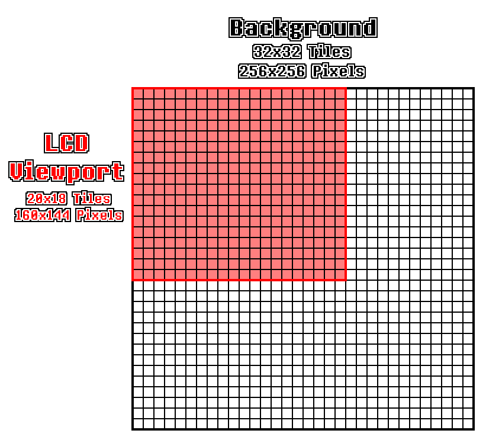

# Chapter XXIV. Background Viewport

[*Return to Index*](../README.md)

[*Previous Chapter*](23-debugger.md)

Now that our emulator can render the background layer, we can quickly begin making improvements to support a growing list of necessary features. The first we'll tackle is the ability to move the viewport. As a reminder, the background layer is 32x32 tiles, or 256x256 pixels. Since the Game Boy screen is only 160x144, we are only seeing a slice into that background layer. The Game Boy has the ability to specify where the top left corner of the viewport should be located, stored in its SCX and SCY registers, which we can access via our `get_viewport_coords` function. Note that we can specify any point within the background layer to be the origin of the viewport, even points inside of tiles. Our current `render_bg` function will need to be refactored to support this, as we currently just naively iterate over tiles.



The Game Boy screen only shows a fraction of the available background layer, and can be moved

[Source - GBEDG](https://hacktix.github.io/GBEDG/ppu/#the-background)

There are a few ways for us to accomplish this. Perhaps the easiest to implement would be to render the entire background layer, then just copy slices of it into the output buffer. This would avoid dealing with any annoying edge cases, but would be rather wasteful, as the majority of the background layer is never seen. Another issue that arises is that there are other behaviors of the background layer that we will eventually need to support, so it would be a waste creating another implementation we're just going to throw away. In particular, I'm speaking of the scanlines here. Recall that one of the interrupts we added was for when the rendering hit a particular scanline. This allows the developer to change pretty much every piece of metadata on a scanline basis &mdash; the palette, viewport coordinates, tile data, etc. While we aren't going to implement that yet, our refactored solution will focus on iterating over the pixel rows and columns of the screen, so that it will be easier to adjust to that new paradigm when needed.

To support the viewport, the only thing that needs to change is the addition of some constants (and the removal of some we no longer will use), and rewriting of the `render_bg` function; everything else will stay the same.

```rust
// In ppu/mod.rs
// Unchanged code omitted

const TILESIZE: usize   = 8;
const LAYERSIZE: usize  = 32;
const MAP_PIXELS: usize = TILESIZE * LAYERSIZE;
```

Rather than trying to dictate which sections of `render_bg` should and shouldn't remain the same, I'm going to walk through the process of writing it again, this time utilizing the viewport coordinates. Much of this can be copied over from our currently implementation, but some of it will be new. To begin, there are now three pieces of metadata that we will need to use, and will stay the same throughout the function. These are the background tile map indices, the background palette, and now the background viewport coordinates.

```rust
// In ppu/mod.rs
// Unchanged code omitted

impl Ppu {
    fn render_bg(&self, buffer: &mut [u8]) {
        let map_offset = self.get_bg_tile_map_index() as usize * TILE_MAP_TABLE_SIZE;
        let palette = self.get_bg_palette();
        let viewport = self.get_viewport_coords();
    }
}
```

Previously, we iterated across each of the visible tiles. Since we want to take a more forward-thinking approach with respect to scanlines, we will instead iterate over all the pixels on the screen. The pixel coordinates will be used to calculate not only which tile we're on, but also which row and column in that tile we need to access. If the viewport origin is placed in such a way that the viewport would run off the edge of the background layer, it wraps around, which can be easily calculated using the modulo operator.

```rust
// In ppu/mod.rs
// Unchanged code omitted

impl Ppu {
    fn render_bg(&self, buffer: &mut [u8]) {
        let map_offset = self.get_bg_tile_map_index() as usize * TILE_MAP_TABLE_SIZE;
        let palette = self.get_bg_palette();
        let viewport = self.get_viewport_coords();
        for py in 0..SCREEN_HEIGHT {
            let current_y = viewport.y as usize + py as usize;
            let y = current_y % MAP_PIXELS;
            let row = current_y % TILESIZE;
            for px in 0..SCREEN_WIDTH {
                let current_x = viewport.x as usize + px as usize;
                let x = current_x % MAP_PIXELS;
                let col = current_x % TILESIZE;
            }
        }
    }
}
```

`px` and `py` are the actual screen coordinates of the pixels, `x` and `y` are the translation of those coordinates to the overall background layer, and `row` and `col` are the coordinate on the individual tile.

With these in place, most of the function is very similar to what we had before. We can get the actual tile index by dividing `x` and `y` by the size of the tiles, then getting the corresponding tile follows unchanged. The only thing remaining is to get the needed pixel out of the tile (using `row` and `col`) and applying it to the palette to get the right color to add to the buffer.

```rust
// In ppu/mod.rs
// Unchanged code omitted

impl Ppu {
    fn render_bg(&self, buffer: &mut [u8]) {
        let map_offset = self.get_bg_tile_map_index() as usize * TILE_MAP_TABLE_SIZE;
        let palette = self.get_bg_palette();
        let viewport = self.get_viewport_coords();
        for py in 0..SCREEN_HEIGHT {
            let current_y = viewport.y as usize + py as usize;
            let y = current_y % MAP_PIXELS;
            let row = current_y % TILESIZE;
            for px in 0..SCREEN_WIDTH {
                let current_x = viewport.x as usize + px as usize;
                let x = current_x % MAP_PIXELS;
                let col = current_x % TILESIZE;
                let map_num = (y / TILESIZE) * LAYERSIZE + (x / TILESIZE);
                let tile_index = self.maps[map_offset + map_num] as usize;
                let adjusted_tile_index = if self.get_bg_wndw_tile_set_index() == 1 {
                    tile_index as usize
                } else {
                    (256 + tile_index as i8 as isize) as usize
                };
                let tile = self.tiles[adjusted_tile_index];
                let data = tile.get_row(row);
                let cell = data[col];
                let color_idx = palette[cell as usize];
                let color = GB_PALETTE[color_idx as usize];
                let buffer_idx = 4 * (py * SCREEN_WIDTH + px);
                for i in 0..4 {
                    buffer[buffer_idx + i] = color[i];
                }
            }
        }
    }
}
```

Now, this might seem a bit wasteful. We've gone from doing these calculations once per tile to once per pixel. As mentioned, we'll be implementing a feature soon that allows data to change between scanlines, so it was unavoidable that these calculations would need to be redone on each scanline. It also simplifies our code, as with this implementation, we don't care if we're rendering and entire tile or only part of one on the edges, the math is all the same. I've said before, but this tutorial is more structured towards readability than pure performance. However, this function is pretty close to its final version now, so this would be a good place to optimize if wish.

To ensure that it's working, we can use the Opus1 ROM, which uses background scrolling. Previously, the background starfield always remained static, but with this new implementation, you should see the stars scroll across the screen from right to left.


Our background layer, now with scrolling!

[*Next Chapter*](25-window-layer.md)
