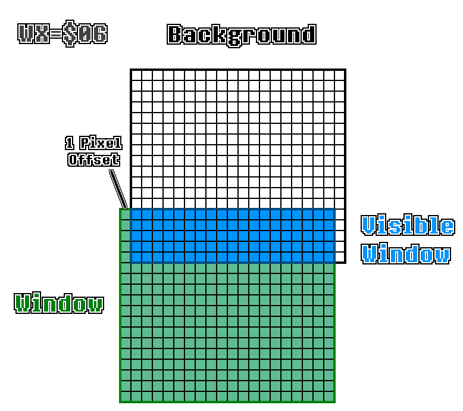

# Chapter XXV. Window Layer

[*Return to Index*](../README.md)

[*Previous Chapter*](24-background-viewport.md)

With the Background layer in a good place, it's time to expand beyond it to the second of the three rendering layers &mdash; the Window layer. Fortunately for us, this layer functions very similarly to the Background layer. It uses one of the two tile maps to layout its tiles, which are pulled from the same set as the Background layer. The biggest difference between the two is how its coordinate scheme functions. In the previous chapter we implemented the viewport into the Background layer &mdash; the 160x144 rectangle chunk taken out of the Background layer.

The Window layer, uses its coordinates to move it around in relation to the actual Game Boy screen. For example, if the Window layer is placed at (0, 100), then only the top 60 rows of the window will be seen, which is useful for things like status bars. The window coordinates are stored in the WX and WY registers, which we access via the `get_window_coords` function. However, since these are unsigned coordinate values, the Window layer can't be placed at a negative position. This means that it can only be shifted down and right on the screen, which makes the logic much simpler.



The Window Layer can be positioned so it only partially appears on-screen.

[Source - GBEDG](https://hacktix.github.io/GBEDG/ppu/#the-wx-and-wy-registers)

To begin, we'll add a new conditional to the `render` function which, like the Background layer, checks if the Window layer is even being displayed and if so, calls a new `render_window` function.

```rust
// In ppu/mod.rs
// Unchanged code omitted

impl Ppu {
    pub fn render(&self) -> [u8; DISPLAY_BUFFER] {
        let mut result = [0xFF; DISPLAY_BUFFER];

        if self.is_bg_layer_displayed() {
            self.render_bg(&mut result);
        }

        if self.is_window_layer_displayed() {
            self.render_window(&mut result);
        }

        return result;
    }
}
```

Note how it will write into the same framebuffer already containing our Background layer. This allows us to correctly layer everything together into the correct image. The Window layer always renders on top of the Background layer (hence the name). `render_window` will look very similar to `render_bg`, with the exception that we use the Window layer functions rather than the background ones where applicable, and how we handle the coordinates. Since the Window layer is always shifted down and right, if at all, we just need to iterate from the origin to the edge of the screen. We can even return early if the window coordinates are high enough that it won't be visible on screen at all.


```rust
// In mod/ppu.rs
// Unchanged code omitted

impl Ppu {
    fn render_window(&self, buffer: &mut [u8]) {
        let map_offset = self.get_wndw_tile_map_index() as usize * TILE_MAP_TABLE_SIZE;
        let palette = self.get_bg_palette();
        let coords = self.get_window_coords();
        if (coords.x as usize > SCREEN_WIDTH) || (coords.y as usize > SCREEN_HEIGHT) {
            return;
        }
        for y in (coords.y as usize)..SCREEN_HEIGHT {
            let row = y % TILESIZE;
            for x in (coords.x as usize)..SCREEN_WIDTH {
                let col = x % TILESIZE;
                let map_num = (y / TILESIZE) * LAYERSIZE + (x / TILESIZE);
                let tile_index = self.maps[map_offset + map_num] as usize;
                let adjusted_tile_index = if self.get_bg_wndw_tile_set_index() == 1 {
                    tile_index as usize
                } else {
                    (256 + tile_index as i8 as isize) as usize
                };
                let tile = self.tiles[adjusted_tile_index];
                let data = tile.get_row(row);
                let cell = data[col];
                let color_idx = palette[cell as usize];
                let color = GB_PALETTE[color_idx as usize];
                let buffer_idx = 4 * (y * SCREEN_WIDTH + x);
                for i in 0..4 {
                    buffer[buffer_idx + i] = color[i];
                }
            }
        }
    }
}
```

This is the finalized function. It uses `get_window_coords` to get the origin of the window layer, then iterates from that position to the edge of the screen. Aside from that, it's the same implementation we used in `render_bg` copy and pasted in. Since the window layer has no transparency, we can simply overwrite what was already stored in the output `buffer` without any care of what was already there. There will be a few changes we'll eventually need to make here, which will be similar to what we'll do in the background layer, but for now, this is enough to get us a functioning window layer.

[*Next Chapter*](26-input.md)
