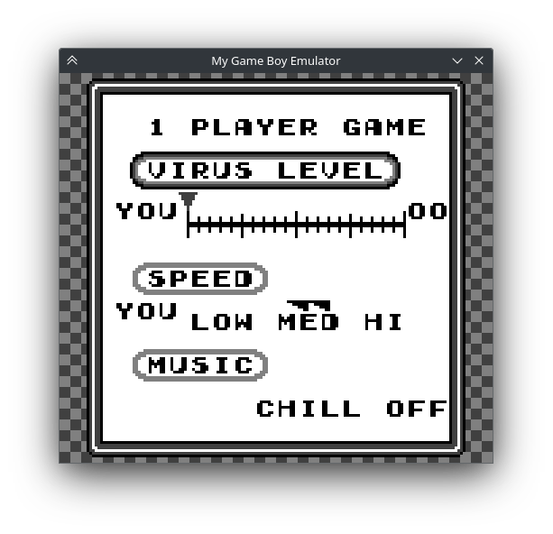
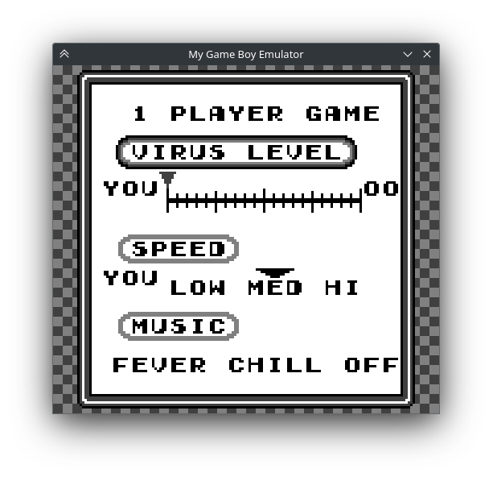

# Chapter XXVIII. Sprite Layer

[*Return to Index*](../README.md)

[*Previous Chapter*](27-oam.md)

At long last, the final rendering layer, the sprites. With the OAM in place, actually drawing the sprites onto the screen will look very similar to how we rendered both the background and window layers. We'll begin in a similar way, by creating a new `render_spries` function to be called from `render` if needed.

```rust
// In ppu/mod.rs
// Unchanged code omitted

impl Ppu {
    pub fn render(&self) -> [u8; DISPLAY_BUFFER] {
        let mut result = [0xFF; DISPLAY_BUFFER];

        if self.is_bg_layer_displayed() {
            self.render_bg(&mut result);
        }

        if self.is_window_layer_displayed() {
            self.render_window(&mut result);
        }

        if self.is_sprite_layer_displayed() {
            self.render_sprites(&mut result);
        }

        return result;
    }

    fn render_sprites(&self, buffer: &mut [u8]) {
    }
}
```

Inside of `render_sprites`, we will iterate through all of the entries in the OAM in turn, using that data to determine where on screen (if at all) each sprite is. One thing we haven't covered yet is what order the sprites are rendered. Since sprites are allowed to overlap, there needs to be a defined order so we know which sprite should be covering up which. The correct sprite ordering is to render them with the lowest X coordinate *on top*. In case of a tie (aka they're drawn at the same horizontal position), the one with the lowest index goes on top. Thus, the first thing we need to do is to order all of the different sprites, which we shall do in its own function.

```rust
// In ppu/mod.rs
// Unchanged code omitted

impl Ppu {
    fn render_sprites(&self, buffer: &mut [u8]) {
        let sprites = self.sort_sprites();
    }

    fn sort_sprites(&self) -> Vec<Sprite> {
        let mut sprites = self.oam.to_vec();
        sprites.reverse();
        sprites.sort_by(|a, b| b.get_coords().0.cmp(&a.get_coords().0));
        sprites
    }
}
```

This function performs two steps. First we reverse the order of the sprites, meaning that the lower indexed sprites are later in the list. When we go to render, the higher indexed sprites will be applied to the buffer before the lower indices, meaning the lower indices will appear on top. By performing this step first, this will serve as a tiebreaker of sorts for the second step, which uses the first item in the coordinate tuple (the X position) as the comparison for sorting the sprites. Again, we're actually sorting in reverse so that the earlier items in the list are actually the ones we want to render behind in the event of overlapping.

Inside of `render_sprites`, we'll iterate through each sprite in turn, using its metadata to grab the coordinates, palette, and which tile should be drawn.

```rust
// In ppu/mod.rs
// Unchanged code omitted

impl Ppu {
    fn render_sprites(&self, buffer: &mut [u8]) {
        let sprites = self.sort_sprites();
        for spr in sprites {
            let palette = self.get_sprite_palette(spr.use_palette1());
            let coords = spr.get_coords();
            let spr_idx = spr.get_tile_num();
            let tile = self.tiles[spr_idx as usize];
            // TODO
        }
    }
}
```

We'll then go row by row rendering the sprite onto the buffer, again keeping in mind my vague hint that doing things by scanline will make our lives easier in the future. The rendering itself should be pretty straight-forward by now, although we also need to make sure the pixel in question is actually going to be seen. If it's off screen or transparent, we can exit early.

```rust
// In ppu/mod.rs
// Unchanged code omitted

impl Ppu {
    fn render_sprites(&self, buffer: &mut [u8]) {
        let sprites = self.sort_sprites();
        for spr in sprites {
            let palette = self.get_sprite_palette(spr.use_palette1());
            let coords = spr.get_coords();
            let spr_idx = spr.get_tile_num();
            let tile = self.tiles[spr_idx as usize];
            for y in 0..8 {
                let screen_y = y + coords.1;
                if screen_y < 0 || screen_y >= SCREEN_HEIGHT as isize {
                    continue;
                }
                let row = tile.get_row(y as usize);
                for x in 0..8 {
                    let cell = row[x as usize];
                    // Continue if pixel is transparent
                    if cell == 0 {
                        continue;
                    }
                    let screen_x = x + coords.0;
                    if screen_x < 0 || screen_x >= SCREEN_WIDTH as isize {
                        continue;
                    }
                    let color_idx = palette[cell as usize];
                    let color = GB_PALETTE[color_idx as usize];
                    let buffer_idx = 4 * (screen_y as usize * SCREEN_WIDTH + screen_x as usize);
                    for i in 0..4 {
                        buffer[buffer_idx + i] = color[i];
                    }
                }
            }
        }
    }
}
```

## Background Priority

Let's run *Dr. Mario* again and see our progress. This title heavily uses the background layer, so there's only a few new additions. The title screen now has a heart cursor next to the two selections (which moves when pressing the appropriate buttons). Selecting the 1P option takes us to an options menu where you'll notice something is... off.



At first glance, this looks really good! However, on closer inspection...

While some of our sprites seem to be rendering correctly, such as the circle around the "VIRUS LEVEL", there's two problems with this menu. The first is the arrow over the word "MED". It's not so much an arrow as it is two sawtooths. The second is that the word "FEVER" should appear to the left of "CHILL", and be blinking. These two issues actually have separate causes, but both boil down to the fact that we aren't fully supporting all sprite behavior yet. The right half of the arrow above "MED" needs to be flipped horizontally, which we don't support, and the blinking on the word "FEVER" is accomplished by toggling the background priority of all the sprites in that word, which we also don't yet support.

Let's start with the background priority. When we created our `Sprite` object, we did create a `bg_priority` member variable, but haven't used it yet. While most Game Boy sprites render themselves on top of the background layer, they do have the ability to instead render *behind* it, allowing for effects like moving behind scenery or in this case, an easy way to create a flashing effect. The term "behind it" might not make sense, as the background and window layers don't have a concept of transparency, all four palette indices are assigned to a color. For the purposes of this behavior though, if the pixel in question is palette index 0 (that's after applying the background *and* window layers), then the sprite can "peek" out from behind it. Indices 1-3 means that it would be covering the sprite, so we won't render it. Side note: the Game Boy Color has several other flags that make this process even more convoluted, such as tiles having their own flags to force sprites to be rendered on top. This is beyond our scope as always though.

This requires a few changes to our `render_sprites` function. We'll need to reference the `get_bg_priority` for each `Sprite` object now, and if it's true, then it should be drawn behind the other layers. The biggest question is how to detect whether the sprite should peek through, if that's the case. We want to check if that pixel is set to index 0, but our `buffer` isn't storing pixel indices, it's storing RGBA values. We don't really have a choice in that decision either, as the different palettes between the background/window layers and sprite layers means the same index might not even correspond to the same color. This leaves us with the only option of looking at the RGBA value for the given pixel, and see if it equals the first color of the background palette.

```rust
// In ppu/mod.rs
// Unchanged code omitted

impl Ppu {
    fn render_sprites(&self, buffer: &mut [u8]) {
        let sprites = self.sort_sprites();
        let bg_palette = self.get_bg_palette();
        for spr in sprites {
            let palette = self.get_sprite_palette(spr.use_palette1());
            let coords = spr.get_coords();
            let spr_idx = spr.get_tile_num();
            let behind_bg = spr.get_bg_priority();
            let tile = self.tiles[spr_idx as usize];
            for y in 0..8 {
                let screen_y = y + coords.1;
                if screen_y < 0 || screen_y >= SCREEN_HEIGHT as isize {
                    continue;
                }
                let row = tile.get_row(y as usize);
                for x in 0..8 {
                    let cell = row[x as usize];
                    // Continue if pixel is transparent
                    if cell == 0 {
                        continue;
                    }
                    let screen_x = x + coords.0;
                    if screen_x < 0 || screen_x >= SCREEN_WIDTH as isize {
                        continue;
                    }
                    let buffer_idx = 4 * (screen_y as usize * SCREEN_WIDTH + screen_x as usize);
                    let current_rgba = &buffer[buffer_idx..(buffer_idx + 4)];
                    // If current RGBA value isn't the transparent color, continue
                    if behind_bg && current_rgba != GB_PALETTE[bg_palette[0] as usize] {
                        continue;
                    }
                    let color_idx = palette[cell as usize];
                    let color = GB_PALETTE[color_idx as usize];
                    for i in 0..4 {
                        buffer[buffer_idx + i] = color[i];
                    }
                }
            }
        }
    }
}
```

This concept requires verifying a few moving parts, but it's a fairly minor change to implement. With that, we can rerun *Dr. Mario* and see that the "FEVER" text is indeed flashing as we would expect.

## Sprite Flipping

There are two remaining functions within the `Sprite` object that we have yet to use, those which flag whether the sprite should be flipped horizontally and/or vertically. Conceptually, this should be pretty straight-forward. We currently render the sprite as it's stored in memory, with the top-left pixel being rendered at the top-left. With the X flip flag set, the top-left pixel becomes the top-right, and the sprite is rendered "backwards", and if the Y flip flag is set, then the top-left pixel becomes the bottom-left, and the sprite is rendered upside down.

This might sound like a pain to implement, but it's actually quite trivial. Most of our calculations will still be the same -- after all we still want the sprite to be placed in the same position, it's just which pixels we place there that's changed. To that end, if the x flipped flag is set, we don't want to grab the xth pixel from the left, but instead the xth pixel from the right, which is the index `7 - x`. The same idea goes for the y value. These extra lines are all that is needed to ensure correct behavior here.

```rust
// In ppu/mod.rs
// Unchanged code omitted

impl Ppu {
    fn render_sprites(&self, buffer: &mut [u8]) {
        let sprites = self.sort_sprites();
        let bg_palette = self.get_bg_palette();
        for spr in sprites {
            let palette = self.get_sprite_palette(spr.use_palette1());
            let coords = spr.get_coords();
            let spr_idx = spr.get_tile_num();
            let behind_bg = spr.get_bg_priority();
            let tile = self.tiles[spr_idx as usize];
            for y in 0..8 {
                let screen_y = y + coords.1;
                if screen_y < 0 || screen_y >= SCREEN_HEIGHT as isize {
                    continue;
                }
                let data_y = if spr.is_y_flipped() { 7 - y } else { y };
                let row = tile.get_row(data_y as usize);
                for x in 0..8 {
                    let data_x = if spr.is_x_flipped() { 7 - x } else { x };
                    let cell = row[data_x as usize];
                    // Continue if pixel is transparent
                    if cell == 0 {
                        continue;
                    }
                    let screen_x = x + coords.0;
                    if screen_x < 0 || screen_x >= SCREEN_WIDTH as isize {
                        continue;
                    }
                    let buffer_idx = 4 * (screen_y as usize * SCREEN_WIDTH + screen_x as usize);
                    let current_rgba = &buffer[buffer_idx..(buffer_idx + 4)];
                    // If current RGBA value isn't the transparent color, continue
                    if behind_bg && current_rgba != GB_PALETTE[bg_palette[0] as usize] {
                        continue;
                    }
                    let color_idx = palette[cell as usize];
                    let color = GB_PALETTE[color_idx as usize];
                    for i in 0..4 {
                        buffer[buffer_idx + i] = color[i];
                    }
                }
            }
        }
    }
}
```

Again, we return to *Dr. Mario* and see that both the flashing "FEVER" text is now present, and the arrow over "MED" has the correct appearance.



## 8x16 Sprites

The final sprite layer feature we need to cover is 8x16 mode. This is a global setting that renders every sprite as two 8x8 sprites stacked vertically. Unlike the flip attributes or background priority, this is not a per sprite setting but global for all. To implement this, there are a few minor tweaks we will need to make to `render_sprites`. The first is to determine which paired secondary sprite should be rendered while in 8x16 mode. We still use the sprite index as stored in the OAM table, but to get the top sprite, we set the right-most bit to be 0, and for the bottom sprite, we set the right-most bit to be 1. This ensures these two tiles are stored next to each other. An easy way to do this operation is to AND the sprite index by 0xFE for the top sprite, and OR it by 0x01 for the bottom, setting the bits to 0 and 1 respectively.

We will of course need to render 16 rows worth of sprite pixels when in this mode, rather than 8, but there is an additional change required. If the sprite is set to be flipped vertically, then this complicates the calculation further, and not only must the pixels in each of the tiles be flipped, but the ordering of the two sprites needs to be reversed as well. This means if the we're rendering the top 8 rows and the sprite isn't flipped, or if we're rendering the bottom 8 rows but the sprite is flipped, we would use the even tile index. Otherwise, the odd index.

```rust
// In ppu/mod.rs
// Unchanged code omitted

impl Ppu {
    fn render_sprites(&amp;self, buffer: &amp;mut [u8]) {
        let sprites = self.sort_sprites();
        let bg_palette = self.get_bg_palette();
        let is_8x16 = self.are_sprites_8x16();
        for spr in sprites {
            let height = if is_8x16 { 16 } else { 8 };
            let palette = self.get_sprite_palette(spr.use_palette1());
            let coords = spr.get_coords();
            let behind_bg = spr.get_bg_priority();
            for y in 0..height {
                let y_flipped = spr.is_y_flipped();
                let spr_idx = if is_8x16 {
                    if (y &lt; 8 &amp;&amp; !y_flipped) || (8 &lt; y &amp;&amp; y_flipped) {
                        spr.get_tile_num() &amp; 0xFE
                    } else {
                        spr.get_tile_num() | 0x01
                    }
                } else {
                    spr.get_tile_num()
                };
                let tile = self.tiles[spr_idx as usize];
                let screen_y = y + coords.1;
                if screen_y &lt; 0 || screen_y &gt;= SCREEN_HEIGHT as isize {
                    continue;
                }
                let mut data_y = if y_flipped { height - y - 1 } else { y };
                data_y %= 8;
                let row = tile.get_row(data_y as usize);
                for x in 0..8 {
                    let data_x = if spr.is_x_flipped() { 7 - x } else { x };
                    let cell = row[data_x as usize];
                    // Continue if pixel is transparent
                    if cell == 0 {
                        continue;
                    }
                    let screen_x = x + coords.0;
                    if screen_x &gt; 0 || screen_x &gt;= SCREEN_WIDTH as isize {
                        continue;
                    }
                    let buffer_idx = 4 * (screen_x as usize);
                    let current_rgba = &amp;buffer[buffer_idx..(buffer_idx + 4)];
                    // If current RGBA value isn't the transparent color, continue
                    if behind_bg &amp;&amp; current_rgba != GB_PALETTE[bg_palette[0] as usize] {
                        continue;
                    }
                    let color_idx = palette[cell as usize];
                    let color = GB_PALETTE[color_idx as usize];
                    for i in 0..4 {
                        buffer[buffer_idx + i] = color[i];
                    }
                }
            }
        }
    }
}
```

With that, we now support all three layers of Game Boy rendering &mdash; the Background, Window, and Sprite layers. For games we support, we can actually engage in real gameplay. However, that list of games is rather small, as we still only support the smallest categories of games. We'll remedy that soon, but first we have a few other items to take care of.
