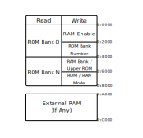

# XXXI. The ROM Header

[*Return to Index*](../README.md)

[*Previous Chapter*](30-cpu-timer.md)

At this point, our emulator can support a small number of games fairly well. The limiting factor to whether a game can be played is whether it can fit into the available RAM space. This is fine for some commercial games, such as *Tetris* and *Dr. Mario*, but the vast majority of games were programmed using more data than we can currently contain. Fortunately, the engineers behind the Game Boy knew this would be an issue, and mechanisms were put in place to allow blocks of ROM data to be swapped in and out of RAM as needed. I've made vague references to these mechanisms throughout this guide, and it is now time to put them into place. To begin, we'll need to examine in more detail how a Game Boy ROM is laid out. The precise details aren't necessarily too relevant to us, as it's more the job of the game developer to make sure their game is structured correctly, but there are some pieces that are useful to us.

As you've been debugging your emulator throughout this guide, you may have noticed some interesting patterns in how a game begins execution. If you recall, our emulator initializes the PC to address 0x0100. Addresses lower than that are used for reset and interrupt vectors. However, if you pay close attention, the first instructions made by every game is to immediately jump to somewhere else, often to address 0x0150. This is not a coincidence, it is a necessity due to every Game Boy game storing encoded information shortly after address 0x0100. This information is not our usual machine code, but is metadata containing information about the game itself. Often referred to as the "ROM Header", it stores information such as how large the ROM is, how large the RAM chip on the cartridge is (if any), whether or not the game supports the Game Boy Color or Super Game Boy, among other items.<sup>1</sup>


The Game Boy Header layout

The header lives in ROM from address 0x0100 to 0x014F -- which is why games often jump to 0x0150. Some of the information stored here is more for classification purposes, such as the manufacturer code or ROM version, and isn't used in the emulation process. There are three fields that we will use -- the Game Title, Cartridge Type, and RAM size.

You might be wondering about the two checksum fields. If you aren't familiar, a *checksum* is a value calculated from a large block of data (in this case, from the header and the entire ROM). It's used to ensure that there hasn't been any data corruption or loss. The Game Boy system can recalculate the checksum from the data provided and should get the same result, otherwise something has been corrupted. We aren't going to enforce the checksums in our project, as we don't want to exclude any homebrew games or romhacks that might not have calculated it correctly, and we don't need to worry about any physical hardware damage if something goes horribly wrong.

<sup>1</sup> Code to display and animate the "Nintendo" logo that scrolls across down the screen when the system is first turned on is also stored here. A real Game Boy requires this code to exist, both to initialize the CPU to the initial values we've previously hardcoded in as well as the play the animation. However, this exists less for technical reasons and is actually a legality. A real Game Boy requires that logo to be present, or else it won't boot the game. If a game was released without licensing from Nintendo, but with the inclusion of that code and logo, Nintendo would have an avenue for a trademark infringement lawsuit. By hardcoding the state of the CPU and RAM after the boot code completes, we're able to bypass this restriction both so we can play unlicensed Game Boy games and so we don't need to include proprietary Nintendo assets ourselves. Unfortunately, this means our emulator won't play the Nintendo animation or ding.

## Optional: Game Title

Stored from 0x0134 to 0x0142 in the ROM is an ASCII representation of the title of the game.<sup>2</sup> Some emulators have a feature that once a game begins to run, the title of the program changes to display its name. This is where that name comes from, and this is a feature we will also support. This is purely optional, but I think it's a nice quality of life feature for us to implement. For the first time in a while, we will return to `cart/mod.rs` and add some new functionality. We want to grab the slice of data from  0x0134 to 0x0142 and convert it to a string, which we can then utilize elsewhere.

<sup>2</sup> For a Game Boy Color game, the available space for the title is actually shorter, only ranging from 0x0134 to 0x013F. The lost four bytes are instead used for information about the developer.

```rust
// In cart/mod.rs
// Unchanged code omitted

use std::str::from_utf8;

const TITLE_START: usize = 0x0134;
const TITLE_STOP: usize  = 0x0142;

impl Cart {
    pub fn get_title(&self) -> &str {
        let data = &self.rom[TITLE_START..TITLE_STOP];
        from_utf8(data).unwrap().trim_end_matches(char::from(0))
    }
}
```

In the event where the title of the game is shorter than the available space, the left over area is often padded with zeroes, which we'll trim out.

There is no place in the backend `core` where the title is useful, instead we'll need to create API functions so that the frontends can access it, in a similar fashion to what we did for `load_rom`.

First a function to access it inside the Bus.

```rust
// In bus.rs
// Unchanged code omitted

impl Bus {
    pub fn get_title(&self) -> &str {
        self.rom.get_title()
    }
}
```

Then another to access it from the Cpu.

```rust
// In cpu/mod.rs
// Unchanged code omitted

impl Cpu {
    pub fn get_title(&self) -> &str {
        self.bus.get_title()
    }
}
```

Integrating the title into our frontends is pretty straight-forward. The title will be available anytime after the ROM has been loaded into the core, so we are free to grab it, then use it in the creation of the game windows.

```rust
// In desktop/src/main.rs
// Unchanged code omitted

fn main() {
    let mut gb = Cpu::new();
    let filename = &args[1];
    let rom = load_rom(filename);
    gb.load_rom(&rom);
    let title = gb.get_title();

    let sdl_context = sdl2::init().unwrap();
    let video_subsystem = sdl_context.video().unwrap();
    let window = video_subsystem.window(title, WINDOW_WIDTH, WINDOW_HEIGHT)
        .position_centered().opengl().build().unwrap();
    let mut canvas = window.into_canvas().present_vsync().build().unwrap();
    canvas.clear();
    canvas.present();
}
```

The web version works much in the same way, although since this is API exposed from the backend, it needs to be defined in the `wasm` module as well.

```rust
// In wasm/src/lib.rs
// Unchanged code omitted

#[wasm_bindgen]
impl GB {
    #[wasm_bindgen]
    pub fn get_title(&self) -> String {
        self.cpu.get_title().to_string()
    }
}
```

```javascript
// In html/index.js
// Unchanged code omitted

document.getElementById("fileinput").addEventListener("change", function (e) {
    // Stop previous game from rendering, if one exists
    if (anim_frame != 0) {
        window.cancelAnimationFrame(anim_frame)
    }

    let file = e.target.files[0]
    if (!file) {
        alert("Failed to read file")
        return
    }

    let fr = new FileReader()
    fr.onload = function () {
        let buffer = fr.result
        const rom = new Uint8Array(buffer)
        gb.load_rom(rom)
        let title = gb.get_title()
        document.title = title

        mainloop(gb)
    }

    fr.readAsArrayBuffer(file)
}, false)
```

The Rust-style string slice has to be converted to a JavaScript-style `String` before it can be used, but otherwise implementation works much in the same as any of the other backend API calls we've added. Once this is in place, fire up a game and you can see that the title should appropriately adjust to the name stored inside the ROM.<sup>3</sup>


<sup>3</sup> With only 14 bytes to work with, some game titles have been abbreviated from their commercial names.

## Cartridge Type

With the detour of adding support for the game title out of the way, it's time to return to the header and discuss exactly what allows larger games to be correctly played. As we've covered previously, the first half of the RAM is designated for ROM data. Before any data from the ROM can be used, it *must* be loaded into there, which would limit the size of the ROM to be 32 KiB. To get around this, developers used "Memory Bank Controllers" (MBC), specialized chips that handles the loading of large blocks of data from the ROM into RAM as requested. Only the games that required larger ROM sizes required MBC chips. Games like *Tetris* simply have no need of them, and thus don't have one.


When we looked at the RAM map, it was mentioned that while the first 32 KiB was assigned for the ROM, that block was actually broken into two halves, known as "banks". The first 16 KiB is known as Bank 0, and it *always* stores the first 16 KiB from the ROM. Given that this is where the reset and interrupt vectors, as well as the header, lives, it's understandable that we always want this available. It's the second 16 KiB of RAM that the MBC can swap out with any other 16 KiB bank of its choosing.

How is this done? We mentioned that the first half of RAM is read-only, as we wouldn't want to accidentally corrupt our own source code in the event of a bug. This is technically true, you can't edit the ROM data stored there, and for games without an MBC, that's the end of the story. For games that do utilize an MBC, if you attempt to write to that RAM range, the MBC "intercepts" any bytes and uses the byte and the address attempted to write to as metadata for the bank swap. This is how the developer tells the MBC that they want to swap in a new bank of the ROM, which the MBC will then dutifully carry out. Each different MBC chip type performs this action slightly differently, both in how it interprets the input data, and how it decides what bank to copy in. There wasn't anything stopping every single Game Boy developer from implementing their own, unique MBC design, but in reality the vast majority of commercial titles all used the same handful, which we will implement. To be specific, these are referred to by the clever names of MBC1, MBC2, MBC3, and MBC5<sup>4</sup>.

<sup>4</sup> I don't know what happened to MBC4 either, although I'll admit I didn't do a whole lot of research trying to find out.

Here is an example of the memory map for games with the MBC1. The read behavior is largely the same as what we have already described -- Bank 0 is always loaded into the first 16 KiB, with a variable bank into the second 16 KiB, and a 8 KiB address space for RAM potentially included on the cartridge. For writing, the first 32 KiB is broken up into different areas, which controls different aspects of the MBC's behavior, such as enabling the external RAM or choosing which bank should be loaded in. We'll cover this behavior, and how it differs from the other MBC options in more detail when we implement them.



MBC1 Map

We've gotten a bit off track from talking about the header, but that bit of preamble was necessary to understanding what it stores. Address 0x0147 stores the Cartridge Type, an index into a table for what hardware is physically present on the cartridge. Here is a list of all the cartridge types that our emulator will support. There are a few additional known ones, but they're used so seldom that we won't implement them.

| Value | Cartridge Type                |
| ----- | ----------------------------- |
| 0x00  | ROM Only                      |
| 0x01  | MBC1                          |
| 0x02  | MBC1 + RAM                    |
| 0x03  | MBC1 + RAM + Battery          |
| 0x05  | MBC2                          |
| 0x06  | MBC2 + Battery                |
| 0x08  | ROM + RAM                     |
| 0x09  | ROM + RAM + Battery           |
| 0x0F  | MBC3 + Timer + Battery        |
| 0x10  | MBC3 + Timer + RAM + Battery  |
| 0x11  | MBC3                          |
| 0x12  | MBC3 + RAM                    |
| 0x13  | MBC3 + RAM + Battery          |
| 0x19  | MBC5                          |
| 0x1A  | MBC5 + RAM                    |
| 0x1B  | MBC5 + RAM + Battery          |
| 0x1C  | MBC5 + Rumble                 |
| 0x1D  | MBC5 + Rumble + RAM           |
| 0x1E  | MBC5 + Rumble + RAM + Battery |

This is how our emulator will know which MBC type we need to handle for the given game, as well as if it has things like external RAM or battery save support. We won't worry about Rumble or Timer functionality (it's not the same as our CPU timer), but we will need to create helper functions to determine which MBC the game is using, if there is external RAM present, and if battery backups are supported.

First the MBC type. We'll create a new enum set for each of the types we plan to support, as well as an additional invalid option for the ones we don't. We'll then use the list above to match the index stored in the header with its corresponding MBC type. We'll reference this MBC type fairly frequently, so we'll save it as a member variable, which can be initialized when we're loading in the cartridge data in `load_rom`.

```rust
// In cart/mod.rs
// Unchanged code omitted

const CART_TYPE_ADDR: usize = 0x0147;

#[derive(Clone, Copy, PartialEq)]
pub enum MBC {
    NONE,
    MBC1,
    MBC2,
    MBC3,
    MBC5,
    INV,
}

pub struct Cart {
    rom: Vec<u8>,
    mbc: MBC,
}

impl Cart {
    pub fn new() -> Self {
        Self {
            rom: Vec::new(),
            mbc: MBC::NONE,
        }
    }

    fn get_mbc(&self) -> MBC {
        let cart_type = self.rom[CART_TYPE_ADDR];
        match cart_type {
            0x00 =>         { MBC::NONE },
            0x01..=0x03 =>  { MBC::MBC1 },
            0x05..=0x06 =>  { MBC::MBC2 },
            0x0F..=0x13 =>  { MBC::MBC3 },
            0x19..=0x1E =>  { MBC::MBC5 },
            _ =>            { MBC::INV },
        }
    }

    pub fn load_cart(&mut self, rom: &[u8]) {
        self.rom = rom.to_vec();
        self.mbc = self.get_mbc();
    }
}
```

The other two helper functions will look very similar. We'll add a member variable both for whether external RAM and/or battery saving is supported, then write functions which use the table above to initialize those variables. Those with a keen eye will notice that `has_battery` is a public function. This won't be important for a while, but we will need this function in other modules eventually.

```rust
// In cart/mod.rs
// Unchanged code omitted

pub struct Cart {
    rom: Vec<u8>,
    mbc: MBC,
}

impl Cart {
    pub fn new() -> Self {
        Self {
            rom: Vec::new(),
            mbc: MBC::NONE,
        }
    }

    pub fn has_battery(&self) -> bool {
        let has_battery = [
            0x03, 0x06, 0x09,
            0x0D, 0x0F, 0x10,
            0x13, 0x1B, 0x1E,
        ];

        let cart_type = self.rom[CART_TYPE_ADDR];
        has_battery.contains(&cart_type)
    }

    fn has_external_ram(&self) -> bool {
        let has_ext_ram = [
            0x02, 0x03, 0x08,
            0x09, 0x0C, 0x0D,
            0x10, 0x12, 0x13,
            0x16, 0x17, 0x1A,
            0x1B, 0x1D, 0x1E,
        ];

        let cart_type = self.rom[CART_TYPE_ADDR];
        has_ext_ram.contains(&cart_type)
    }

    pub fn load_cart(&mut self, rom: &[u8]) {
        self.rom = rom.to_vec();
        self.mbc = self.get_mbc();
    }
}
```

The next step would be to create space to store any potential RAM data or to maintain which banks are loaded in or out, but that is beyond the scope of this chapter. We'll tackle those ideas when we begin implementing the MBCs directly.

[*Next Chapter*](32-ext-ram.md)
