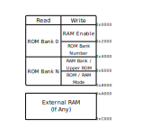

# XXXIII. ROM Banking & MBC1

[*Return to Index*](../README.md)

[*Previous Chapter*](32-ext-ram.md)

It's time to begin implementing the different MBC mapper chips which handles memory banking for the games. There are several different MBC chips our emulator will support, each with their own behavior, although the general concepts apply to all. To implement a new MBC, there are four functions that need to be implemented namely for reading from ROM space, reading from RAM space, writing to ROM space, and writing to RAM space. We'll begin by implementing these functions for the MBC1 chip first, to give an example of the general structure, as well as to create some of the shared functions and constants that they will all use. Once it is in place, we'll cover the other MBC types in quicker succession.

## Initial Setup

We'll begin by adding some new constants and member variables to our `Cart` object. These will handle which RAM and ROM banks are currently selected, and which modes are enabled (more on that later). Unlike a real system, we aren't going to copy banks of data whenever a bank switch occurs. Instead, we'll just keep track of what bank index is currently chosen and use it to calculate the correct index into the large `rom` or `ram` vectors.

```rust
// In cart/mod.rs
// Unchanged code omitted

pub struct Cart {
    rom: Vec<u8>,
    ram: Vec<u8>,
    rom_bank: u16,
    ram_bank: u8,
    mbc: MBC,
    rom_mode: bool,
    ram_enabled: bool,
}

impl Cart {
    pub fn new() -> Self {
        Self {
            rom: Vec::new(),
            ram: Vec::new(),
            rom_bank: 1,
            ram_bank: 0,
            mbc: MBC::NONE,
            rom_mode: true,
            ram_enabled: false,
        }
    }
}
```

We'll initialize the `rom_bank` to 1, as bank 0 is always loaded into the lowest 16 KiB, leaving bank 1 to be the default bank in the switchable space. The external RAM, on the other hand, will default to bank 0.

The other two booleans are used by some of the MBCs. `ram_enabled` does exactly what it says -- it enables or disables writing to external RAM. There are various reasons why a developer would want to limit this, but for now we only need to know to support it. `rom_mode` is used by some MBCs to allow the same memory map space to serve two purposes. When set, writing to the specific address will change the ROM bank index, otherwise it will change the external RAM bank. We'll explore exactly what this means in a moment, when we implement writing to the ROM memory addresses.

## Reading from ROM

Although the different MBCs have different behavior, they all read from ROM in the same way. If the system is attempting to read from address 0x0000 through 0x3FFF, then we always read from ROM bank 0. This behavior is mandated by the Game Boy, regardless of the MBC. Addresses 0x4000 through 0x7FFF is the swappable bank space. On a real Game Boy, the MBC would copy in entire banks of data from ROM into RAM as needed. We will avoid doing this, and instead just use the value in `rom_bank` to calculate the absolute address into the `rom` vector to read. Each of the different MBC types will have their own way of updating `rom_bank`, but this also works if there is no MBC at all. In that case, we're initializing `rom_bank` to be bank 1 and it will never change.

```rust
// In cart/mod.rs
// Unchanged code omitted

const ROM_BANK_SIZE: usize = 0x4000;

impl Cart {
    pub fn read_cart(&self, addr: u16) -> u8 {
        if (addr as usize) < ROM_BANK_SIZE {
            self.rom[addr as usize]
        } else {
            let rel_addr = (addr as usize) - ROM_BANK_SIZE;
            let bank_addr = (self.rom_bank as usize) * ROM_BANK_SIZE + rel_addr;
            self.rom[bank_addr]
        }
    }
}
```

## Reading from RAM

While our `read_cart` function handles reading from address 0x0000-0x7FFF, `read_ram` will handle the external RAM space, from 0xA000-0xBFFF. Unfortunately, unlike reading from ROM, external RAM access does slightly vary between the different MBCs, although it's only minor differences. Conveniently, the functionality for RAM reads for the MBC1 is exactly the same as with no MBC at all, so we can begin by writing shared code for them.

```rust
// In cart/mod.rs
// Unchanged code omitted

const RAM_BANK_SIZE: usize = 0x2000;

impl Cart {
    pub fn read_ram(&self, addr: u16) -> u8 {
        match self.mbc {
            MBC::NONE | MBC::MBC1 => {
                let rel_addr = (addr - EXT_RAM_START) as usize;
                let bank_addr = (self.ram_bank as usize) * RAM_BANK_SIZE + rel_addr;
                self.ram[bank_addr]
            },
            _ => unimplemented!()
        }
    }
}
```

This should look extremely similar to what we implemented for `read_cart`. In the case of having no MBC, `ram_bank` will always be set to 0, effectively always reading from the relative address in the RAM array. For MBC1, it is possible for `ram_bank` to change, as we'll see.

## Writing to ROM

The idea of writing to the ROM might seem odd. It is Read-Only Memory after all, and up until now we've explicitly said that you cannot write to the memory space from 0x0000-0x7FFF. This is still true, the data itself stored in RAM at those address cannot be changed by the Game Boy, with the exception of replacing the entire memory bank. However, attempting to write to those addresses does serve a purpose. A MBC, if one exists, can intercept those write instructions and use them as its own input, allowing the developer to send updates to the MBC directly. The address space is broken up into several sections, where writing to one of them serves a specific purpose. Fortunately for us, all of the MBCs we will support all break up the address space in the same way, although what happens when you write to those spaces differs.



The 16 KiB ROM address space has been broken up into four 4 KiB regions. Using the MBC1 as an example, writing the value 0x0A anywhere from 0x0000-0x1FFF enables external RAM access; any other value disables it. Writing a byte from 0x2000 to 0x3FFF sets the lower five bits of the ROM bank number, which initiates a bank swap. If the value written has anything in the higher bits, it's ignored. Skipping over a section, writing a 0 between 0x6000 and 0x7FFF sets the MBC to ROM mode -- as opposed to RAM mode. When in ROM mode, writing to 0x4000-0x5FFF you set bits five and six of the ROM bank, while in RAM mode writing to that same address space sets the external RAM bank. Like the ROM bank though, the RAM bank on an MBC1 can only range from 0 to 3, so only the lower two bits are used.

To reiterate that, the behavior we need to support looks like the following:

| Address Range | Purpose                         |
| ------------- | ------------------------------- |
| 0x0000-0x1FFF | RAM is enabled if value == 0x0A |
| 0x2000-0x3FFF | Sets lower five bits of ROM bank |
| 0x4000-0x5FFF | If ROM mode: Sets bits 5 and 6 of ROM bank, else sets lower two bits of RAM bank |
| 0x6000-0x7FFF | ROM mode is enabled if value == 0, else RAM mode |

There is one final gotcha when implementing this functionality. While it's true that writing from 0x2000 to 0x3FFF sets the lower five bits of the ROM bank, some of the bank addresses are invalid. Telling the MBC1 to swap in bank 0 isn't allowed for example -- perhaps understandably, given that we always have bank 0 available to us -- but banks 0x20, 0x40, and 0x60 aren't swappable either. If you do try and write those memory banks, the next bank is loaded instead. Meaning that if you write 0x00, 0x20, 0x40, or 0x60 between 0x2000 and 0x3FFF, ROM bank 0x01, 0x21, 0x41, or 0x61 will be swapped in, respectively.

Rather than cram all this functionality into our `write_cart` function, we'll again use a match statement to distinguish between the different MBC types, then call an MBC1-specific function to handle the table above. If the game has no MBC at all, then the write attempt can be completely ignored, there's no MBC to intercept that call.

```rust
// In cart/mod.rs
// Unchanged code omitted

const RAM_ENABLE_START: u16     = 0x0000;
const RAM_ENABLE_STOP: u16      = 0x1FFF;
const ROM_BANK_NUM_START: u16   = 0x2000;
const ROM_BANK_NUM_STOP: u16    = 0x3FFF;
const RAM_BANK_NUM_START: u16   = 0x4000;
const RAM_BANK_NUM_STOP: u16    = 0x5FFF;
const ROM_RAM_MODE_START: u16   = 0x6000;
const ROM_RAM_MODE_STOP: u16    = 0x7FFF;

impl Cart {
    pub fn write_cart(&mut self, addr: u16, val: u8) {
        match self.mbc {
            MBC::NONE => {},
            MBC::MBC1 => { self.mbc1_write_rom(addr, val); },
            _ => unimplemented!()
        }
    }

    fn mbc1_write_rom(&mut self, addr: u16, val: u8) {
        match addr {
            RAM_ENABLE_START..=RAM_ENABLE_STOP => {
                self.ram_enabled = val == 0x0A;
            },
            ROM_BANK_NUM_START..=ROM_BANK_NUM_STOP => {
                let bank = (val & 0x1F) as u16;
                match bank {
                    // Bank numbers 0x00, 0x20, 0x40, 0x60 aren't used
                    // Instead they load the next bank
                    0x00 | 0x20 | 0x40 | 0x60 => {
                        self.rom_bank = bank + 1;
                    },
                    _ => {
                        self.rom_bank = bank;
                    }
                }
            },
            RAM_BANK_NUM_START..=RAM_BANK_NUM_STOP => {
                let bits = val & 0b11;

                if self.rom_mode {
                    self.rom_bank |= (bits << 5) as u16;
                } else {
                    self.ram_bank = bits;
                }
            },
            ROM_RAM_MODE_START..=ROM_RAM_MODE_STOP => {
                self.rom_mode = val == 0;
            },
            _ => unreachable!()
        }
    }
}
```

## Writing to RAM

Finally comes writing to the external RAM space, 0xA000 through 0xBFFF. Previously, when we had no MBC, but did have external RAM, it was simply a matter of calculating the right index in our `ram` array and writing to it. For the MBC1, that is pretty close to the same behavior with two slight variations. We now need to take the RAM bank into account, and we also need to disallow writing to external RAM if `ram_enabled` isn't set. This is just different enough behavior that we'll separate it out from the case where there is no MBC.

```rust
// In cart/mod.rs
// Unchanged code omitted

impl Cart {
    pub fn write_ram(&mut self, addr: u16, val: u8) {
        match self.mbc {
            MBC::NONE => {
                let rel_addr = addr - EXT_RAM_START;
                self.ram[rel_addr as usize] = val;
            },
            MBC::MBC1 => self.mbc1_write_ram(addr, val),
            _ => unimplemented!()
        }
    }

    fn mbc1_write_ram(&mut self, addr: u16, val: u8) {
        if self.ram_enabled {
            let rel_addr = (addr - EXT_RAM_START) as usize;
            let ram_addr = (self.ram_bank as usize) * RAM_BANK_SIZE + rel_addr;
            self.ram[ram_addr] = val;
        }
    }
}
```

With that, all games utilizing the MBC1 chip have been supported by our emulator, which opens up a huge amount of new games for us to play. *The Legend of Zelda: Link's Awakening*, *Metroid II*, several of the *Mega Man* games and more all use the MBC1, and all of them should now be playable, with only a few features we have yet to support still missing.

We'll next cover the other MBCs we plan on supporting -- MBC2, MBC3, and MBC5, which will make nearly the entire Game Boy library playable in our emulator.

[*Next Chapter*](34-mbc2.md)
