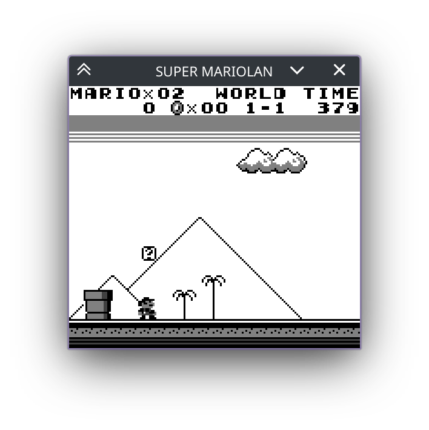
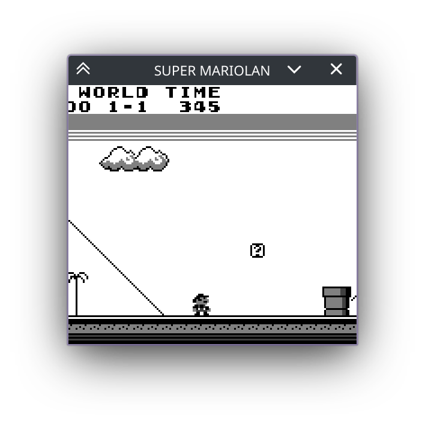
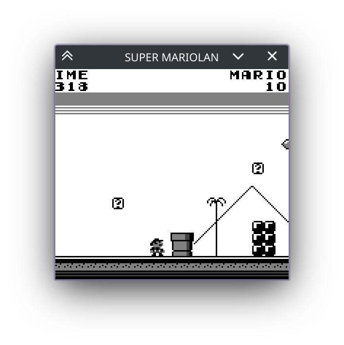

# XXXVII. Render by Scanline

[*Return to Index*](../README.md)

[*Previous Chapter*](36-mbc5.md)

Let's fire up a game of *Super Mario Land*, a Game Boy classic. If you've not played it, *Super Mario Land* was an earnest attempt to replicate the early Mario gameplay by scaling down the visuals. You still have the block-based gameplay, navigating enemies, and status bar up at the top.



As you move across the world, you'll first run into a goomb- wait... where is the status bar going?



Alright.. it looks like it doesn't want to come with us. Well, no matter, we can continue on without it. As we move through the course we'll come across... the status bar again. What's going on here?



If you've made it this far into this guide, it's likely you already have a pretty good idea what's causing this and what feature we need to support to fix this issue. It is time to add support for scanline rendering, functionality we've discussed repeatedly when implementing the different frame layers. When we implemented the layers, we went row by row, pixel by pixel, and rendered the entire frame all at once. However, this is not how a Game Boy actually renders. Instead, the system will draw the frame line by line, building up the entire frame over a spread of time rather than all at once. This impacts our *Super Mario Land* gameplay, as the status bar is utilizing the LYC register behavior. This register allows the developer to trigger an interrupt when the scanline stored in LYC is reached. *Super Mario Land* uses this to offset where the Window Layer -- which holds the status bar -- is positioned. Thus, while the rest of the background scrolls with Mario, the game re-centers the status bar to always be at the original position each frame. We went through all the work of supporting the LY and LYC registers, handling the interrupts, but by rendering the frame all at once, we render the frame data as it is at the very end. For things like the scanline interrupts, which might change parameters mid-frame, we're never seeing the changes.

## Modifying the Rendering Layers

Currently in `ppu/mod.rs`, our `render` function initializes an array large enough to store the RGBA data for each pixel in the frame, renders each layer, then returns it. Our goal in this chapter is to instead construct the frame line by line whenever one is ready, meaning that we'll need to store the state of the frame in-between function calls. We'll do this by creating a new array within our `Ppu` struct to hold our screen buffer.

```rust
// In ppu/mod.rs
// Unchanged code omitted

pub struct Ppu {
    screen_buffer: [u8; DISPLAY_BUFFER],
    mode: Lcd,
    tiles: [Tile; NUM_TILES],
    maps: [u8; TILE_MAP_SIZE],
    lcd_regs: [u8; LCD_REG_SIZE],
    oam: [Sprite; NUM_OAM_SPRITES],
}

impl Ppu {
    pub fn new() -> Self {
        Self {
            screen_buffer: [0; DISPLAY_BUFFER],
            mode: Lcd::new(),
            tiles: [Tile::new(); NUM_TILES],
            maps: [0; TILE_MAP_SIZE],
            lcd_regs: [0; LCD_REG_SIZE],
            oam: [Sprite::new(); NUM_OAM_SPRITES],
        }
    }
}
```

The size of the buffer should be our familiar `DISPLAY_BUFFER` constant, which is the same size of the array that is returned from `render`. Speaking of `render`, we're essentially going to be splitting it into two twin functions. We will still need a function to retrieve the `screen_buffer` and return it to the frontends for rendering, as it does now. We'll continue to call that function `render`, so that we won't need to go around renaming everything. However, rather than construct the layers here, it will instead be a simple function that returns the `screen_buffer`.

```rust
// In ppu/mod.rs
// Unchanged code omitted

impl Ppu {
    pub fn render(&self) -> [u8; DISPLAY_BUFFER] {
        if self.is_lcd_enabled() {
            self.screen_buffer
        } else {
            [0; DISPLAY_BUFFER]
        }
    }
}
```

We're also finally using our `is_lcd_enabled` function, which had be sitting untouched all this time. If the LCD screen is enabled, we return the buffer data, otherwise we just return blank data.

All of the behavior that was previously in `render`, such as calling `render_bg`, `render_window`, and `render_sprites` will go into a new `render_scanline` function. Rather than operate on a frame's worth of data, this function will now apply the background, window, and sprites to a single row at a time, which at the end will be "pasted" onto the `screeen_buffer`. This means that our three render sub-functions will need to be slightly modified to accept a row array, rather than a frame array, and which line number is being rendered. We'll start by writing the `render_scanline` function, so we know what parameters we have to pass in, the modify the other three functions in turn.

The current scanline being rendered can be obtained by reading from the `LY` register. A line of pixel data itself will take up four times the `SCREEN_WIDTH` in size, as each pixel requires four bytes each to store the RGBA values.

```rust
// In ppu/mod.rs
// Unchanged code omitted

impl Ppu {
    pub fn render_scanline(&mut self) {
        let line = self.read_lcd_reg(LY);
        let mut row = [0xFF; SCREEN_WIDTH * 4];

        if self.is_bg_layer_displayed() {
            self.render_bg(&mut row, line);
        }

        if self.is_window_layer_displayed() {
            self.render_window(&mut row, line);
        }

        if self.is_sprite_layer_displayed() {
            self.render_sprites(&mut row, line);
        }

        let start_idx = line as usize * SCREEN_WIDTH * 4;
        let end_idx = (line + 1) as usize * SCREEN_WIDTH * 4;
        self.screen_buffer[start_idx..end_idx].copy_from_slice(&row);
    }
}
```

Modifying `render_bg`, `render_window`, and `render_sprites` will actually be a rather simple procedure. Each of these functions iterates over a range of Y values, at some point or another. We no longer need to do this, instead the `line` parameter will be the only Y value that needs to be used. In the case of `render_bg`, the only change we'll make is changing the function parameters, removing the `py` loop by replacing `py` with `line`, and finally changing the index of the output array to take into account we're only passing a row of data.

```rust
// In ppu/mod.rs
// Unchanged code omitted

impl Ppu {
    fn render_bg(&self, buffer: &mut [u8], line: u8) {
        let map_offset = self.get_bg_tile_map_index() as usize * TILE_MAP_TABLE_SIZE;
        let palette = self.get_bg_palette();
        let viewport = self.get_viewport_coords();
        let current_y = viewport.y as usize + line as usize;
        let y = current_y % MAP_PIXELS;
        let row = current_y % TILESIZE;
        for px in 0..SCREEN_WIDTH {
            let current_x = viewport.x as usize + px as usize;
            let x = current_x % MAP_PIXELS;
            let col = current_x % TILESIZE;
            let map_num = (y / TILESIZE) * LAYERSIZE + (x / TILESIZE);
            let tile_index = self.maps[map_offset + map_num] as usize;
            let adjusted_tile_index = if self.get_bg_wndw_tile_set_index() == 1 {
                tile_index as usize
            } else {
                (256 + tile_index as i8 as isize) as usize
            };
            let tile = self.tiles[adjusted_tile_index];
            let data = tile.get_row(row);
            let cell = data[col];
            let color_idx = palette[cell as usize];
            let color = GB_PALETTE[color_idx as usize];
            for i in 0..4 {
                buffer[4 * px + i] = color[i];
            }
        }
    }
}
```

Modifying `render_window` is essentially the same. We will no longer need to loop over multiple Y values, instead we can set `y` to be the offset of our current scanline value from the Window Y coordinate. The other changes should look the same as what we did to `render_bg`.

```rust
// In ppu/mod.rs
// Unchanged code omitted

impl Ppu {
    fn render_window(&self, buffer: &mut [u8], line: u8) {
        let map_offset = self.get_wndw_tile_map_index() as usize * TILE_MAP_TABLE_SIZE;
        let palette = self.get_bg_palette();
        let coords = self.get_window_coords();
        if (coords.x as usize > SCREEN_WIDTH) || (coords.y > line) {
            return;
        }
        let y = (line - coords.y) as usize;
        let row = y % TILESIZE;
        for x in (coords.x as usize)..SCREEN_WIDTH {
            let col = x % TILESIZE;
            let map_num = (y / TILESIZE) * LAYERSIZE + (x / TILESIZE);
            let tile_index = self.maps[map_offset + map_num] as usize;
            let adjusted_tile_index = if self.get_bg_wndw_tile_set_index() == 1 {
                tile_index as usize
            } else {
                (256 + tile_index as i8 as isize) as usize
            };
            let tile = self.tiles[adjusted_tile_index];
            let data = tile.get_row(row);
            let cell = data[col];
            let color_idx = palette[cell as usize];
            let color = GB_PALETTE[color_idx as usize];
            for i in 0..4 {
                buffer[4 * x + i] = color[i];
            }
        }
    }
}
```

Finally comes `render_sprites`. This function is slightly more complicated than the others as we also need to check if the sprite currently being rendered even contains the scanline in question at all. Thus, we'll add an extra conditional to move on to the next sprite if there's nothing to render.

```rust
// In ppu/mod.rs
// Unchanged code omitted

impl Ppu {
    fn render_sprites(&self, buffer: &mut [u8], line: u8) {
        let sprites = self.sort_sprites();
        let bg_palette = self.get_bg_palette();
        let is_8x16 = self.are_sprites_8x16();
        for spr in sprites {
            let height = if is_8x16 { 16 } else { 8 };
            let coords = spr.get_coords();
            let signed_line = line as isize;
            if signed_line < coords.1 || coords.1 + height <= signed_line  {
                continue
            }
            let palette = self.get_sprite_palette(spr.use_palette1());
            let behind_bg = spr.get_bg_priority();
            let y = (signed_line - coords.1) as isize;
            let y_flipped = spr.is_y_flipped();
            let spr_idx = if is_8x16 {
                if (y < 8 && !y_flipped) || (8 < y && y_flipped) {
                    spr.get_tile_num() & 0xFE
                } else {
                    spr.get_tile_num() | 0x01
                }
            } else {
                spr.get_tile_num()
            };
            let tile = self.tiles[spr_idx as usize];
            let screen_y = y + coords.1;
            if screen_y < 0 || screen_y >= SCREEN_HEIGHT as isize {
                continue;
            }
            let mut data_y = if y_flipped { height - y - 1 } else { y };
            data_y %= 8;
            let row = tile.get_row(data_y as usize);
            for x in 0..8 {
                let data_x = if spr.is_x_flipped() { 7 - x } else { x };
                let cell = row[data_x as usize];
                // Continue if pixel is transparent
                if cell == 0 {
                    continue;
                }
                let screen_x = x + coords.0;
                if screen_x < 0 || screen_x >= SCREEN_WIDTH as isize {
                    continue;
                }
                let buffer_idx = 4 * (screen_x as usize);
                let current_rgba = &buffer[buffer_idx..(buffer_idx + 4)];
                // If current RGBA value isn't the transparent color, continue
                if behind_bg && current_rgba != GB_PALETTE[bg_palette[0] as usize] {
                    continue;
                }
                let color_idx = palette[cell as usize];
                let color = GB_PALETTE[color_idx as usize];
                for i in 0..4 {
                    buffer[buffer_idx + i] = color[i];
                }
            }
        }
    }
}
```

## Scanline Timing

We now support scanline rendering for our rendering functions, but currently, the program only ever calls `render`, not `render_scanline`. If you were to run a game now, you would only get a blank screen. We need to modify our timing behavior to know when the current scanline is ready to be applied to our screen buffer. This only requires a small change to `ppu/modes.rs`.

Our `LcdResults` enum has up until now been a bit pointless, it only had two options -- either it was time to render the full frame or no action was required. The reason we used an enum rather than a boolean is that there is another option we're going to add here, namely to render a single line.

```rust
// In ppu/modes.rs
// Unchanged code omitted

#[derive(PartialEq)]
pub enum LcdResults {
    NoAction,
    RenderFrame,
    RenderLine,
}
```

We now need to return from our `step` function anytime the system has a line's worth of video data ready to render, which should be right as the system is entering an HBlank stage. HBlank is entered at the end of VRAM Read, and thus the only change we need to make is to set our `result` to inform that a line is ready to render at that state in the machine.

```rust
// In ppu/modes.rs
// Unchanged code omitted

impl Lcd {
    pub fn step(&mut self, cycles: u8) -> LcdResults {
        self.cycles += cycles as usize;
        let mut result = LcdResults::NoAction;

        match self.mode {
            // Other LcdModeTypes...

            LcdModeType::VRAMReadMode => {
                if self.cycles >= VRAM_READ_LEN {
                    self.cycles = 0;
                    self.mode = LcdModeType::HBLANK;
                    result = LcdResults::RenderLine;
                }
            }
        }

        return result;
    }
}
```

From here, things are pretty straight-forward. We'll need to add a new function in `bus.rs` to allow us to call our new `render_scanline` function.

```rust
// In bus.rs
// Unchanged code omitted

impl Bus {
    pub fn render_scanline(&mut self) {
        self.ppu.render_scanline();
    }
}
```

Then finally, we'll modify our CPU's `tick` function to check for the `RenderLine` result and render the present scanline accordingly. A small change will also be needed for `RenderFrame` too.

```rust
// In cpu/mod.rs
// Unchanged code omitted

impl Cpu {
    pub fn tick(&mut self) -> bool {
        self.last_read = None;
        self.last_write = None;
        let mut draw_time = false;
        let cycles = if self.halted { 1 } else { opcodes::execute(self) };
        let ppu_result = self.bus.update_ppu(cycles);
        if ppu_result.irq {
            self.enable_irq_type(Interrupts::Stat, true);
        }
        match ppu_result.lcd_result {
            LcdResults::RenderFrame => {
                // Render final scanline
                self.bus.render_scanline();
                self.enable_irq_type(Interrupts::Vblank, true);
                draw_time = true;
            },
            LcdResults::RenderLine => {
                self.bus.render_scanline();
            },
            _ => {},
        }

        let timer_irq = self.bus.update_timer(cycles);
        if timer_irq {
            self.enable_irq_type(Interrupts::Timer, true);
        }

        if let Some(irq) = self.check_irq() {
            self.trigger_irq(irq);
        }
        draw_time
    }
}
```

`RenderLine` should make sense, we just need to call `render_scanline`. For `RenderFrame` though, we do need to take care to render the final scanline onto the buffer, otherwise we'll have a blank row at the bottom of the screen.

If you load *Super Mario Land* once again, you can move left and right throughout the stage and the status bar will always remain fixed in place as it should. A number of other games should have some graphical bugs fixed as well, such as *Legend of Zelda: Link's Awakening*, whose intro movie will now have correct parallax motion in the background.

[*Next Chapter*](38-battery-saves.md)
